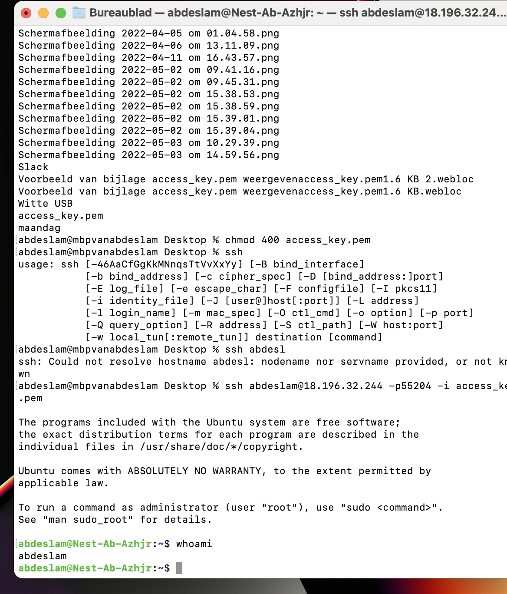

# Linux 1 Setting Up

Creating a connection with the VM with SSH

## Key terminology
SSH - (Secure Shell or Secure Socket Shell) is a network protocol that gives users, particularly system administrators, a secure way to access a computer over an unsecured network.

CLI - Command Line

Public Key -

VM - Virtual Machine

## Exercise

-Make an SSH-connection to your machine. SSH requires the key file to have specific permissions, so you might need to change those. 

-When the connection is successful, type whoami in the terminal. This command should show your username.

### Sources
https://phoenixnap.com/kb/ssh-to-connect-to-remote-server-linux-or-windows

https://filext.com/file-extension/PEM

https://www.youtube.com/watch?v=qWKK_PNHnnA&t=6s

### Overcome challanges

It was difficult in the beginning to establish the connection because of issues with the public-key
### Results

