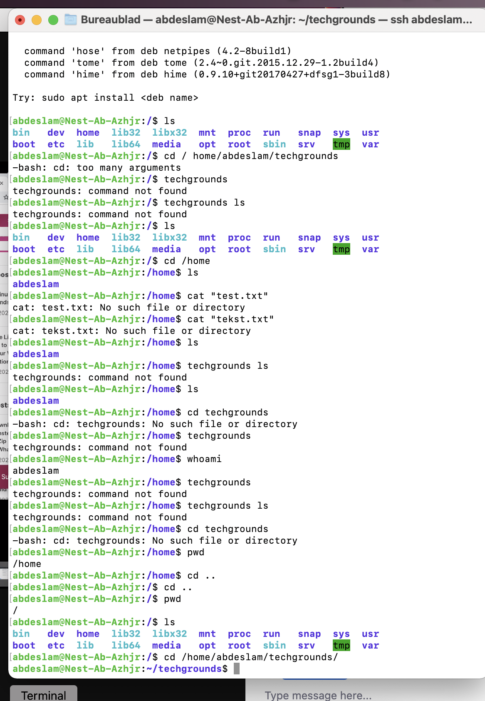
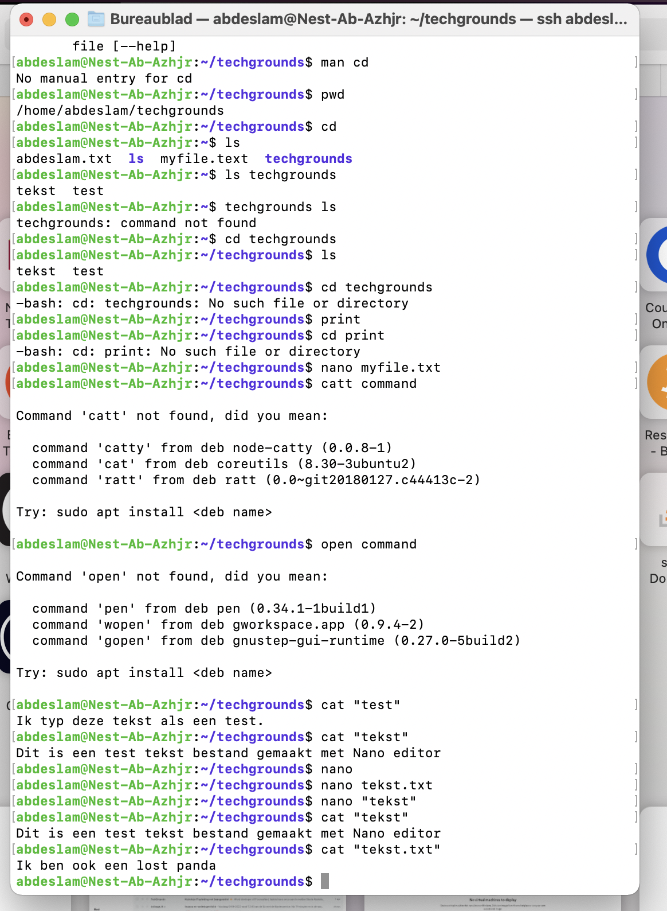
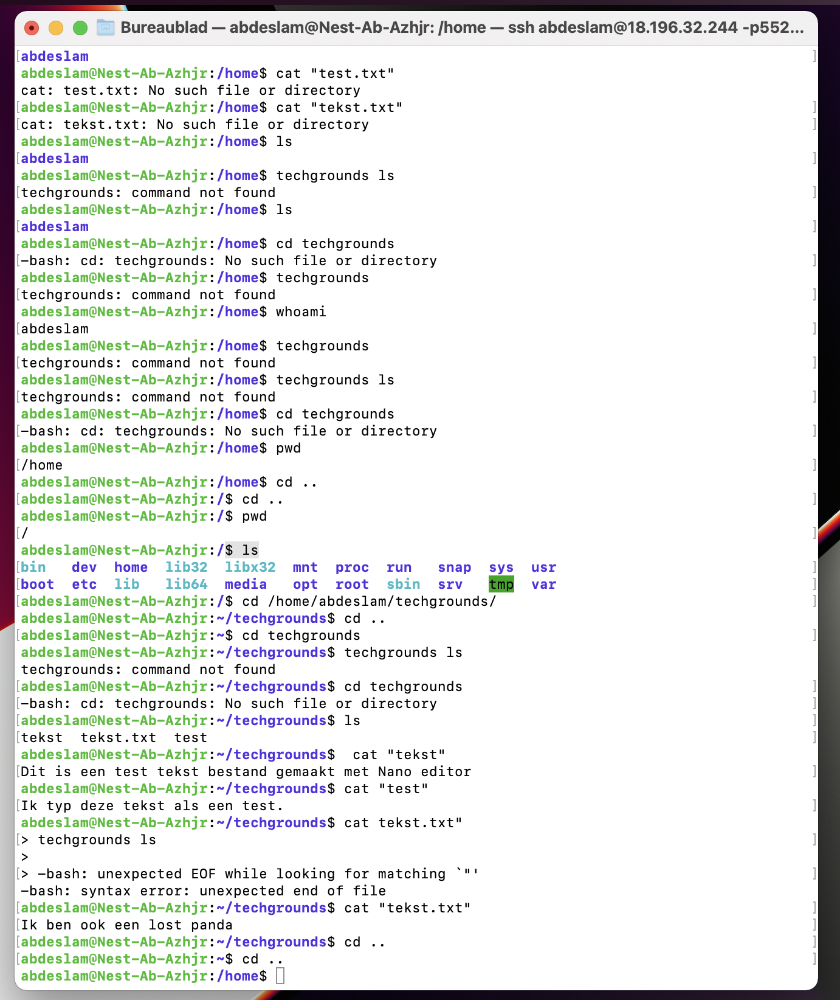

# Linux 2 Files and Directories
To know about how the create a fila and directories.

## Key terminology
Directory - A folder

Sudo - the one command to rule them all. It stands for “super user do!”

Cat - A standard Unix utility that reads files.

Nano - An easy to use command line text editor for Unix and Linux operating systems.

Absolute path - An absolute, or full, path begins with a drive letter followed by a colon, such as D:.

Relative path - Refers to a location that is relative to a current directory. Relative paths make use of two special symbols, a dot (.) and a double-dot (..), which translate into the current directory and the parent directory. Double dots are used for moving up in the hierarchy. A single dot represents the current directory itself.

## Exercise

-Find out your current working directory.

-Make a listing of all files and directories in your home directory. You should see directories like ‘Desktop’, ‘Public’ and ‘Pictures’ among others.

-Within your home directory, create a new directory named ‘techgrounds’.

-Within the techgrounds directory, create a file containing some text.

-Move around your directory tree using both absolute and relative paths.

### Sources
https://linuxhint.com/absolute-relative-paths-linux/

https://www.compuhoy.com/how-do-i-save-a-text-file-in-unix-format/

https://desktop.arcgis.com/en/arcmap/10.6/tools/supplement/pathnames-explained-absolute-relative-unc-and-url.htm

### Overcome challanges

I had to learn about the different commands and look them al up.

### Results

