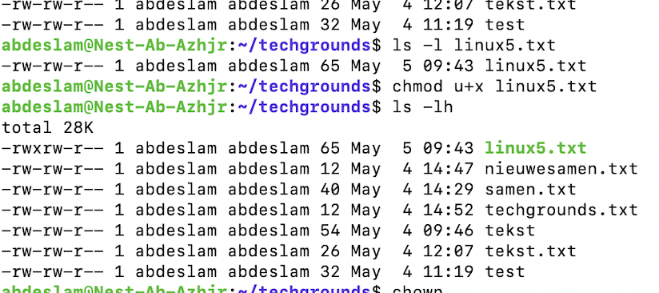
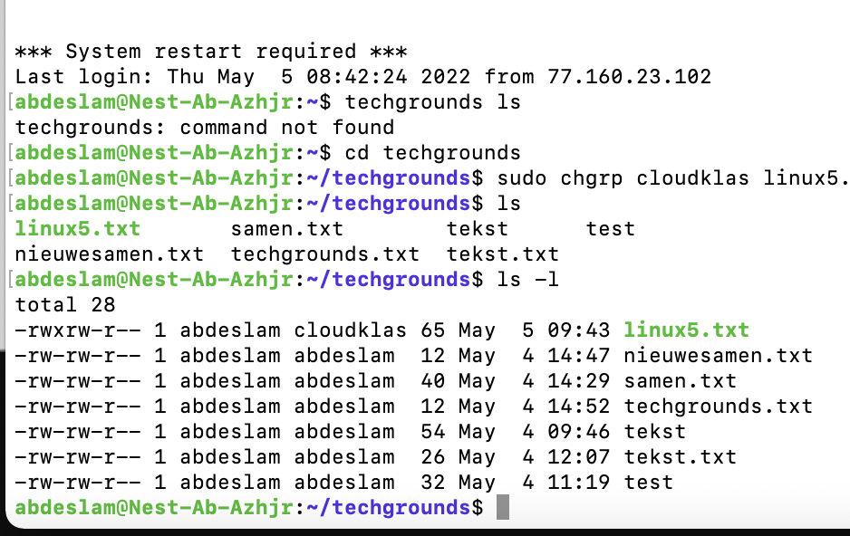
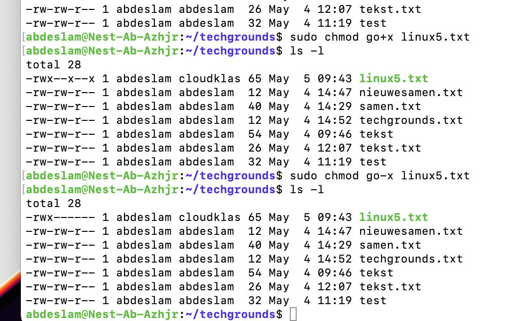
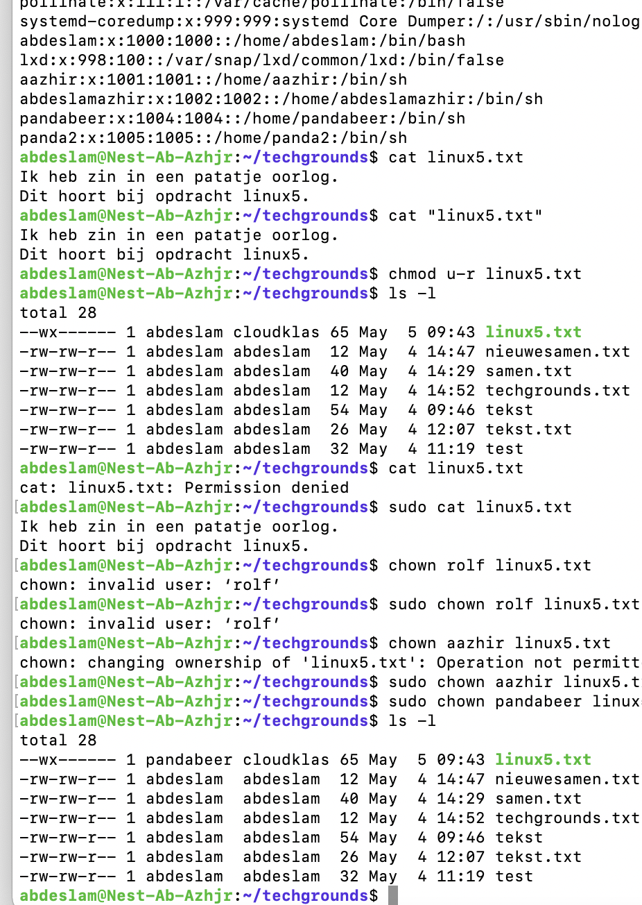
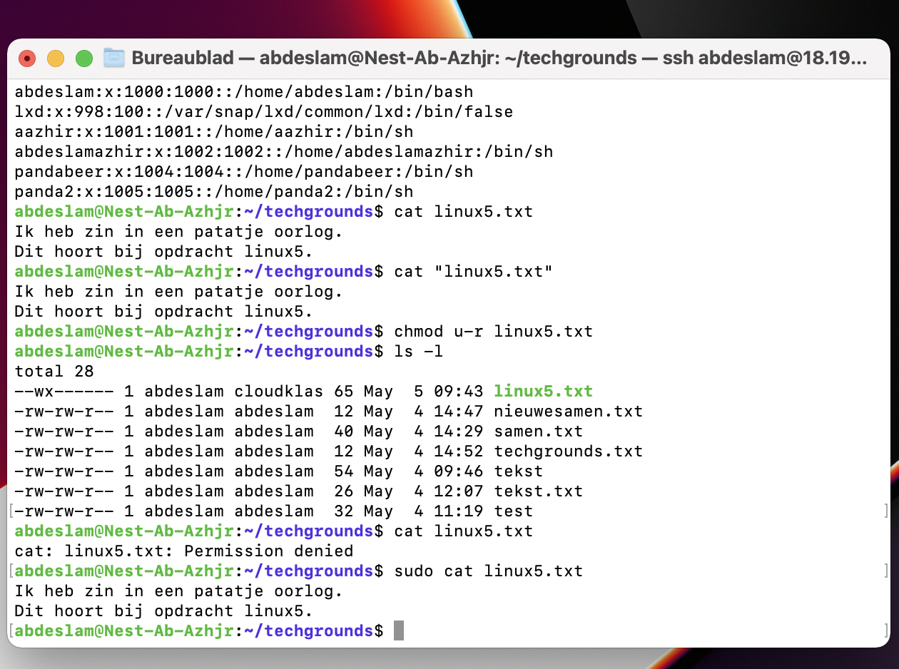
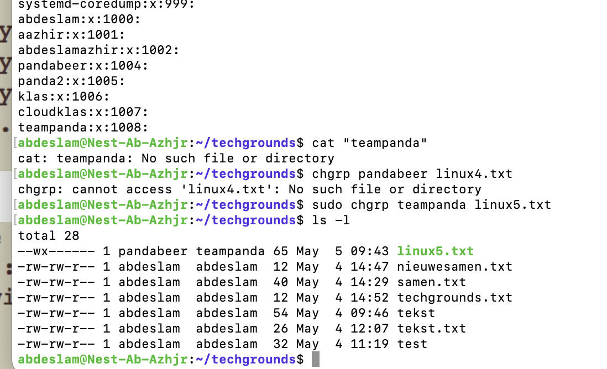
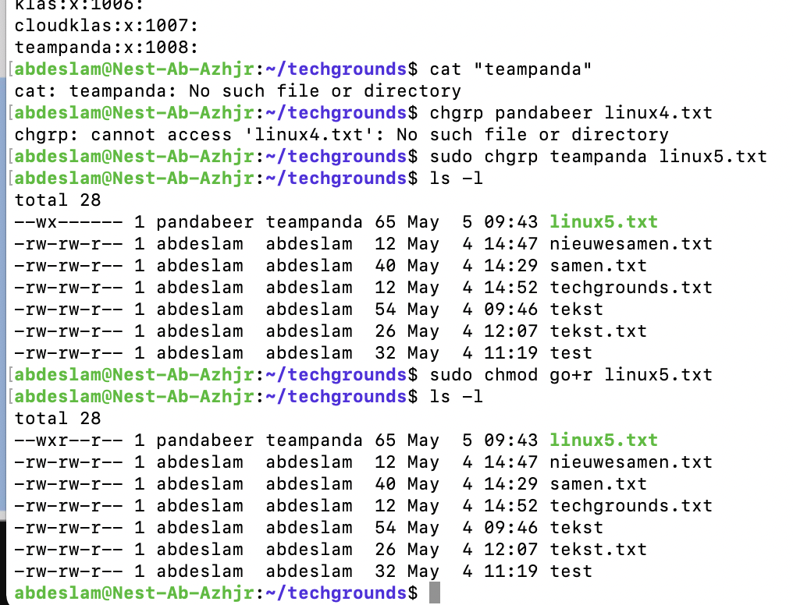

# File permissions
Creating a file, users and groups and how to give and remove certain permissions for users for specific files.

## Key terminology

Chmod - Change mode

Chgrp - Change group

r - Permission to read the file

w - Permission to write the file

x - Permission to execute the file

u - User

g - Group

o - Others

## Exercise

-Create a text file.

-Make a long listing to view the file’s permissions. Who is the file’s owner and group? What kind of permissions does the file have?

-Make the file executable by adding the execute permission (x).

-Remove the read and write permissions (rw) from the file for the group and everyone else, but not for the owner. Can you still read it?

-Change the owner of the file to a different user. If everything went well, you shouldn’t be able to read the file unless you assume root privileges with ‘sudo’.

-Change the group ownership of the file to a different group.

### Sources

https://linuxize.com/post/understanding-linux-file-permissions/

https://phoenixnap.com/kb/linux-file-permissions

### Overcome challanges

Because of the last exercise, this one was not that difficult.

### Results

