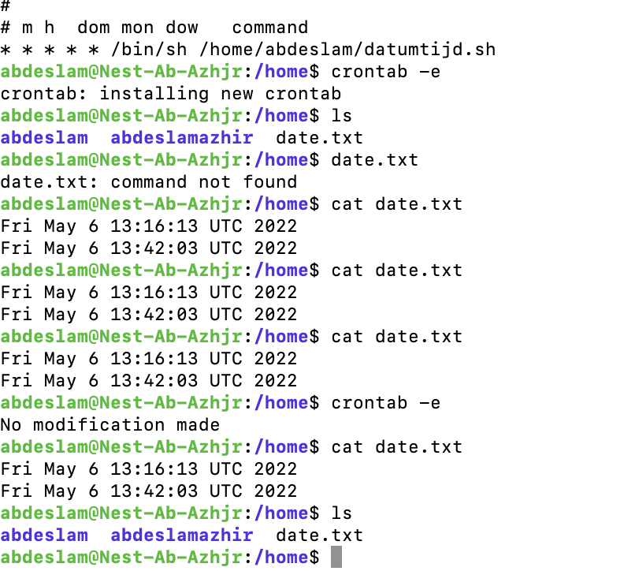
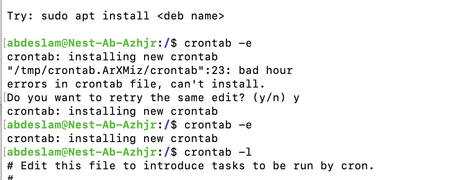
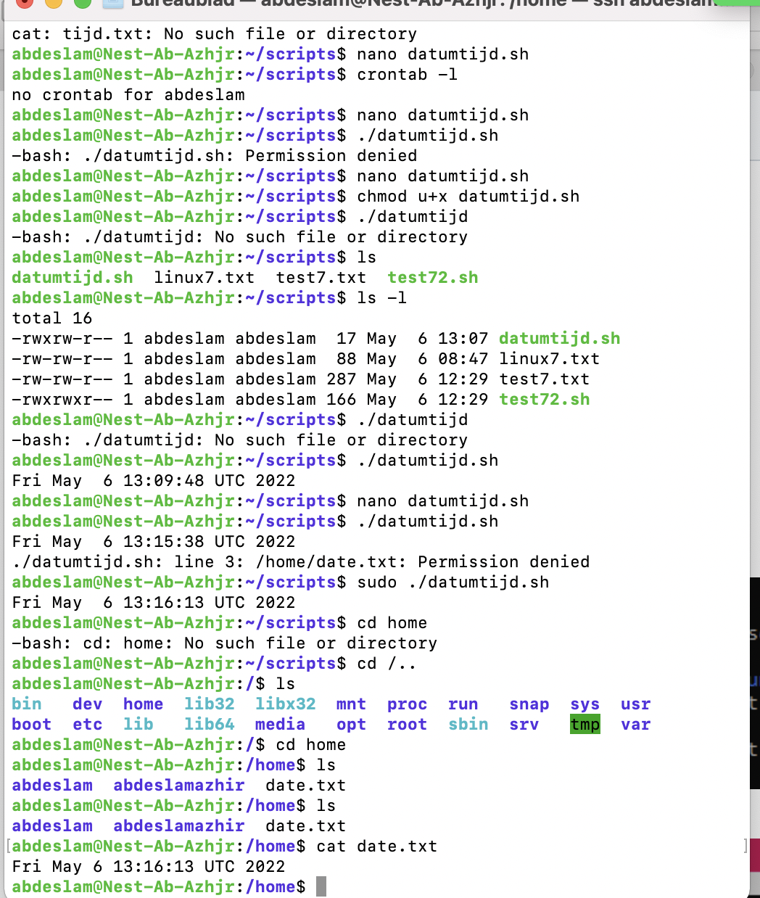

# Cron jobs

Create a cron job

## Key terminology

crontab - A command that creates a table or list of commands, each of which is to be executed by the operating system at a specified time

crontab -e - To edit cronjobs

## Exercise

-Create a Bash script that writes the current date and time to a file in your home directory.

-Register the script in your crontab so that it runs every minute.

-Create a script that writes available disk space to a log file in ‘/var/logs’. Use a cron job so that it runs weekly.

### Sources

https://phoenixnap.com/kb/set-up-cron-job-linux

### Overcome challanges
This one was very difficult  and evene with help of other members from other teams I could not complete the task crontab running every minute and weekly.

### Results

