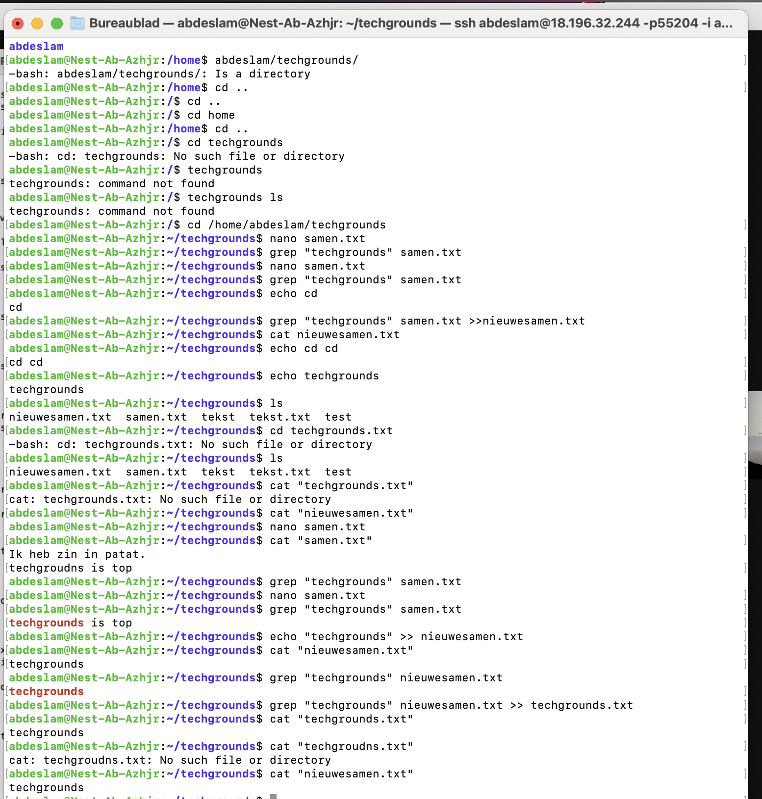

# Working with text (CLI)

## Key terminology

Cat - Print the text in a file to the screen

Grep - Used to search for a string of characters in a specified file.

Mkdir - Make a directory

## Exercise

-Use the echo command and output redirection to write a new sentence into your text file using the command line. The new sentence should contain the word ‘techgrounds’.

-Use a command to write the contents of your text file to the terminal. Make use of a command to filter the output so that only the sentence containing ‘techgrounds’ appears.

-Read your text file with the command used in the second step, once again filtering for the word ‘techgrounds’. This time, redirect the output to a new file called ‘techgrounds.txt’.

### Sources
https://linuxhandbook.com/echo-command/

https://www.w3cschoool.com/linux-grep

https://andysbrainbook.readthedocs.io/en/latest/unix/Unix_03_ReadingTextFiles.html#:~:text=Use%20the%20command%20line%20to,file%20to%20see%20its%20contents.

https://phoenixnap.com/kb/rename-file-linux

### Overcome challanges
I had to look every thing up, and with the help of my team i could finish up and understand this exercise.

### Results

