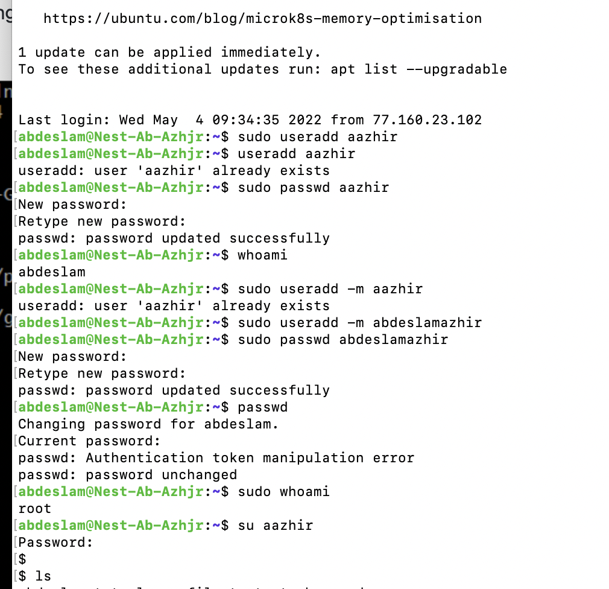
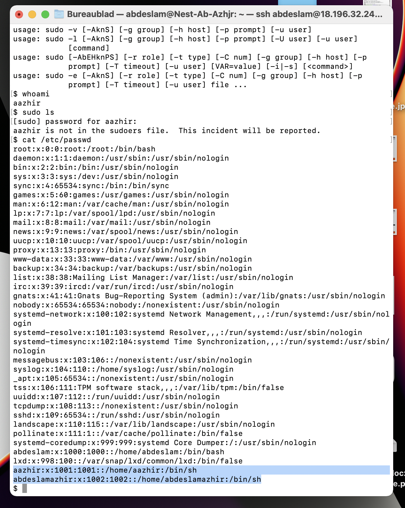
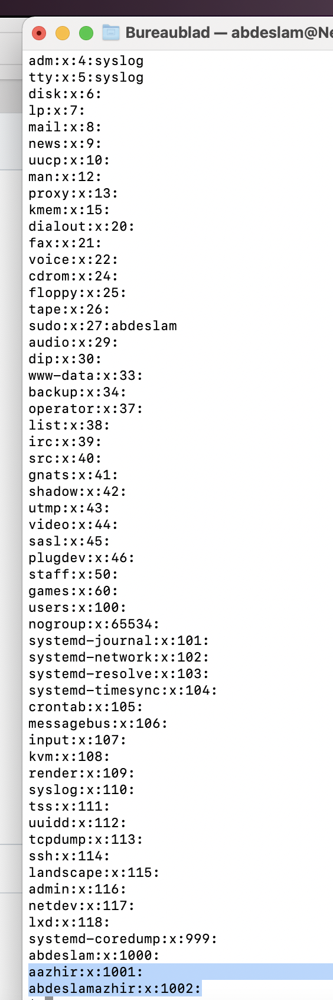
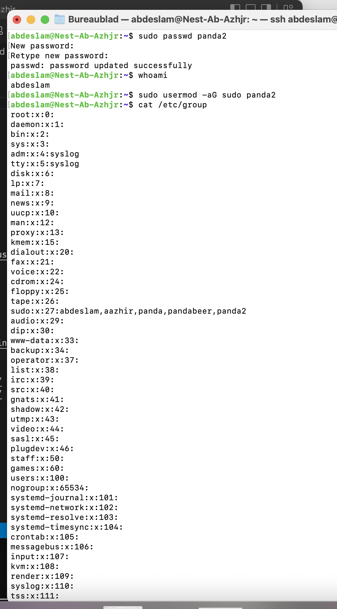

# Users and groups

How to create a new user with a password and manage the permissions.

## Key terminology

Sudo - Super user do

Useradd - Adding a user

/etc/group - Info about the group

## Exercise

-Create a new user in your VM. 
The new user should be part of an admin group.
The new user should have a password.
The new user should be able to use ‘sudo’

-Locate the files that store users, passwords, and groups. See if you can find your newly created user’s data in there.

### Sources
https://linuxize.com/post/how-to-create-users-in-linux-using-the-useradd-command/

https://www.w3cschoool.com/linux-create-user

https://linuxize.com/post/how-to-add-user-to-group-in-linux/

https://www.cyberciti.biz/faq/howto-linux-add-user-to-group/

### Overcome challanges

Very difficult exercise with a lot of saerching and seeking help from the group

### Results

