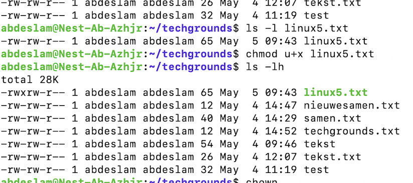
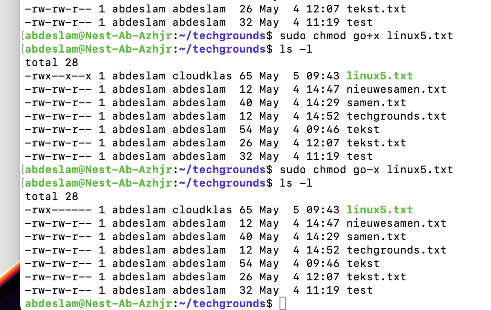
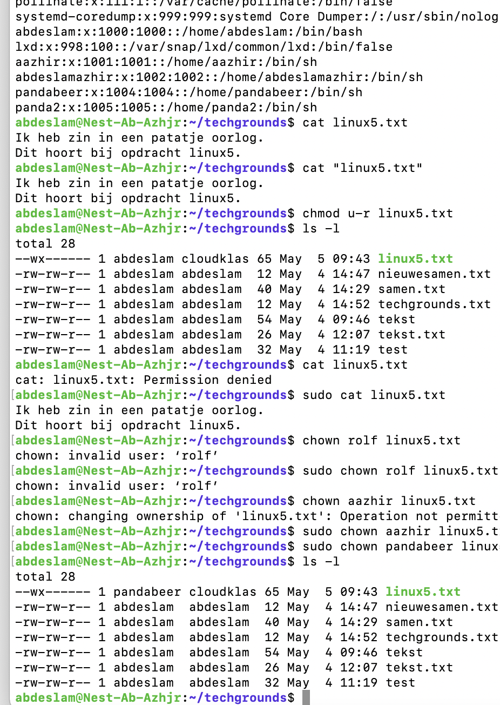
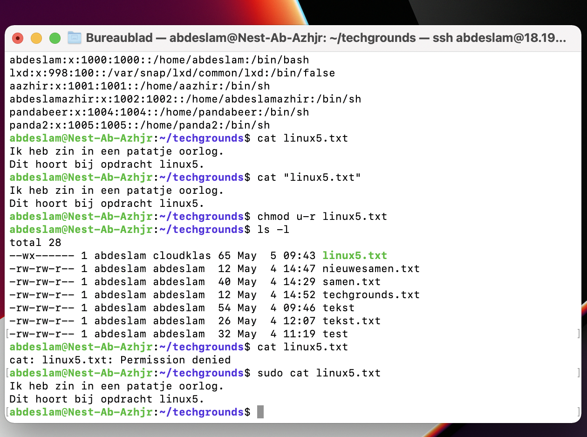
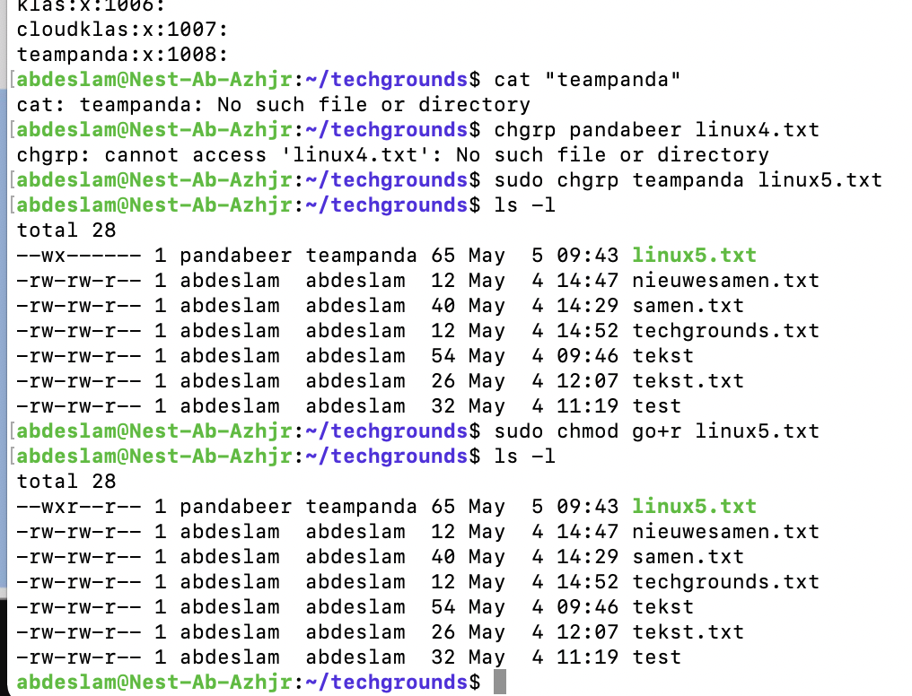

# File permissions

How to give and remove certain permissions for users for specific files.

## Key terminology

Chmod - Change mode

r - Permission to read the file

w - Permission to write the file

x - Permission to execute the file

## Exercise
### Sources

https://linuxize.com/post/understanding-linux-file-permissions/

https://phoenixnap.com/kb/linux-file-permissions

### Overcome challanges

Because of the last exercise, this one was not that difficult.

### Results

