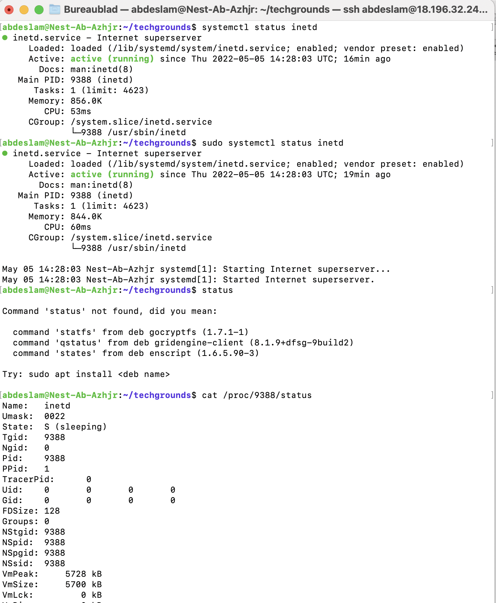
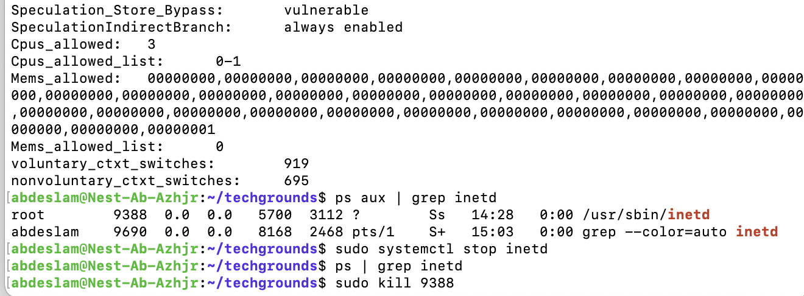
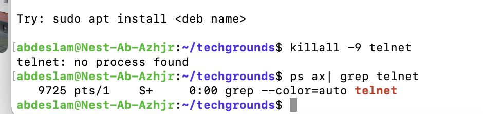

# Processes
[Give a short summary of the subject matter.]

## Key terminology
Telnet - A old network protocol, not secured

Deamon - A process that runs in the background and is not active.

## Exercise
### Sources
https://www.javatpoint.com/linux-telnet-command

https://forum.lowyat.net/topic/346775 

### Overcome challanges
Had to learn about telnet and deamons.

### Results
PID: 9388
Memory : 856.0k

