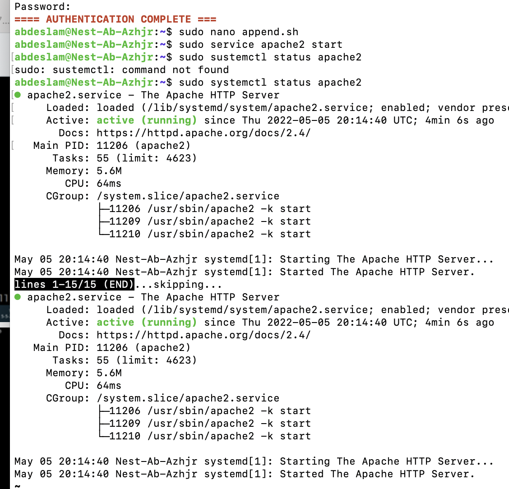
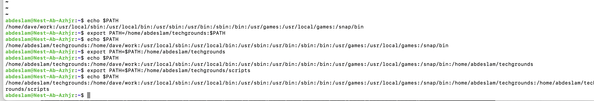

# Bash scripting

[Give a short summary of the subject matter.]

## Key terminology
[Write a list of key terminology with a short description. To prevent duplication you can reference to previous excersizes.]

## Exercise
### Sources
https://www.howtogeek.com/658904/how-to-add-a-directory-to-your-path-in-linux/

### Overcome challanges
[Give a short description of your challanges you encountered, and how you solved them.]

### Results

