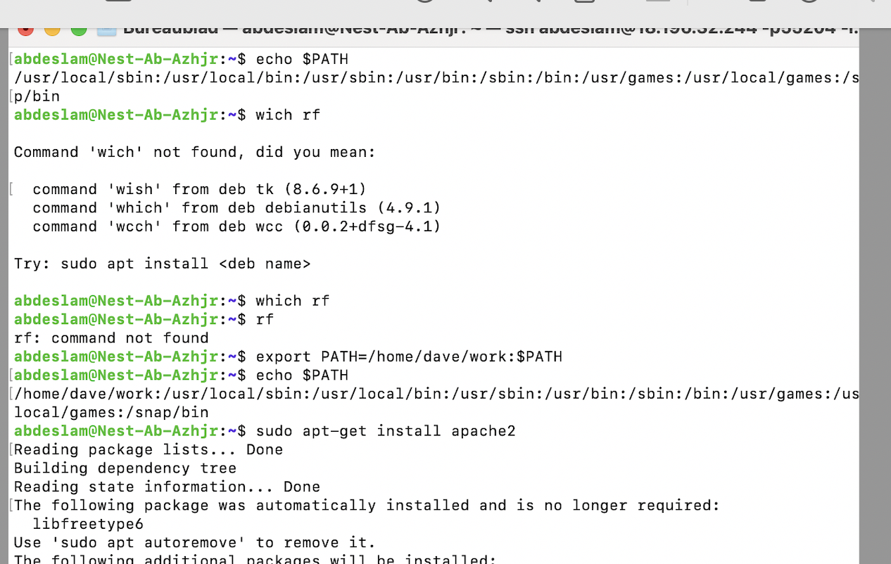
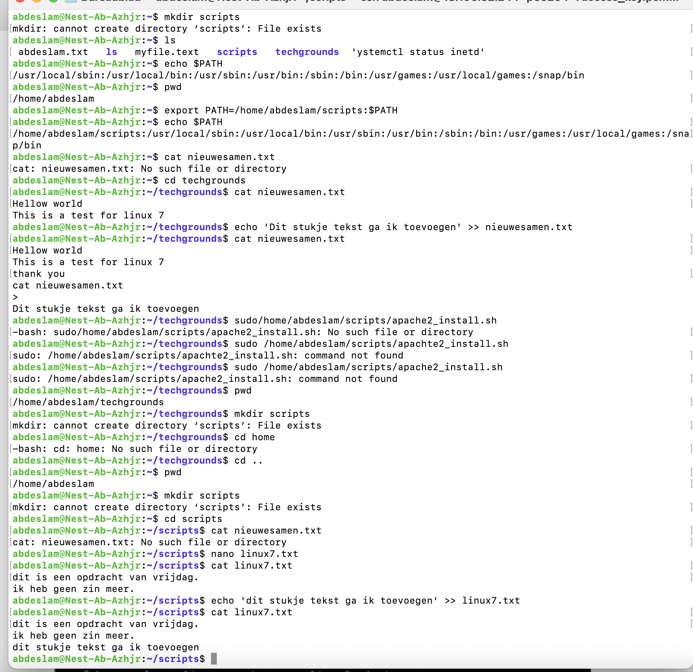
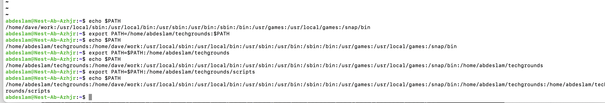
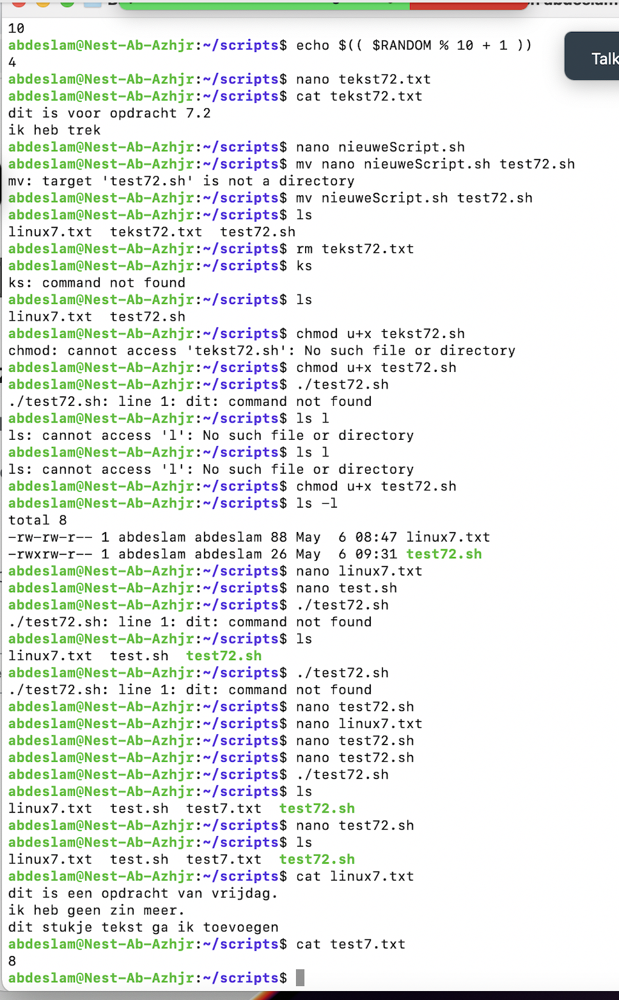
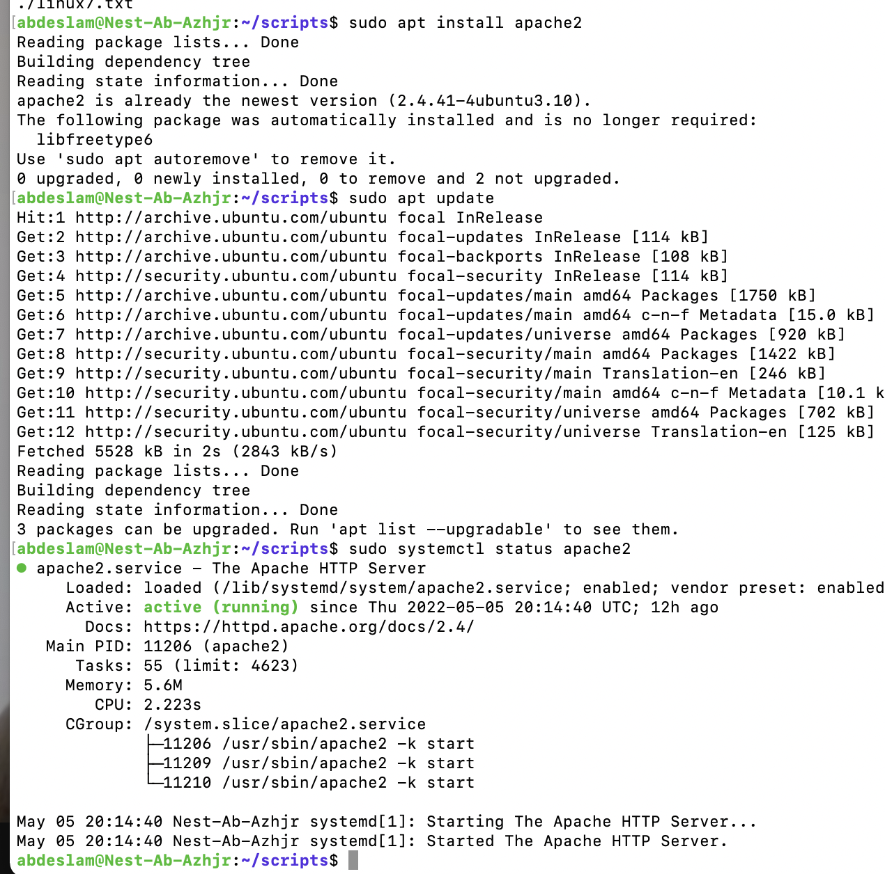
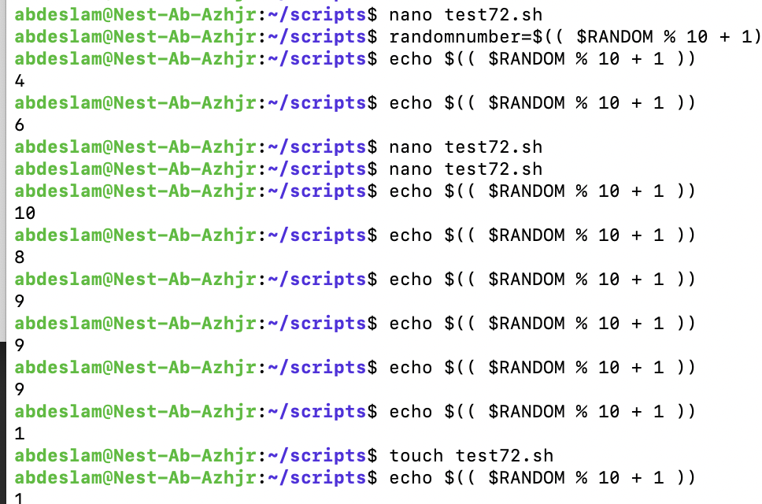
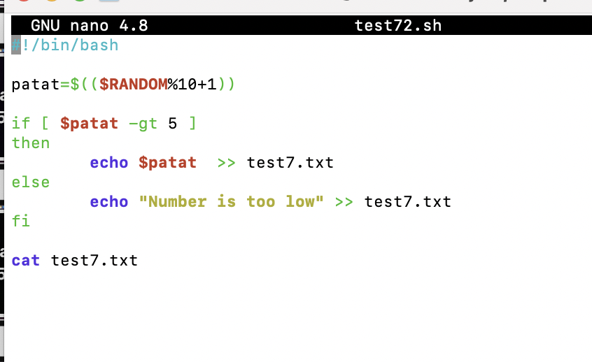

# Bash scripting

Creating a directory and adding it to the PATH variable. 
Installing apache and creating s script that generates a random number and also indicates when a number is lower dan 5.

## Key terminology
Bash - Bourne again Shell,a command language.

PATH -  A variable in Linux and other Unix-like operating systems that tells the shell which directories to search for executable files

## Exercise
### Sources
https://www.howtogeek.com/658904/how-to-add-a-directory-to-your-path-in-linux/

https://stackoverflow.com/questions/1194882/how-to-generate-random-number-in-bash

https://www.cyberciti.biz/faq/linux-install-and-start-apache-httpd/

https://linuxize.com/post/bash-append-to-file/

https://blog.eduonix.com/shell-scripting/generating-random-numbers-in-linux-shell-scripting/

https://linuxhint.com/generate-random-number-bash/

https://httpd.apache.org/docs/2.4/install.html

### Overcome challanges
Had to find out how to use exactly the right code.

### Results

