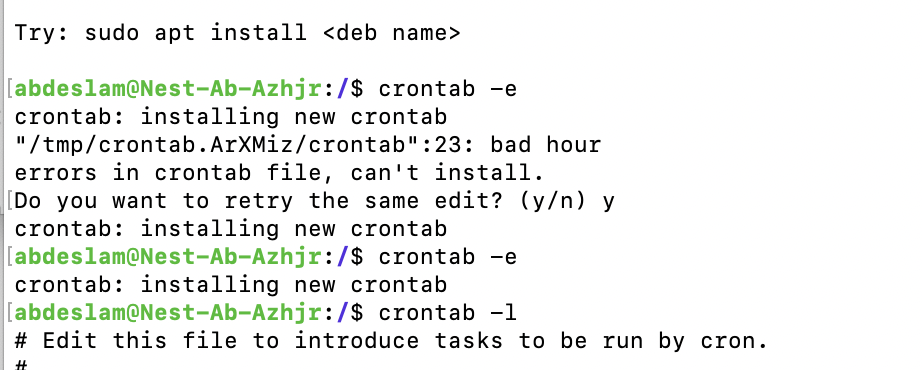
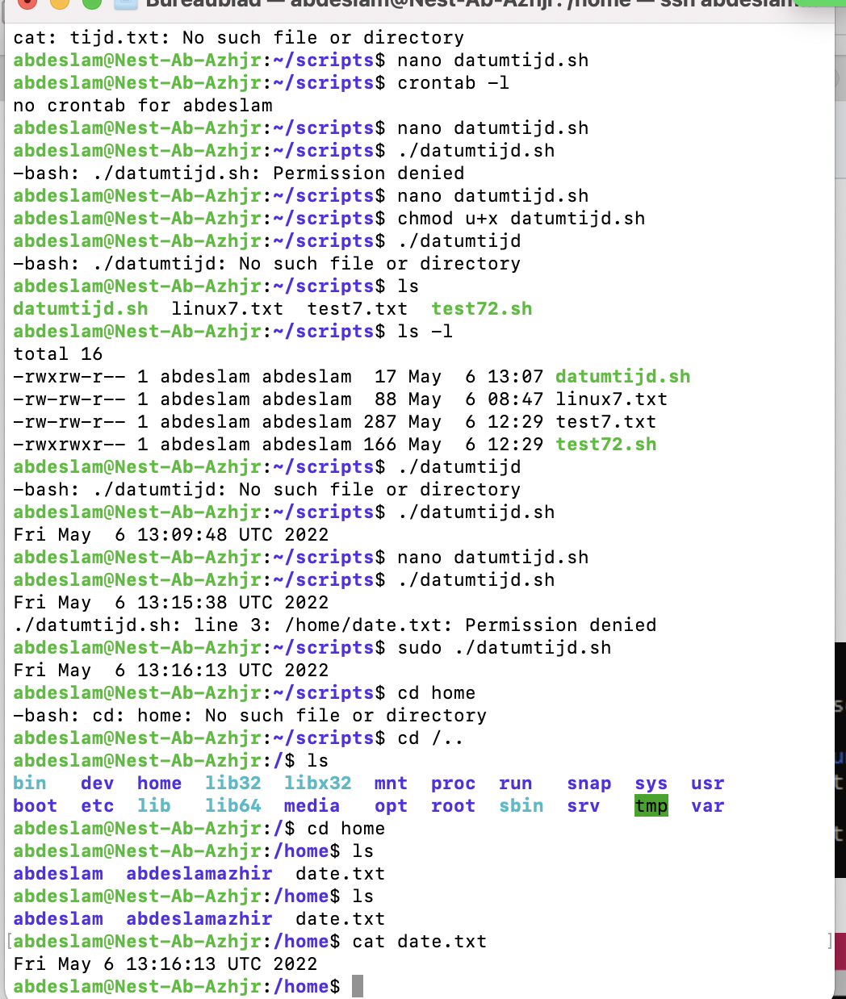

# Cron jobs
[Give a short summary of the subject matter.]

## Key terminology
[Write a list of key terminology with a short description. To prevent duplication you can reference to previous excersizes.]

## Exercise

-Create a Bash script that writes the current date and time to a file in your home directory.

-Register the script in your crontab so that it runs every minute.

-Create a script that writes available disk space to a log file in ‘/var/logs’. Use a cron job so that it runs weekly.

### Sources

https://phoenixnap.com/kb/set-up-cron-job-linux

### Overcome challanges
This one was very difficult

### Results

