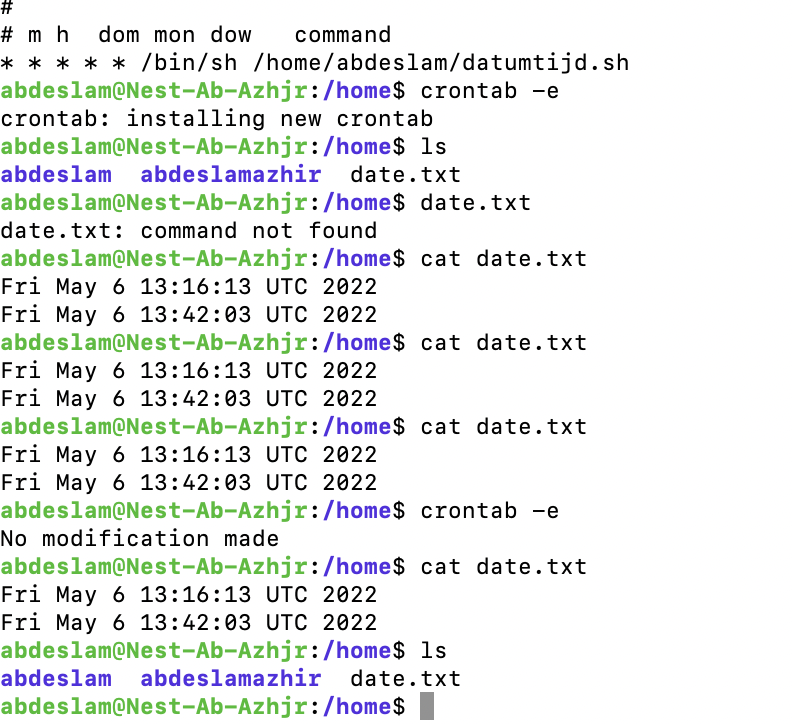

# Cron jobs
[Give a short summary of the subject matter.]

## Key terminology
[Write a list of key terminology with a short description. To prevent duplication you can reference to previous excersizes.]

## Exercise
https://phoenixnap.com/kb/set-up-cron-job-linux

### Overcome challanges
This one was very difficult

### Results

