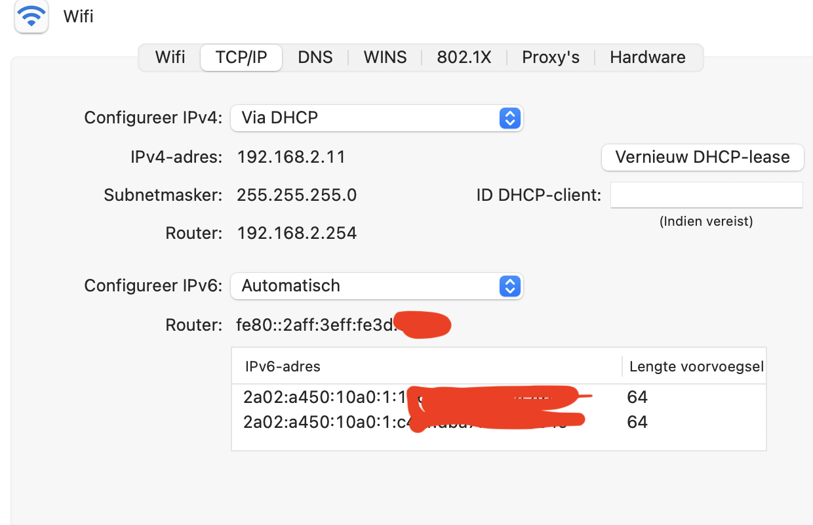
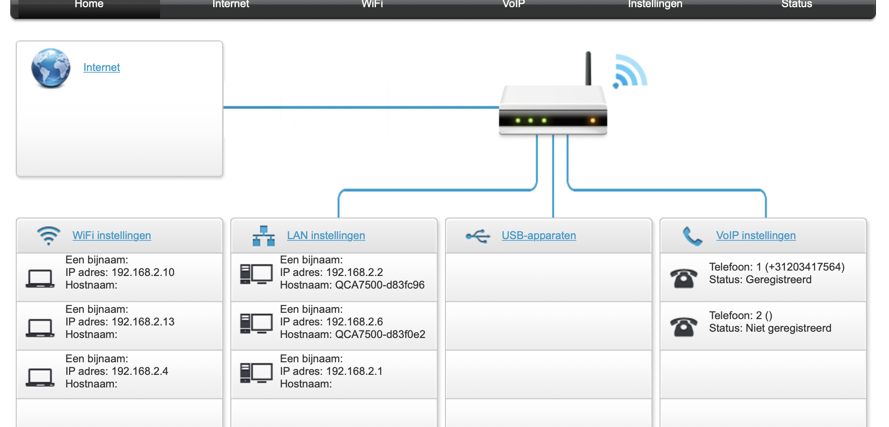
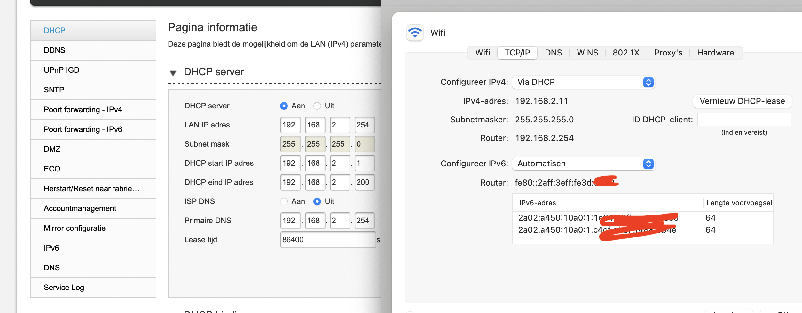

# Network Devices

Learning about network devices and how to get acces to your home modem/router as an admin..

## Key terminology

DHCP - Dynamic Host Configuration Protocol is a client/server protocol that automatically provides an Internet Protocol (IP) host with its IP address and other related configuration information such as the subnet mask and default gateway.

Network device - The network device is one kind of device used to connect devices or computers together to transfer resources or files like fax machines or printers.

## Exercise

Name and describe the functions of common network equipment.

Most routers have an overview of all connected devices, find this list. What other information does the router have about connected equipment?

Where is your DHCP server located on your network? What are the configurations of this?

### Sources

https://blog.netwrix.com/2019/01/08/network-devices-explained/

https://www.netspotapp.com/hardware/how-to-access-router/

https://www.howtogeek.com/233952/how-to-find-your-routers-ip-address-on-any-computer-smartphone-or-tablet/

### Overcome challanges
Had to find how to get acces to the modem/router.

### Results
The names and functions of common network equipment

Repeater - A repeater operates at the physical layer. Its job is to regenerate the signal over the same network before the signal becomes too weak or corrupted so as to extend the length to which the signal can be transmitted over the same network. An important point to be noted about repeaters is that they do not amplify the signal. When the signal becomes weak, they copy the signal bit by bit and regenerate it at the original strength. It is a 2 port device.

Hub - A hub is basically a multiport repeater. A hub connects multiple wires coming from different branches. Hubs cannot filter data, so data packets are sent to all connected devices.  In other words, the collision domain of all hosts connected through Hub remains one.  Also, they do not have the intelligence to find out the best path for data packets which leads to inefficiencies and wastage. 

Bridge – A bridge operates at the data link layer. A bridge is a repeater, with add on the functionality of filtering content by reading the MAC addresses of source and destination. It is also used for interconnecting two LANs working on the same protocol. It has a single input and single output port, thus making it a 2 port device.

Switch - A switch is a multiport bridge with a buffer and a design that can boost its efficiency and performance. A switch is a data link layer device. The switch can perform error checking before forwarding data, which makes it very efficient as it does not forward packets that have errors and forward good packets selectively to the correct port only. 

Routers - A router is a device like a switch that routes data packets based on their IP addresses. The router is mainly a Network Layer device. Routers normally connect LANs and WANs together and have a dynamically updating routing table based on which they make decisions on routing the data packets. Router divide broadcast domains of hosts connected through it. 
 
Access point - An access point is a device that creates a wireless local area network, or WLAN, usually in an office or large building. An access point connects to a wired router, switch, or hub via an Ethernet cable, and projects a Wi-Fi signal to a designated area

Modem - In simple language, a modem is a device that is used to connect to the Internet. Technically, it is the device that enables digital data to be transmitted over telecommunication lines.

Gateway - Gateway is used to forward packets that originate from a local host or a local network and are intended for remote networks. If a data packet does not get its destination address in the local network then it takes the help of the gateway device to find the destination address in the remote network. The gateway device knows the path to the remote destination address. If necessary, it also encapsulates the packet so that it can travel through other networks to reach its destination address.

Here is a photo of my ip adresses.

Overview of all connected devices.

DHCP server. Located

