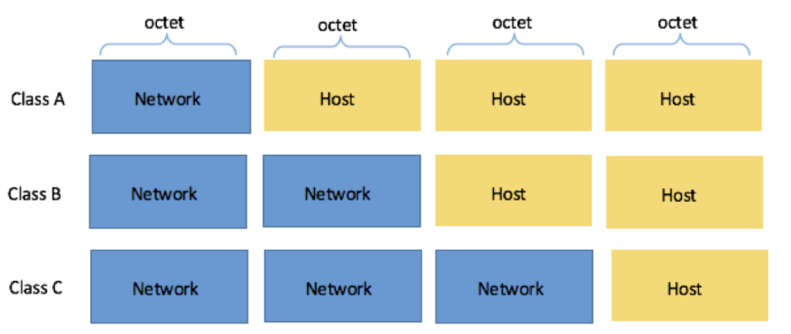
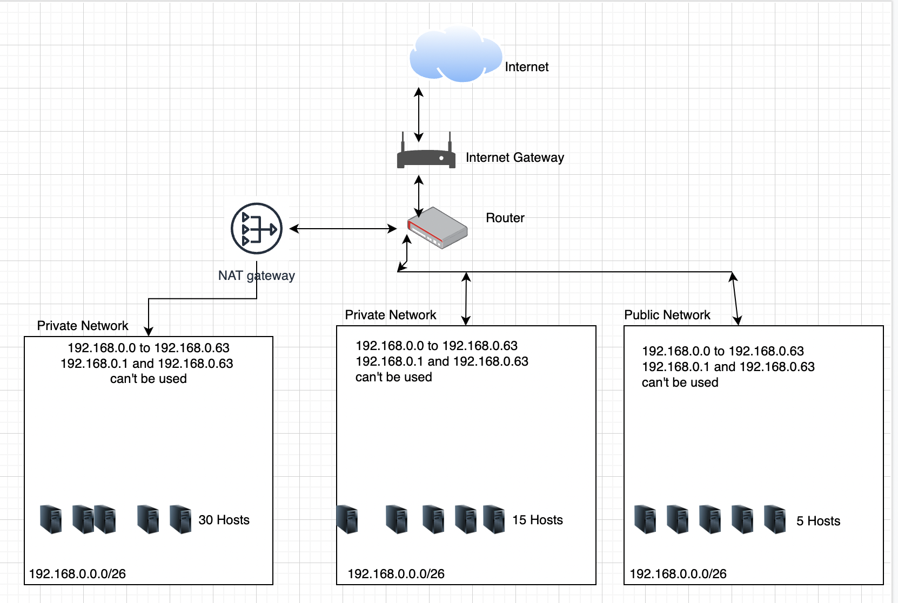

# Subnetting

Understand subnetting and create an achitecture with it.

## Key terminology

Subnetting - A technique that lets network administrators use the 32 bits available in an IP address more efficiently by creating networks that aren’t limited to the scales provided by Class A, B, and C IP addresses. With subnetting, you can create networks with more realistic host limits.

NAT gateway - also known as Network Address Translation Gateway, is used to enable instances present in a private subnet to help connect to the internet or AWS services. In addition to this, the gateway makes sure that the internet doesn’t initiate a connection with the instances. NAT Gateway service is a fully managed service by Amazon, that doesn’t require any efforts from the administrator.

LAN - Local Area Network. It's a structure for organizing and protecting network communicayions for devices running within a single router.

## Exercise

Create a network architecture that meets the following requirements:

- 1 private subnet that can only be reached from within the LAN. This subnet must be able to accommodate at least 15 hosts.
- 1 private subnet that has internet access through a NAT gateway. This subnet must be able to place at least 30 hosts (the 30 hosts does not include the NAT gateway).
- 1 public subnet with an internet gateway. This subnet must be able to place at least 5 hosts (the 5 hosts is excluding the internet gateway).
- Post the architecture you created, including a short explanation, in the Github repository you shared with the learning coach.

### Sources

https://edu.anarcho-copy.org/TCP%20IP%20-%20Network/Networking%20For%20Dummies.pdf

https://www.cbtnuggets.com/blog/technology/networking/networking-basics-what-is-ipv4-subnetting

https://dnsmadeeasy.com/support/subnet

https://www.knowledgehut.com/tutorials/aws/aws-nat-gateway

https://www.youtube.com/watch?v=SBYNeGIng6I

https://www.subnet-calculator.com/subnet.php?net_class=C

### Overcome challanges

Had no idea how to start drwaing the architecture. Seen many video's, listended a lott to teammates discussing the issue.

### Results

I have chosen for the /26 CIDR notation because that gives the possibility of the range of IP addresses from 192.168.0.0 to 192.168.0.63. And in this exercise we need 52 IP addresses.

