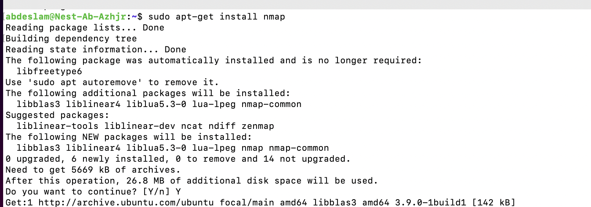
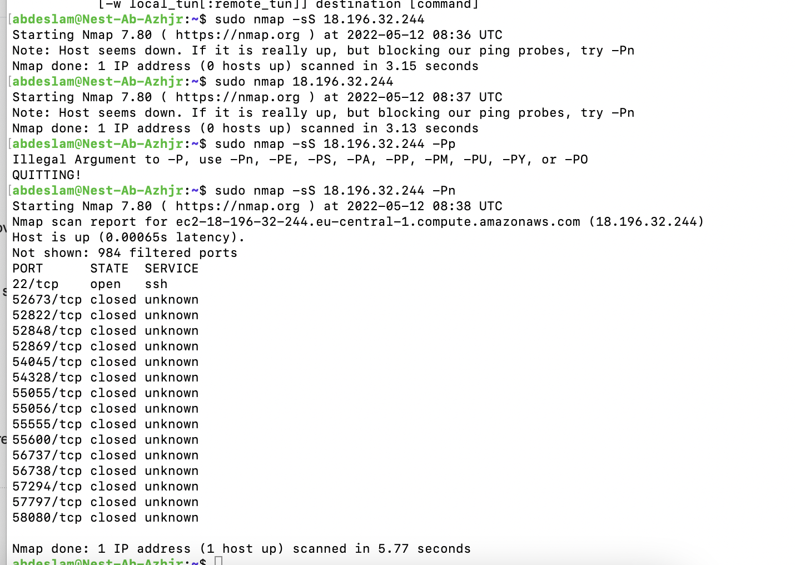
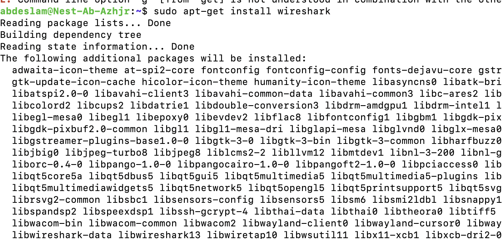
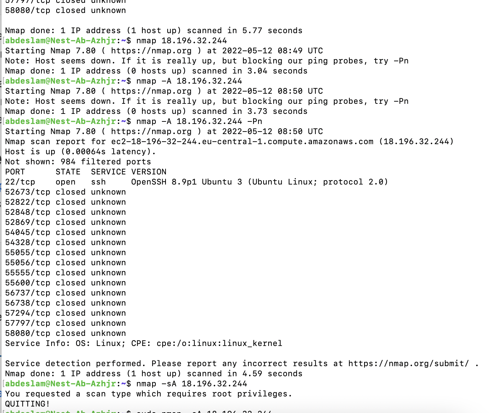
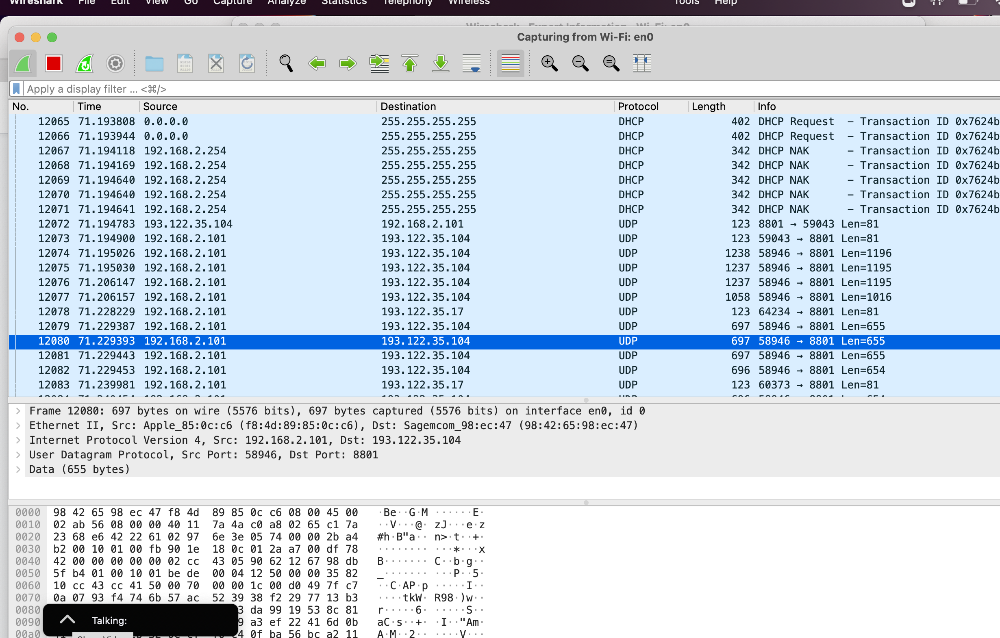

# Network detection

In order to prevent or stop attacks on a network, you must be able to analyse your network. There are many tools available to do this, but this exercise will focus on two very popular ones: nmap and Wireshark.

Nmap (Network Mapper) is a tool that scans a network to find information about it. For example, what ports are open in a host in your network.

Wireshark is a protocol analyzer. It looks at network traffic and shows information about packets like protocol and destination (among other things).

Learning with which tools you can scan your network and analyze it.

## Key terminology

Nmap - Network Mapper a free, open-source tool for vulnerability scanning and network discovery. Network administrators use Nmap to identify what devices are running on their systems, discovering hosts that are available and the services they offer, finding open ports and detecting security risks.

Wireshark -  a network protocol analyzer, or an application that captures packets from a network connection, such as from your computer to your home office or the internet. Packet is the name given to a discrete unit of data in a typical Ethernet network.

Wireshark does three things:

1- Packet Capture: Wireshark listens to a network connection in real time and then grabs entire streams of traffic – quite possibly tens of thousands of packets at a time.

2- Filtering: Wireshark is capable of slicing and dicing all of this random live data using filters. By applying a filter, you can obtain just the information you need to see.

3- Visualization: Wireshark, like any good packet sniffer, allows you to dive right into the very middle of a network packet. It also allows you to visualize entire conversations and network streams.

sudo apt-get install nmap - Install on Ubunto
## Exercise

Scan the network of your Linux machine using nmap. What do you find?

Open Wireshark in Windows/MacOS Machine. Analyse what happens when you open an internet browser. (Tip: you will find that Zoom is constantly sending packets over the network. You can either turn off Zoom for a minute, or look for the packets sent by the browser between the packets sent by Zoom.)

### Sources

https://www.networkworld.com/article/3296740/what-is-nmap-why-you-need-this-network-mapper.html

https://www.comptia.org/content/articles/what-is-wireshark-and-how-to-use-it

https://phoenixnap.com/kb/nmap-command-linux-examples

https://linuxhint.com/use-nmap-command-ubuntu/

https://www.linuxandubuntu.com/home/how-to-use-wireshark-to-inspect-network-traffic

### Overcome challanges
 I know how to install and run wireshark, but still don't understand it. 

### Results
Installing nmap with sudo apt-get install nmap

Scanning my machine with sudo nmap -sS ( IP address of the machine) -Pn

Installing wireshark on Linux . sudo apt-get install wireshark

