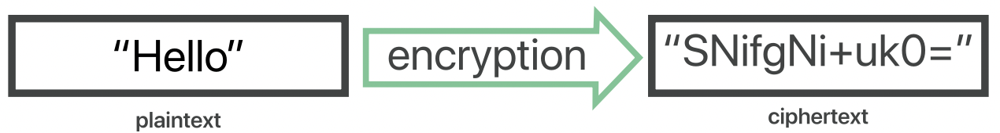
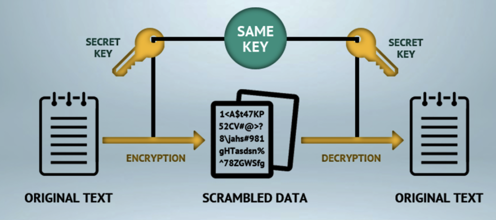
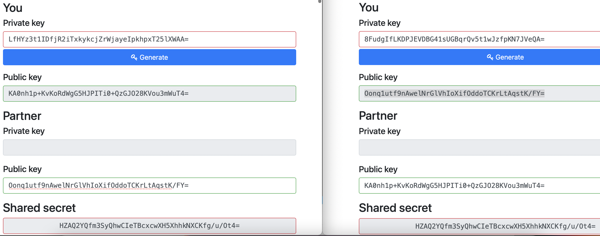

# Symmetric encryption

Learning about symmetric encryption.

## Key terminology

Encryption - Encryption is a way of scrambling data so that only authorized parties can understand the information. In technical terms, it is the process of converting human-readable plaintext to incomprehensible text, also known as ciphertext. In simpler terms, encryption takes readable data and alters it so that it appears random. Encryption requires the use of a cryptographic key: a set of mathematical values that both the sender and the recipient of an encrypted message agree on.

Symmetric encryption - Also called secret key encryption, and it uses just one key, called a shared secret, for both encrypting and decrypting. This is a simple, easy-to-use method of encryption, but there is one problem with it: The key must be shared between the sender and the recipient of the data, so a secure method of key exchange must be devised. Otherwise, if a third party intercepts the key during the exchange, an unauthorized person can easily decrypt the data.

Cipher - Any method of transforming a message to conceal its meaning. The term is also used synonymously with ciphertext or cryptogram in reference to the encrypted form of the message.

Cryptography - The study of secure communications techniques that allow only the sender and intended recipient of a message to view its contents.

Diffie-Hellman key exchange - It allows two parties who have not previously met to securely establish a key which they can use to secure their communications.

## Exercise

- Find two more historic ciphers besides the Caesar cipher.

- Find two digital ciphers that are being used today.

- Send a symmetrically encrypted message to one of your peers via the public Slack channel. They should be able to decrypt the message using a key you share with them. Try to think of a way to share this encryption key without revealing it to everyone. 
You are not allowed to use any private messages or other communication channels besides Slack. Analyse the shortcomings of this method.

### Sources

https://www.cloudflare.com/learning/ssl/what-is-encryption/

https://www.sciencedirect.com/topics/computer-science/symmetric-encryption

https://www.techtarget.com/searchsecurity/definition/cipher

https://www.beaming.co.uk/knowledge-base/techs-cryptography-use-modern-day-networking/

https://www.comparitech.com/blog/information-security/diffie-hellman-key-exchange/

https://www.youtube.com/watch?v=NmM9HA2MQGI

https://cryptotools.net/dhe

### Overcome challanges
Very hard to find a way to share the secret key via the public channel. But after the tip of the LC (Learning Coach) I found a way.

### Results

Two examples of historic ciphers:

- Alberti’s disk
: In 1467, architect Leon Battista Alberti described a curious device. It was a disk made up of two concentric rings: the outer ring engraved with a standard alphabet, and the inner ring, engraved with the same alphabet but written out of order. By rotating the inner ring and matching letters across the disk, a message could be enciphered, one letter at a time, in a fiendishly complex way. 

-  Hieroglyphs: When no one is left who knows how to read a language, it becomes a secret code of its own. That’s exactly what happened with the hieroglyphs of ancient Egypt. These beautiful, iconic characters baffled linguists for centuries, until Napoleon’s troops discovered the Rosetta Stone, which allowed scholars to match the hieroglyphs with known Greek words, giving us the key to understanding the language and culture of one of the greatest civilizations in history.

Two digital ciphers that are being used today:

- Symmetric encryption

Symmetric key cryptography (aka secret/private key cryptography) uses one key, which can be used to encrypt and decrypt data. In order to secure the data further, larger keys are used.

- Hashing

Hashing has a different role in cryptography. Instead of being used as a way to encrypt and decrypt (two-way cryptography) it’s used as a digital signature and uses one-way encryption, so in theory it’s extremely difficult – if not impossible – to reverse the message.

### Send a symmetrically encrypted message to one of your peers via the public Slack channel.

For this exercise I used the Diffie-Hellman key exchange to share the public key with a peer on a public channel. That is a method of securely exchanging cryptographic keys over a public channel.The encrypted message is created by the AES String Encryption and Decryption and that is a symmetric encryption algorithm. To create the keys and the message I used the website https://cryptotools.net/dhe

In my example I used two web pages to show how two people share their public keys with each other in public. The combination of their public keys that they share and their private keys gives the same Shared secret which, just like the private keys, is not shared with anyone.

With the Shared secret key you can now create a encrypted message and share that message in public.

The peer can decrypt the message with the Shared secret key.

The only 3 things that are shared in the public are:

-Public key of A

-Public key of B

-The decrypted message
