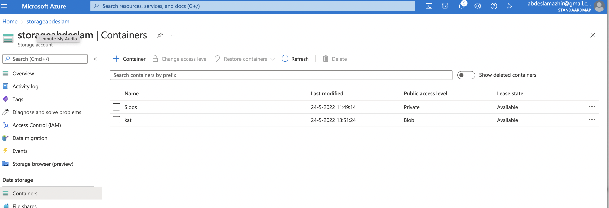
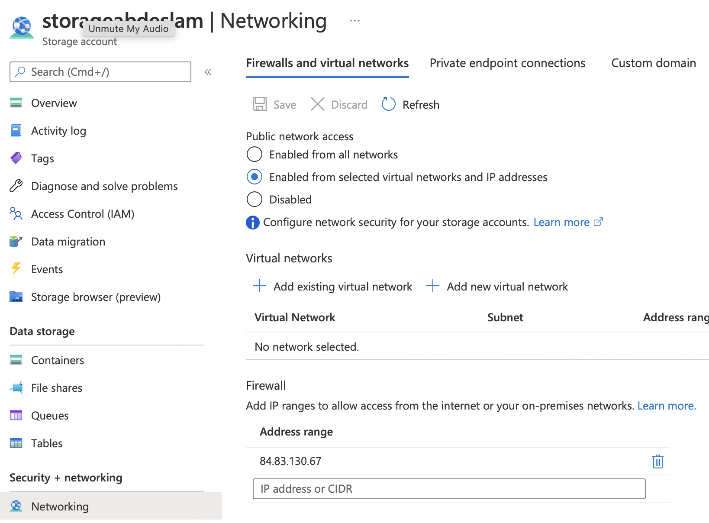
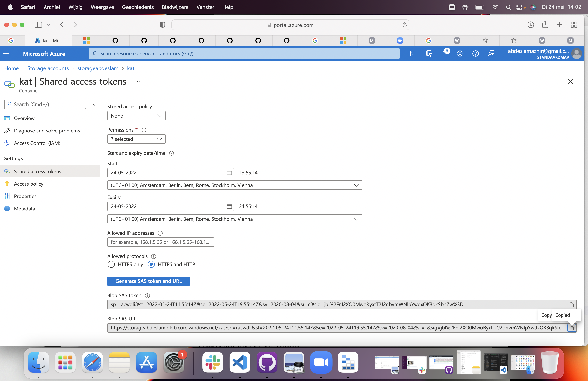
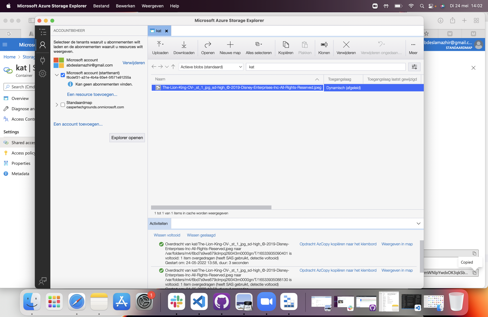

# Azure Storage Account

To store data in Azure you need an Azure Storage Account. A Storage Account contains all Azure Storage data objects such as blobs, files, disks and tables.

Data in a Storage Account is secure, highly available, durable and massively scalable. All data in a Storage Account is accessible via the internet with HTTP and HTTPS. Because it is easy to access, you have to be careful that only the correct identities have permissions to access the data.

Azure Storage explorer is a free GUI to manage your data in Azure.

Many IaaS and PaaS services from Azure also use Azure Storage Accounts.

## Key terminology

- Azure Storage explorer: Microsoft Azure Storage Explorer is a standalone app that makes it easy to work with Azure Storage data across Windows, macOS, and Linux.

- IaaS: Internet as a Service

- PaaS: Platform as a Service

## Exercise

Create an Azure Storage Account. Make sure that only you have access to the data.

Place data in a storage service of your choice via the console (for example a cat photo in Blob storage). 

Retrieve the data to your own computer using the Azure Storage Explorer.

### Sources

https://www.youtube.com/watch?v=2m6An5CwJfA

https://docs.microsoft.com/nl-nl/azure/vs-azure-tools-storage-manage-with-storage-explorer?tabs=macos

https://docs.microsoft.com/nl-nl/azure/storage/common/storage-account-create?tabs=azure-portal

### Overcome challanges

Difficult to get the right properties. The Azure layout is extensive.

### Results

Created an Azure Storage Account and a container with the cat picture file.

Changed the adres s range to my public IP Adress

Here I can change the acces level to Private, Blob or Container

The photo could not be opened in a private browser.

Via the Azure Storage Explorer download the cat file

Created a Blob SAS URL to connect with Azure Storage Explorer app that I have downloaded

The data retrieved with Azure Storage Explorer app

The cat file

