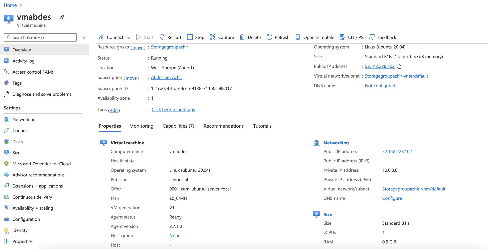
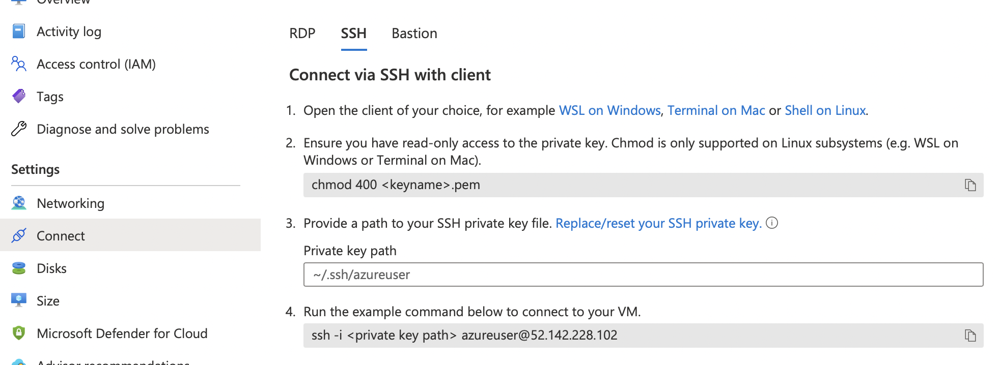
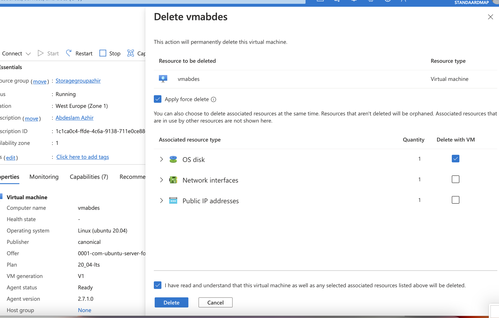

# Azure Virtual Machines

The Service with which you can create VMs in Azure is (very appropriately) called Azure Virtual Machines. You can use these VMs for anything you would use a physical server for. Because they are located in a Microsoft data center, you can only connect to them via the internet. You connect to a remote Linux machine using the Secure Shell (ssh) protocol. For a connection to Windows machines you use the Remote Desktop Protocol (RDP).

To create a VM you need to select an image. An image is like a blueprint for your machine. It includes, among other things, a template for the OS.

VMs come in different sizes. Each size has a different amount of vCPUs, RAM, Data disks, Max IOPS, Temp storage, Premium disk support and price.

For the OS disk (the root volume) you can choose from Premium SSD, Standard SSD and Standard HDD. You also have the option to add additional Data disks.

You can optionally protect your VM with a NIC network security group. It is recommended to configure network security groups at the subnet level (and not at the instance level) where possible, but sometimes you need an allow/deny rule on a specific instance, so the option is there. In any case, you can arrange firewalls outside the instance, and you do not have to configure an extra firewall within the VM.

With Custom Data you can pass a cloud-init script, config file or other data during the startup of the VM. This allows you to automatically configure servers without logging in yourself.
User data is a new version of Custom data. The main difference is that user data remains available throughout the lifetime of the VM.

The price of an Azure VM depends on the size, the image, the region it is in, the number of minutes it is on, and the type of payment you make.

- Pay-as-you-go is the most expensive option, but also the most flexible.

- Reserved Instances are cheaper, but you are stuck with a reservation of 1 or 3 years.

- Spot instances are generally the cheapest, but availability depends on the demand for VMs at the time, so they are not always reliable.

## Key terminology

- SSH: Secure Shell you need to connect to your Linux Azure VM.

## Exercise

Log in to your Azure Console.

Create a VM with the following 
requirements:

- Ubuntu Server 20.04 LTS - Gen1
- Size: Standard_B1ls
- Allowed inbound ports:   
HTTP (80)   
SSH (22)
- OS Disk type: Standard SSD
- Networking: defaults
- Boot diagnostics are not necessary
- Custom dates:  
#!/bin/bash   
sudo su      
apt update    
apt install apache2 -y    
ufw allow 'Apache'    
systemctl enable apache2    
systemctl restart apache2 
- Check if your server is working.
- PAY ATTENTION! Don't forget to throw everything away after the assignment. You can delete each part individually, or you can delete the resource group in one go.

### Sources

https://docs.microsoft.com/en-us/azure/virtual-machines/linux/quick-create-portal

https://docs.microsoft.com/en-us/azure/virtual-machines/custom-data

### Overcome challanges

Couldn't find Ubuntu Server 20.04 LTS - Gen1, only the Ubuntu Server 20.04 LTS - Gen2 was visible. With the help of peers I succeeded.

### Results

Created a VM with the requirements asked.

The command to connect to the VM.

The server is working

Deleted the avm

