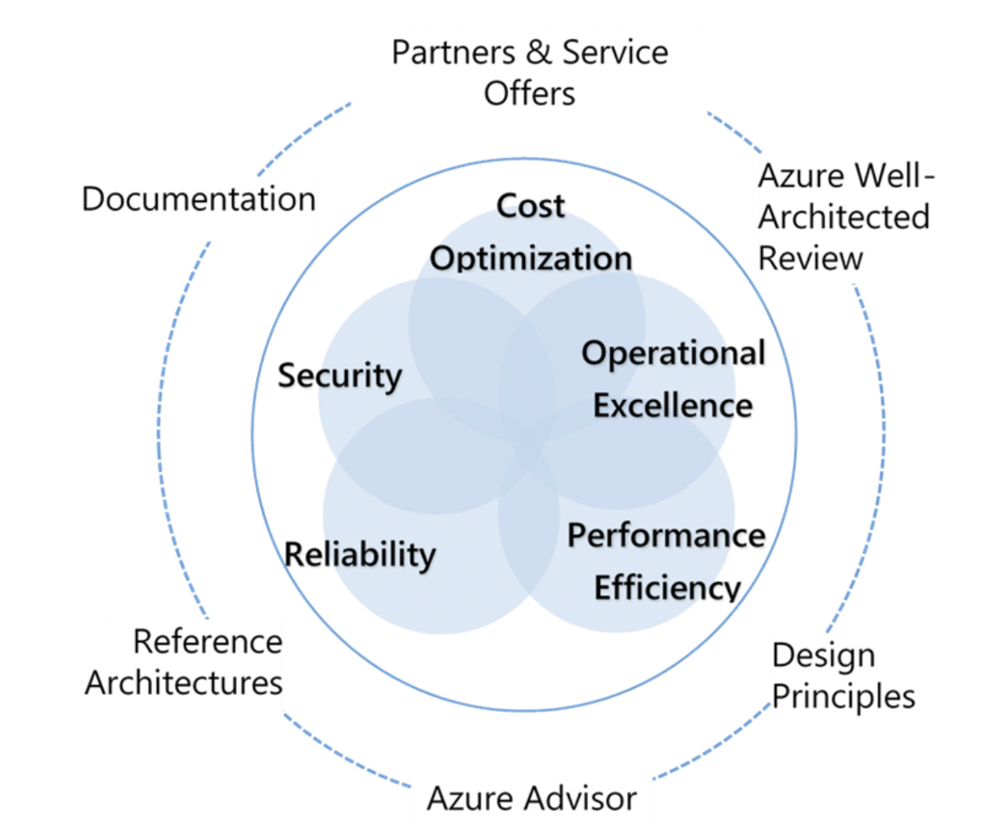

# Well-Architected Framework

The Cloud Providers benefit from their customers running good, secure applications on the provider's infrastructure. The Well-Architected Framework was created to give customers a guideline on what a good, secure application looks like.

The Well-Architected Framework of Azure and AWS are very similar. They are based on almost the same 'pillars', namely:
- Cost Optimization
- Reliability
- Operational Excellence
- Performance Efficiency
- Security

A mnemonic to remember these pillars is also called CROPS.

Each pillar discusses an aspect of your application, and how the Cloud can help to optimize it.

You, as a cloud engineer, should be able to build an application with this Well-Architected Framework that makes optimal use of the possibilities in the Cloud.

## Key terminology

The 5 pillars of a Well-Architected Framework

- Cost Optimization
  - Manage costs to maximize the value delivered.

- Reliability
  - The ability of a system to recover from errors and continue to function.

- Operational Excellence
  - Operational processes that ensure that a system continues to work.

- Performance Efficiency
  - The ability of a system to adapt to changes in load.

- Security
  - Protect applications and data from threats.

---

## Exercise

Study:
- Azure Well-Architected Framework
- How to implement each pillar with cloud services

### Sources

https://docs.microsoft.com/en-us/azure/architecture/framework/mission-critical/mission-critical-design-principles

https://www.cloudwithchris.com/blog/azure-well-architected-framework/

---

### Overcome challanges

None
---

### Results

 The Azure Well-Architected Framework is a framework that you can use to help you consider the core design requirements of your solution and is free.

Azure Well-Architected effectively comes in two parts:

- The framework aspect (i.e. the recommended practices that you’ll want to consider following)
- The review aspect (i.e. the tool that helps you understand your current posture)

The questions align to the pillars of the Azure Well-Architected framework are:

- Cost Optimization (How can you achieve your non-functional requirements while keeping cost low?)

- Operation Excellence (Technical architecture is one aspect of your solution, but are you prepared to monitor and run the system when it goes live?)

- Performance Efficiency (Have you considered how your application scales as part of your design?)

- Reliability (How are you protecting against potential failures in the system?)

- Security (What happens if someone tries to attack your solution?)

---
### How to implement each pillar in the cloud?

 ## Reliability
  - ### Design for failure:	
     - Failure is impossible to avoid in a highly distributed multi-tenant cloud environment like Azure. By anticipating failures and cascading or correlated impact, from individual components to entire Azure regions, a solution can be designed and developed in a resilient manner.

  - ### Observe application health:	
     - Before issues impacting application reliability can be mitigated, they must first be detected. By monitoring the operation of an application relative to a known healthy state it becomes possible to detect or even predict reliability issues, allowing for swift remedial action to be taken.

  - ### Drive automation:	
     - One of the leading causes of application downtime is human error, whether that is due to the deployment of insufficiently tested software or misconfiguration. To minimize the possibility and impact of human errors, it's vital to strive for automation in all aspects of a cloud solution to improve reliability; automated testing, deployment, and management.

  - ### Design for self-healing:	
     - Self healing describes a system's ability to deal with failures automatically through pre-defined remediation protocols connected to failure modes within the solution. It's an advanced concept that requires a high level of system maturity with monitoring and automation, but should be an aspiration from inception to maximize reliability.

------
## Performance Efficiency
- ### Design for scale-out:
   - Scale-out is a concept that focuses on a system's ability to respond to demand through horizontal growth. This means that as traffic grows, more resource units are added in parallel instead of increasing the size of the existing resources. A systems ability to handle expected and unexpected traffic increases through scale-units is essential to overall performance and reliability by further reducing the impact of a single resource failure.

- ### Model capacity
  - The system's expected performance under various load profiles should be modeled through load and performance tests. This capacity model enables planning of resource scale levels for a given load profile, and additionally exposes how system components perform in relation to each other, therefore enabling system-wide capacity allocation planning.

- ### Continuous validation and testing
  - Automated testing should be performed within continuous integration and continuous deployment (CI/CD) processes to drive continuous validation for each application change. Load testing against a performance baseline, ideally with synchronized chaos experimentation, should be included to validate existing thresholds, targets, and assumptions, as well as helping to quickly identify risks to resiliency and availability. 

- ### Baseline performance and identify bottlenecks
  - Performance testing with detailed telemetry from every system component allows for the identification of bottlenecks within the system, including components that need to be scaled in relation to other components, and this information should be incorporated into the capacity model.

- ### Reduce overhead with managed compute services
  - Using managed compute services and containerized architectures significantly reduces the ongoing administrative and operational overhead of designing, operating, and scaling applications by shifting infrastructure deployment and maintenance to the managed service provider.

  ---

  ## Operational Excellence

 - ### Loosely coupled components	
   - Loose coupling enables independent and on-demand testing, deployments, and updates to components of the application while minimizing inter-team dependencies for support, services, resources, or approvals.

 - ### Optimize build and release process	
   - Fully automated build and release processes reduce the friction and increase the velocity of deploying updates, bringing repeatability and consistency across environments. Automation shortens the feedback loop from developers pushing changes to getting automated near instantaneous insights on code quality, test coverage, security, and performance, which increases developer productivity and team velocity.

- ### Understand operational health	
   - Full diagnostic instrumentation of all components and resources enables ongoing observability of logs, metrics and traces, and enables health modeling to quantify application health in the context to availability and performance requirements.

- ### Rehearse recovery and practice failure
   - Business Continuity (BC) and Disaster Recovery (DR) planning and practice drills are essential and should be conducted periodically, since learnings from drills can iteratively improve plans and procedures to maximize resiliency in the event of unplanned downtime.

- ### Embrace continuous operational improvement	
   - Prioritize routine improvement of the system and user experience, using a health model to understand and measure operational efficiency with feedback mechanisms to enable application teams to understand and address gaps in an iterative manner.

   ---
   ## Security

- ### Monitor the security of the entire solution and plan incident responses	
   - Correlate security and audit events to model application health and identify active threats. Establish automated and manual procedures to respond to incidents.

- ### Model and test against potential threats		
   - Ensure appropriate resource hardening and establish procedures to identify and mitigate known threats, using penetration testing to verify threat mitigation, as well as static code analysis and code scanning.

- ### Identify and protect endpoints	
   - Monitor and protect the network integrity of internal and external endpoints through security capabilities and appliances, such as firewalls or web application firewalls. Use industry standard approaches to protect against common attack vectors like Distributed Denial-Of-Service (DDoS) attacks.

- ### Protect against code level vulnerabilities	
   - Identify and mitigate code-level vulnerabilities, such as cross-site scripting or SQL injection, and incorporate security patching into operational lifecycles for all parts of the codebase, including dependencies.

- ### Automate and use least privilege	
   - Drive automation to minimize the need for human interaction and implement least privilege across both the application and control plane to protect against data exfiltration and malicious actor scenarios.

- ### Classify and encrypt data	
   - Classify data according to risk and apply industry standard encryption at rest and in transit, ensuring keys and certificates are stored securely and managed properly.

   ---
   ## Cost Optimization

- ### Cost of resources in Azure regions	
   - Cost of an Azure service can vary between locations based on demand and local infrastructure costs.

- ### Governance	
   - Understand how governance can assist with cost management. This work will benefit your ongoing cost review process and will offer a level of protection for new resources.

- ### Estimate the initial cost	
   - It's difficult to attribute costs before deploying a workload to the cloud. If you use methods for on-premises estimation or directly map on-premises assets to cloud resources, estimate will be inaccurate.

- ### PaaS	
   - Look for areas in the architecture where it may be natural to incorporate platform-as-a-service (PaaS) options. These options include caching, queues, and data storage. PaaS reduces time and cost of managing servers, storage, networking, and other application infrastructure.

- ### Consumption	
   - A common way to estimate cost is by considering workloads on a peak throughput. Under consistently high usage, consumption-based pricing can be less efficient for estimating baseline costs when compared to the equivalent provisioned pricing.

- ### Provision cloud resources	
   - Deployment of workload cloud resources can optimize cost.

- ### Monitor cost	
   - Azure Cost Management has an alert feature. Alerts are generated when consumption reaches a threshold.

- ### Optimize cost	
   - Monitor and optimize the workload by using the right resources and sizes.

- ### Tradeoffs for costs	
   - As you design the workload, consider tradeoffs between cost optimization and other aspects of the design, such as security, scalability, resilience, and operability.

