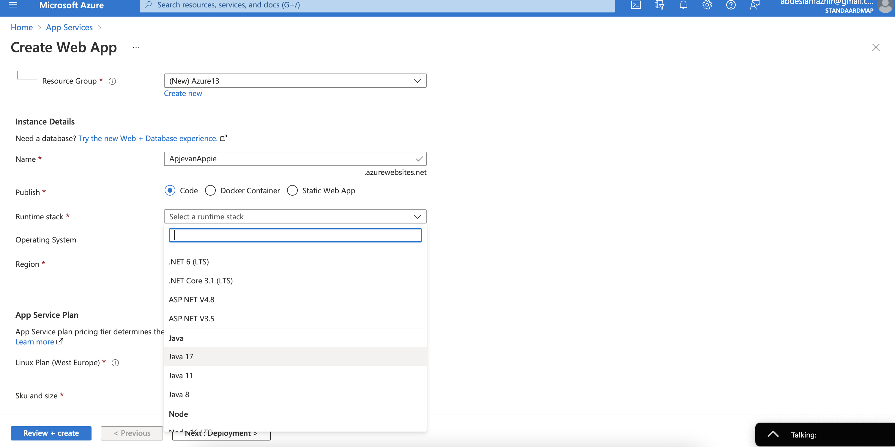
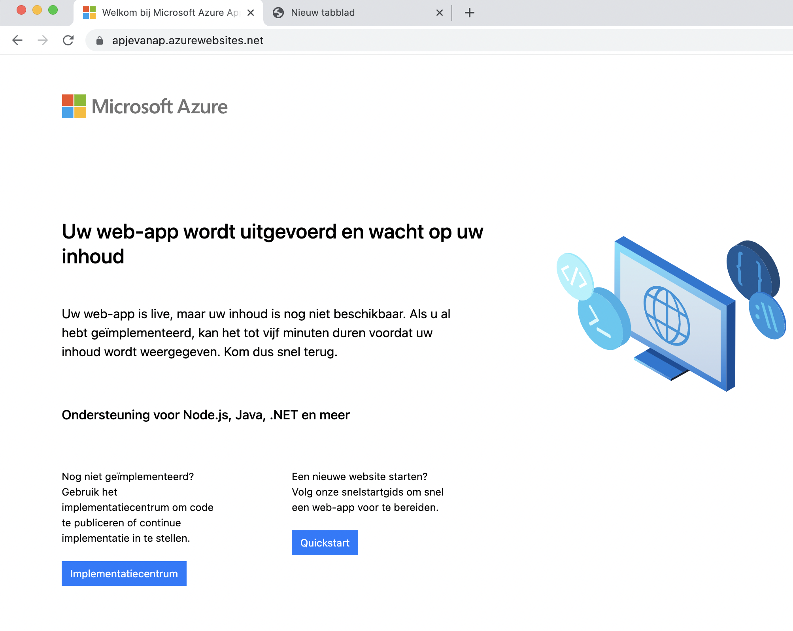

# Azure App Service 

Azure App Service is an HTTP-based service for hosting web applications, REST APIs, and mobile back ends.

With Azure App Service, you can build apps faster with a unique cloud service so you can quickly and easily create enterprise-grade web and mobile apps for any platform or device and deploy them in a scalable and reliable cloud infrastructure.

Azure App Service is a fully managed platform as a service (PaaS) offering for developers.

Azure runs App Services on a fully managed set of virtual machines in either a dedicated or shared mode, based on your App Service Plan. There are 4 types of App Services:

- Web App – used for hosting websites and web applications 

- API App – used for hosting the RESTful APIs

 - Logic App – used for business process automation, system integration and sharing data across clouds

 - Mobile App – used for hosting mobile app back ends )

--- 
---

### Some key features:

- Multiple languages and frameworks 
  - App Service has first-class support for ASP.NET, ASP.NET Core, Java, Ruby, Node.js, PHP, or Python. It can also run PowerShell and other scripts or executables as background services.

  

- Managed production environment 
  - App Service automatically patches and maintains the OS and language frameworks.

- Visual Studio and Visual Studio Code integration
  - Dedicated tools in Visual Studio and Visual Studio Code streamline the work of creating, deploying, and debugging.

 - Application templates
   - Choose from an extensive list of application templates in the Azure Marketplace, such as WordPress, Joomla, and Drupal.

- Connections to SaaS platforms and on-premises data
  - Choose from more than 50 connectors for enterprise systems (such as SAP), SaaS services (such as Salesforce), and internet services (such as Facebook). Access on-premises data using Hybrid Connections and Azure Virtual Networks.

- Containerization and Docker
  - Dockerize your app and host a custom Windows or Linux container in App Service. Run multi-container apps with Docker Compose. Migrate your Docker skills directly to App Service.

  - Global scale with high availability
    - Scale up or out manually or automatically. Host your apps anywhere in Microsoft's global datacenter infrastructure, and the App Service SLA promises high availability.

 - DevOps optimization
   - Set up continuous integration and deployment with Azure DevOps, GitHub, BitBucket, Docker Hub, or Azure Container Registry. Promote updates through test and staging environments. Manage your apps in App Service by using Azure PowerShell or the cross-platform command-line interface (CLI).

   

---
---

## Azure App Service Plan

  In App Service (Web Apps, API Apps, or Mobile Apps), an app always runs in an App Service plan. In addition, Azure Functions also has the option of running in an App Service plan. An App Service plan defines a set of compute resources for a web app to run. 

One or more apps can be configured to run on the same computing resources (or in the same App Service plan).

When you create an App Service plan in a certain region (for example, West Europe), a set of compute resources is created for that plan in that region. Whatever apps you put into this App Service plan run on these compute resources as defined by your App Service plan. Each App Service plan defines:

 - Operating System (Windows, Linux)
 - Region (West US, East US, etc.)
 - Number of VM instances
 - Size of VM instances (Small, Medium, Large)
Pricing tier (Free, Shared, Basic, Standard, Premium, PremiumV2, PremiumV3, Isolated, IsolatedV2)

The pricing tier of an App Service plan determines what App Service features you get and how much you pay for the plan. The pricing tiers available to your App Service plan depend on the operating system selected at creation time. There are a few categories of pricing tiers:

- Shared compute: Free and Shared, the two base tiers, runs an app on the same Azure VM as other App Service apps, including apps of other customers. These tiers allocate CPU quotas to each app that runs on the shared resources, and the resources cannot scale out.

 - Dedicated compute: The Basic, Standard, Premium, PremiumV2, and PremiumV3 tiers run apps on dedicated Azure VMs. Only apps in the same App Service plan share the same compute resources. The higher the tier, the more VM instances are available to you for scale-out.

 - Isolated: This Isolated and IsolatedV2 tiers run dedicated Azure VMs on dedicated Azure Virtual Networks. It provides network isolation on top of compute isolation to your apps. It provides the maximum scale-out capabilities.

---
---

## Exercise

Study App Service.

---

### Sources

https://www.youtube.com/watch?v=vfLN-P8H0KA

https://docs.microsoft.com/en-us/azure/app-service/overview

https://docs.microsoft.com/en-us/azure/app-service/overview-hosting-plans

https://stackify.com/comparison-azure-app-services-vs-cloud-services/

https://www.qovery.com/blog/best-aws-elastic-beanstalk-alternatives-for-2022
---

### Results

Creating a Web App on the App Service environment in the Azure Portal

Chose to run it with Python

After deployment 

The website is live

### Comparison

The three main app hosting platforms providing PaaS are Azure App Service and AWS Elastic Beanstalk and Google's App Engine

- Similarities:

  - Platform As A Service (PaaS)

  - No need to manage or maintain underlying infrastructure

  - You get actionable insights and analytics

  

  