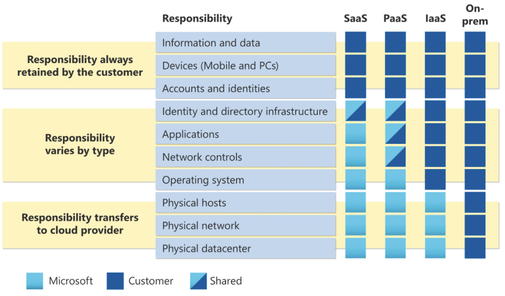
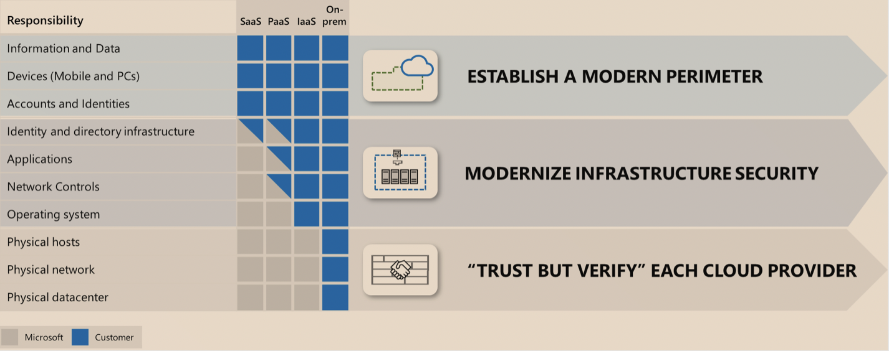

# Shared Responsibility Model

If you manage a data center yourself, you can rest assured that you are responsible for everything from physical security to the security and encryption of your data. But also the maintenance and management of the building where you have your data center and all the staff that is needed for this.
Many of these responsibilities are taken over in the Cloud. The Cloud Provider is then responsible for the physical matters of your infrastructure. And you, as a customer, can rent this infrastructure without having to worry about it.

However, this is not a license. You, as a customer, are still responsible for what you do on this leased infrastructure. These are responsibilities such as access control to data and software, encryption of data at rest and data in transit.
How much responsibilities lie with the customer also depends on what kind of service is purchased. However, there remain responsibilities that are always for the customer.

The Cloud provider extra offers extra services with which you can manage your own responsibilities more easily.

## Key terminology

- IaaS - Infrastructure as a service is a type of cloud computing service that provides critical computing, storage, and networking resources on demand. You pay for what you use. Suitable for: Web servers and VMs

- PaaS : Platform as a Service is a complete cloud-based development and deployment environment, with resources that enable you to deliver everything from simple cloud applications to advanced, cloud-enabled enterprise applications. PaaS includes infrastructure (servers, storage, networking) as well as middleware, development tools, business intelligence (BI) services, database management systems, and more. PaaS is designed to support every stage of a web application's lifecycle: development, testing, deployment, and updating. Suitable for Apps and Business intelligence tools

- SaaS: Software as a Service allows users to connect to and use applications in the cloud over the Internet. Examples are e-mail, calendar functions and office software.

## Exercise

Study the Azure Shared Responibility Model

### Sources

https://docs.microsoft.com/NL-NL/azure/security/fundamentals/shared-responsibility

https://docs.microsoft.com/nl-nl/azure/architecture/framework/security/overview

https://azure.microsoft.com/nl-nl/overview/serverless-computing/

https://azure.microsoft.com/nl-nl/overview/what-is-iaas/

https://azure.microsoft.com/nl-nl/overview/what-is-paas/

https://azure.microsoft.com/nl-nl/overview/what-is-saas/

### Overcome challanges

 None.

### Results

Shared responsibility model: 

As computing environments move from customer-managed data centers to the cloud, so does the responsibility of security. Operating environment security is now a responsibility shared by cloud providers and customers. Organizations can reduce focus on activities that are not core competencies for businesses by moving these responsibilities to a cloud service such as Azure. Depending on the specific technology options, some protections may be built into the respective service while other protections remain the responsibility of the customer. To ensure appropriate security controls are in place, organizations must carefully evaluate services and technology choices.

Regardless of the type of implementation, the following responsibilities always lie with the customer:

- Data

- Endpoints

- Account

- Access Control

