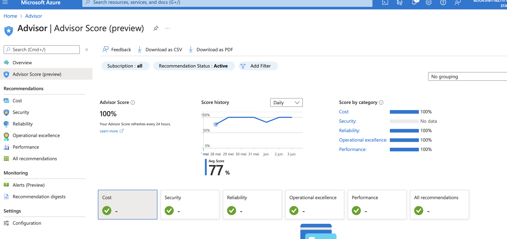

# Azure Advisor

Advisor is a personalized cloud consultant that helps you follow best practices to optimize your Azure deployments. It analyzes your resource configuration and usage telemetry and then recommends solutions that can help you improve the cost effectiveness, performance, Reliability (formerly called High availability), and security of your Azure resources.

With Advisor, you can:
Get proactive, actionable, and personalized best practices recommendations.
Improve the performance, security, and reliability of your resources, as you identify opportunities to reduce your overall Azure spend.
Get recommendations with proposed actions inline.

## Key terminology

## Exercise

Study Azure Advisor

### Advisor Dashboard

The Advisor dashboard displays personalized recommendations for all your subscriptions. You can apply filters to display recommendations for specific subscriptions and resource types. The recommendations are divided into five categories:

- Reliability: To ensure and improve the continuity of your business-critical applications. 

- Security: To detect threats and vulnerabilities that might lead to security breaches. 

- Performance: To improve the speed of your applications. 

- Cost: To optimize and reduce your overall Azure spending. 

- Operational Excellence: To help you achieve process and workflow efficiency, resource manageability and deployment best practices. 

---
---

### Advisor Score

Advisor Score helps you:

Understand the current state of your optimization posture.

Advisor Score is calculated on a scale from 0% - 100% in aggregate and for each of the five Advisor categories. A score of 100% means all your resources tracked by Advisor follow all the best practices recommended in Advisor. A score of 0% means that none of your resources follow the recommended best practices. Advisor Score weighs all resources those with and without active recommendations by their individual cost relative to your total spend. This builds on the assumption that the resources which consume a greater share of your total investment in Azure are more critical to your workloads. Advisor Score also adds weight to resources with longstanding recommendations.

---
---

The Advisor in the Azure Portal

### Sources

https://docs.microsoft.com/en-us/azure/advisor/advisor-overview