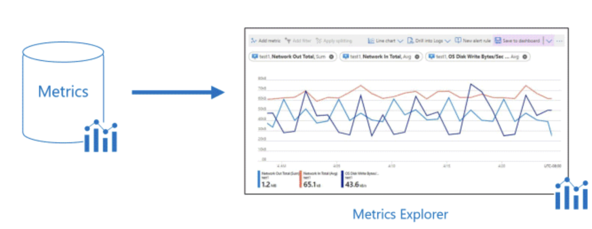
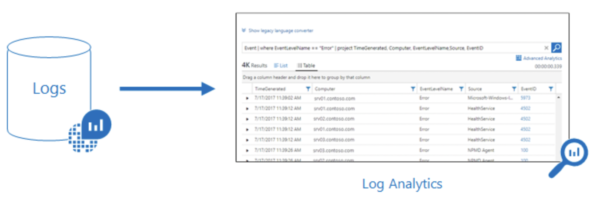
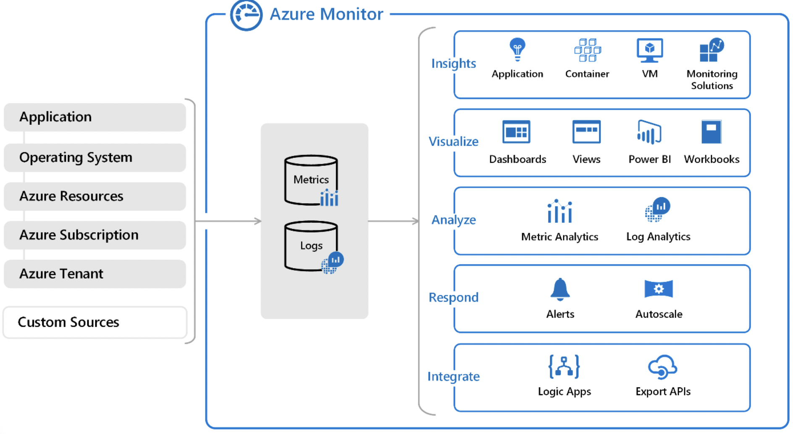
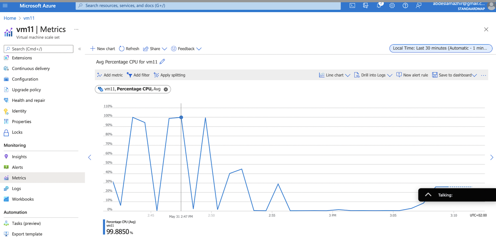
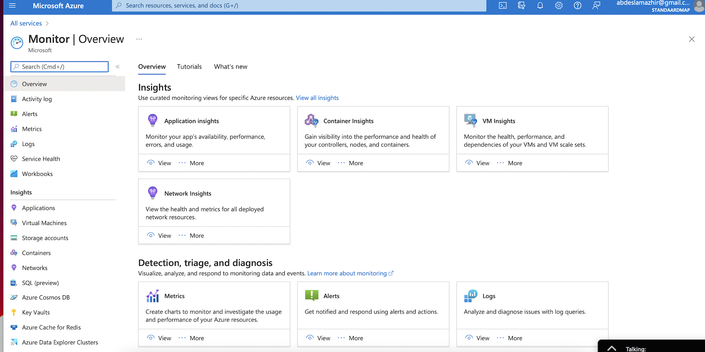
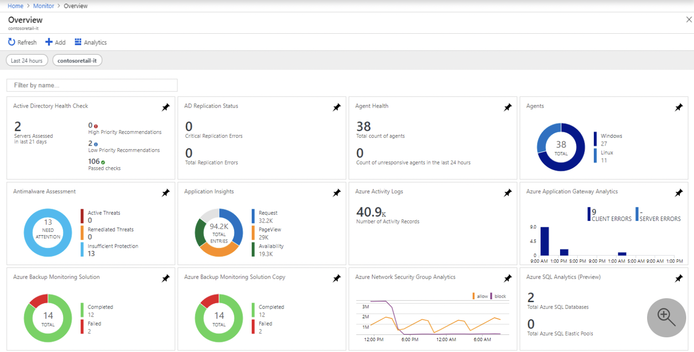

# Azure Monitor

### What is Azure Monitor

Azure Monitor is a powerful reporting and analytics tool. It maximizes the availability and performance of your applications by delivering a comprehensive solution for collecting, analyzing, and acting on telemetry from your cloud and on-premises environments. It helps you understand how your applications are performing and proactively identifies issues affecting them and the resources they depend on. Use it for insights into the behavior and running of your environment and applications. You can then respond proactively to the faults in your system.

## Key terminology

- Metrics: Metrics are measures of a resource’s certain characteristics over a given period. For instance, CPU utilization, disk IOPS, number of connections, etc. These are typically real-time, and since they are stored as values with a standard collection interval, they are ideally suitable for viewing as graphs to help you view results over time.

- Logs: Logs contain time-stamped information about changes made to resources. The type of information recorded varies by log source. The log data is organized into records, with different sets of properties for each type of record. The logs can include numeric values such as Azure Monitor metrics, but most include text data rather than numeric values.

---

### How does Azure Monitor work?

Azure Monitor receives data from target resources like applications, operating systems, Azure resources, Azure subscriptions, and Azure tenants. The nature of the resource defines which data types are available. A data type will be a metric, a log, or both a metric and a log. These data can further be processed to perform different functions such as analysis, visualization, alerting, automation and integrations.

- The focus for metric-based data types is the numerical time-sensitive values that represent some aspect of the target resource.

- The focus for log-based data types is the querying of content data held in structured, record-based log files that are relevant to the target resource.

The following diagram gives a high-level view of Azure Monitor. On the left are the sources of monitoring data: Azure, operating systems, and custom sources. At the center of the diagram are the data stores for metrics and logs. On the right are the functions that Azure Monitor performs with this collected data, such as analysis, alerting, and streaming to external systems.

## Exercise

Study Azure Monitor.

---

### Results

In the exercise [11 Azure Load Balancer (ALB) & Auto Scaling](https://github.com/TechGrounds-Cloud8/cloud8-abdeslamazhir/blob/main/Week%205%20Cloud%20Fundamentals/AZ%2011%20ALB%2C%20Autoscaling.md) I used the Azure Monitor to see the metrics of the CPU ussage of my instances.

---

The overview of the Monitor in my Azure Portal.

---

Example 

---
---

### Sources

https://docs.microsoft.com/en-us/azure/azure-monitor/overview

https://www.serverless360.com/microsoft-azure-monitoring