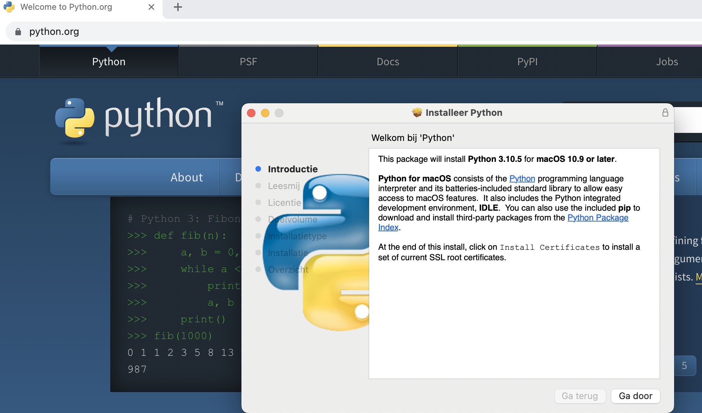
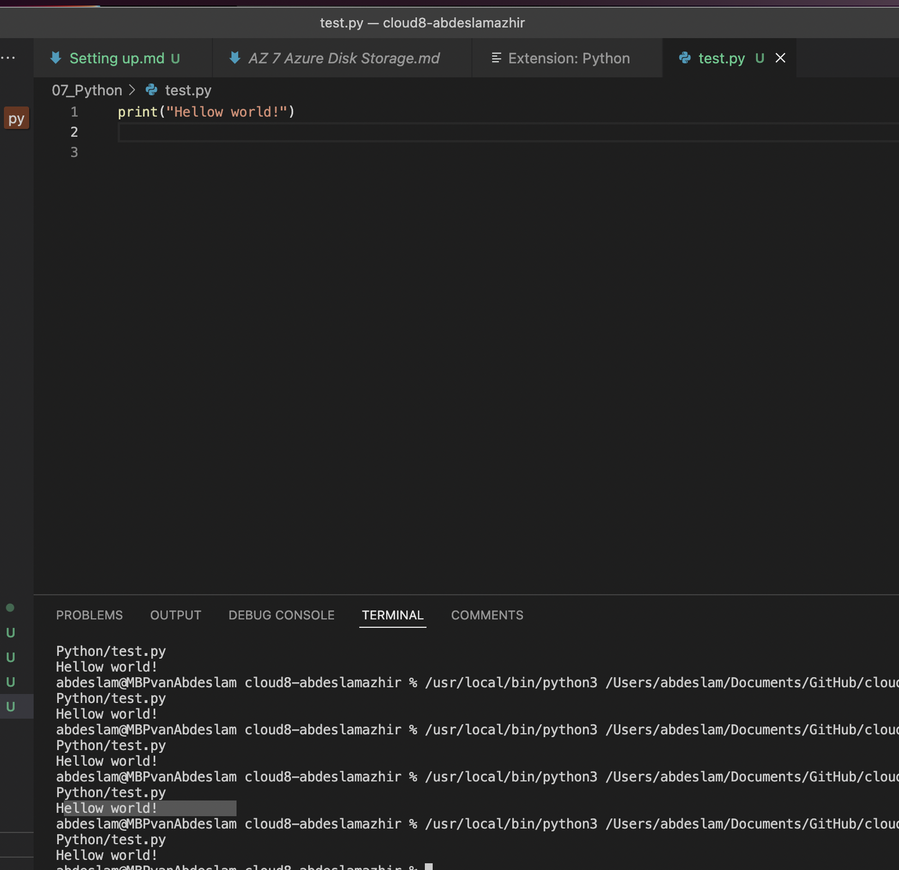

# Setting up

## Exercise

- Install the latest version of Python from https://www.python.org/
- Install VS Code from https://code.visualstudio.com/download
- Install the Python plug-in in VS Code.
- Write the following Python code. The output in the terminal should be the text “Hello world!”

### Results

[Hellow world!](https://github.com/TechGrounds-Cloud8/cloud8-abdeslamazhir/blob/main/07_Python/Scripts/01_Helloworld!.py)

### Sources

https://www.youtube.com/watch?v=9o4gDQvVkLU