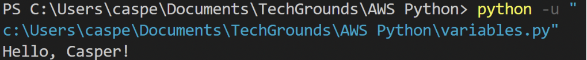
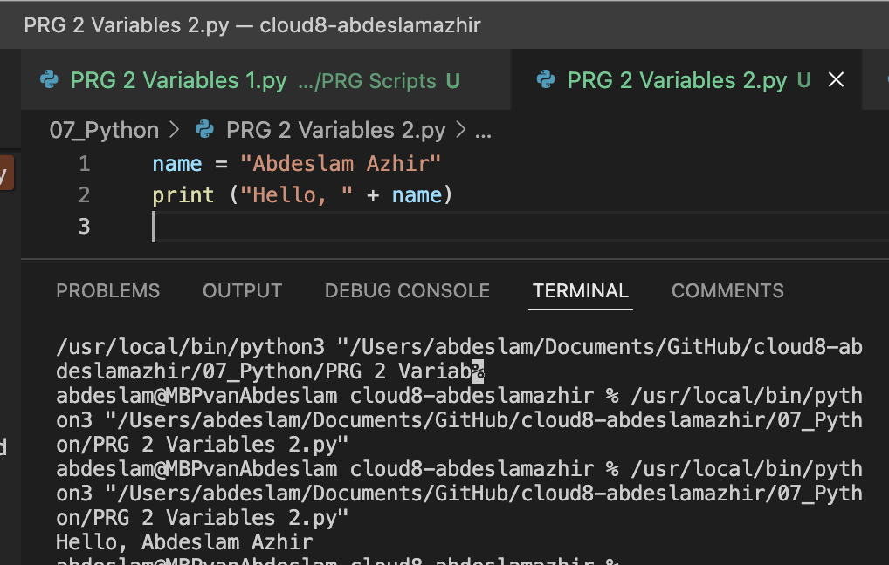

# Variables

## Exercise 1

- Create a new script.
- Create two variables x and y. Assign a numerical value to both variables.
- Print the values of x and y.
- Create a third variable named z. The value of z should be the sum of x and y.
- Print the value of z.

## Exercise 2

- Create a new script.
- Create a variable name. The value of name should be your name.
- Print the text “Hello, <your name here>!”. Use name in the print statement.
Example output:

Script:

    name = "Abdeslam Azhir"
    print ("Hello, " + name)

## Exercise 3

### Results

### Sources