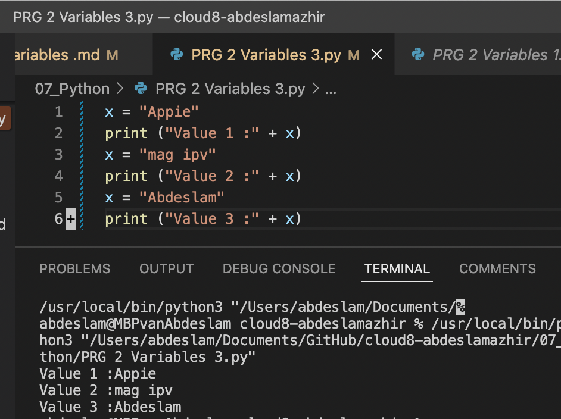

# Variables

## Exercise 1

- Create a new script.
- Create two variables x and y. Assign a numerical value to both variables.
- Print the values of x and y.
- Create a third variable named z. The value of z should be the sum of x and y.
- Print the value of z.

## Result 
Script:

    x = 5
    print (x)
    y = 20
    print (y)
    z = x + y
    print (z)

---
---

## Exercise 2

- Create a new script.
- Create a variable name. The value of name should be your name.
- Print the text “Hello, <your name here>!”. Use name in the print statement.
Example output:

## Result

Script:

    name = "Abdeslam Azhir"
    print ("Hello, " + name)

---
---

## Exercise 3

- Create a new script.
- Create a variable and assign a value to it.
- Print the text “Value 1: <value 1 here>”.
- Change the value of that same variable.
- Print the text “Value 2: <value 2 here>”.
- Change the value of that same variable.

## Results

Script:

    x = "Appie"
    print ("Value 1 :" + x)
    x = "mag ipv"
    print ("Value 2 :" + x)
    x = "Abdeslam"
    print ("Value 3 :" + x)

## Sources 

[Source](https://www.w3schools.com/python/python_variables.asp)