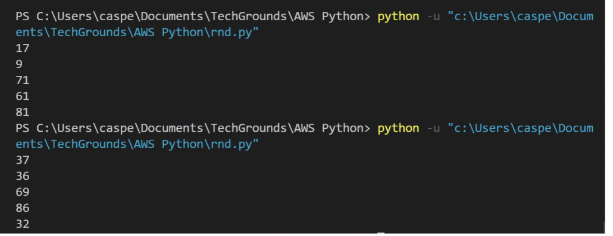
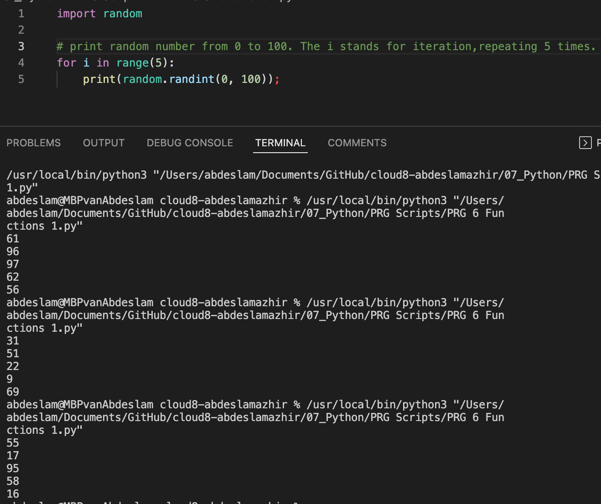
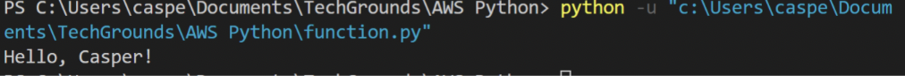
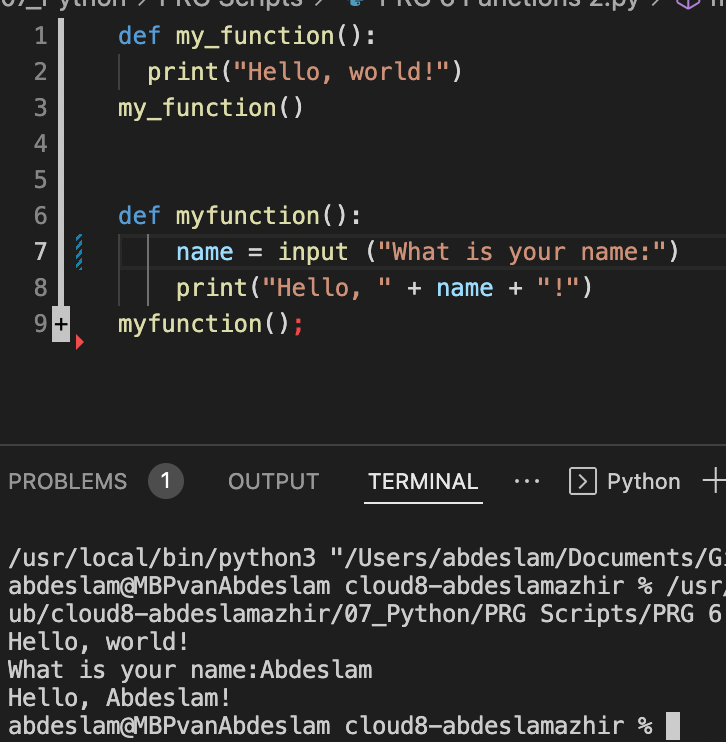

# Functions

You’ve already seen and used a couple of functions, like print() and input(). A function is a block of code that only runs when it is called. Functions are recognizable by the brackets () next to the function name. These brackets serve as a place to input data into a function.
Functions can return data as a result.

Besides the built-in functions, you can also write custom functions, or import functions from a library or package.

## Exercise 1

- Create a new script.
- Import the random package.
- Print 5 random integers with a value between 0 and 100.

    Example output:

### Results

[Code](https://github.com/TechGrounds-Cloud8/cloud8-abdeslamazhir/blob/main/07_Python/PRG%20Scripts/PRG%206%20Functions%201.py)

## Exercise 2

- Create a new script.
- Write a custom function myfunction() that prints “Hello, world!” to the terminal. Call myfunction.
- Rewrite your function so that it takes a string as an argument. Then, it should print “Hello, <string>!”.

    Example output:

### Results

[Code](https://github.com/TechGrounds-Cloud8/cloud8-abdeslamazhir/blob/main/07_Python/PRG%20Scripts/PRG%206%20Functions%202.py)

## Exercise 3

- Create a new script.
- Copy the code below into your script.

        def avg():
        # write your code here
 
        x = 128
        y = 255
        z = avg(x,y)
        print ("The average of",x,"and", y, "is", z)
- Write the custom function avg() so that it returns the average of the given parameters.

### Results

[Code]()

### Sources

[Random](https://www.codegrepper.com/code-examples/python/how+to+use+random+in+python)

