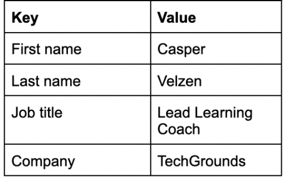
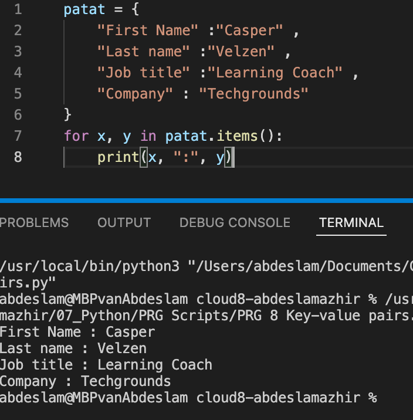
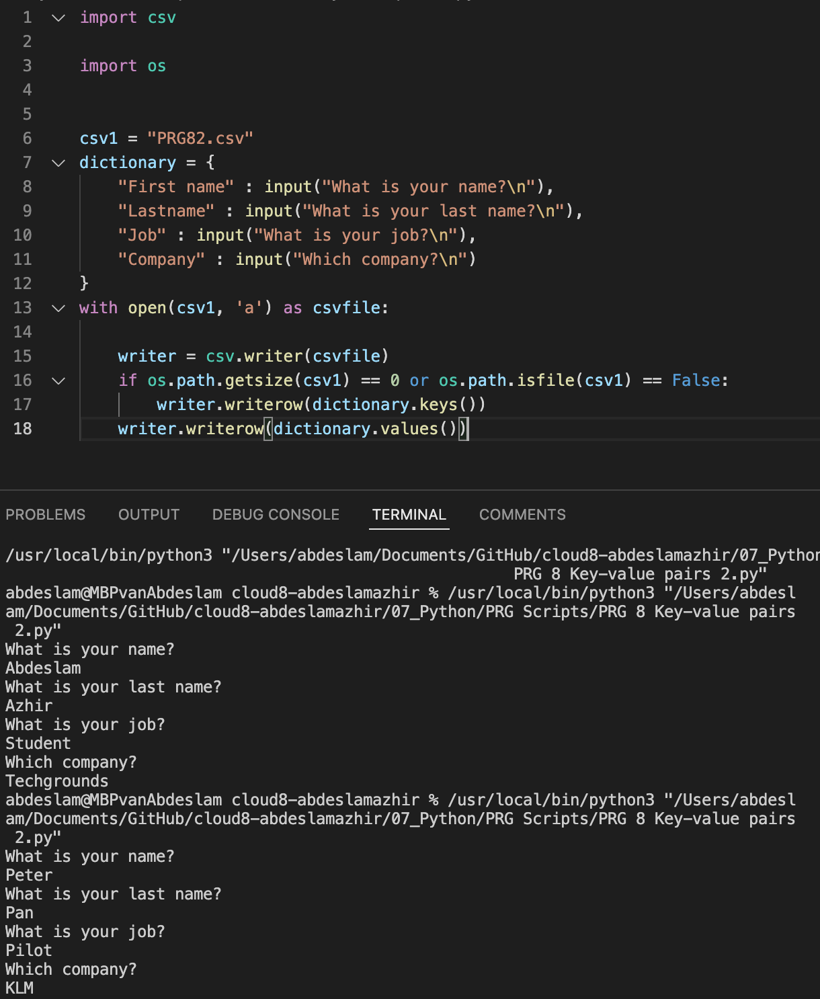
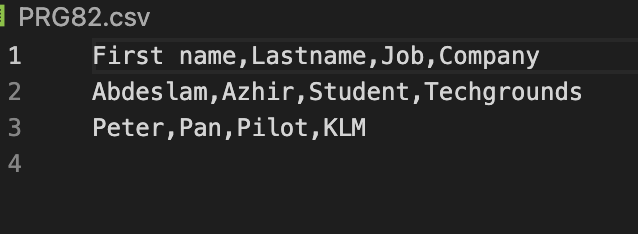

# Key-value pairs

Key-value pairs are a general concept you will definitely encounter. Some examples of where you will find them are NoSQL databases or AWS resource tags. Dictionaries (dict) in Python also use key-value pairs to store information.

Dicts in Python are written using curly brackets {}. You can get values from the dict by calling its key. 

## Exercise 1

- Create a new script.
-Create a dictionary with the following keys and values:

- Loop over the dictionary and print every key-value pair in the terminal.

### Results
[Code](https://github.com/TechGrounds-Cloud8/cloud8-abdeslamazhir/blob/main/07_Python/PRG%20Scripts/PRG%208%20Key-value%20pairs%201.py)

## Exercise 2

- Create a new script.
- Use user input to ask for their information (first name, last name, job title, company). Store the information in a dictionary.
- Write the information to a csv file (comma-separated values). The data should not be overwritten when you run the script multiple times.

### Results
[Code](https://github.com/TechGrounds-Cloud8/cloud8-abdeslamazhir/blob/main/07_Python/PRG%20Scripts/PRG%208%20Key-value%20pairs%202.py)

[csv file](https://github.com/TechGrounds-Cloud8/cloud8-abdeslamazhir/blob/main/PRG82.csv)

