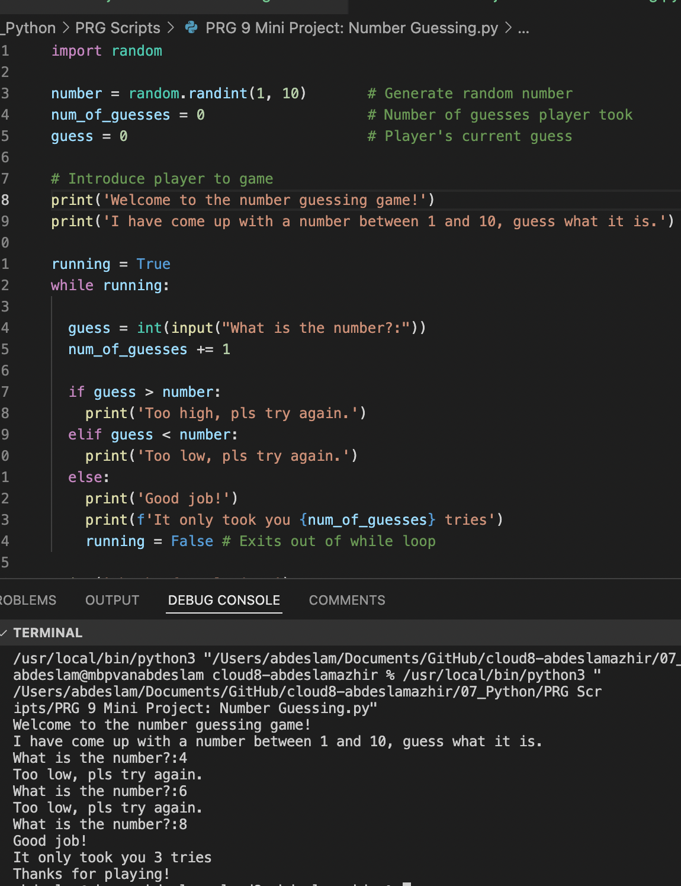

# Mini Project: Number Guessing

## Exercise

- Generate a random number between 1 and 100 (or any other range).
- The player guesses a number. For every wrong answer the player receives a clue.
- When the player guesses the right number, display a score.

### Results

[code](https://github.com/TechGrounds-Cloud8/cloud8-abdeslamazhir/blob/main/07_Python/PRG%20Scripts/PRG%209%20Mini%20Project:%20Number%20Guessing.py)

