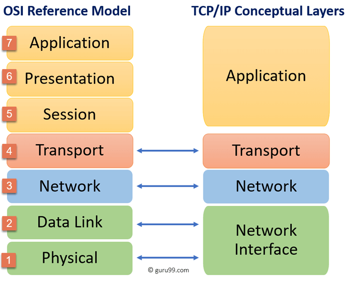

# Networking OSI stack
This exercise is about understanding nework models. 
The OSI model and the TCP/IP model and there uses.

## Key terminology

The OSI Model - (Open Systems Interconnection Model) is a conceptual framework used to describe the functions of a networking system. It had 7 layers.

Application Layer - Layer closest to the end-user.To identify communication partners, determine the availability of resources and synchronize communucation.

Presentation Layer - Trandlates data for the application layer for the network.

Session Layer - Handles the management, establishment, and termination of connections between to end-users of a network.

Transport Layer - Ensures complete data transfer between end-users.

Network Layer - Provides routing and switching technologies that route variable lengt data packets from the source to the destination network.

Data Link Layer - Provides the transmission protocol that contols the data flow between network devices

Physical Layer - Devines devices' electrical and physical aspects, for example, cables, connectors, electrical signals etc.

TCP-IP model - Takes its name from two of its protocols, the Transmission Control Protocol (TCP) and the Internet Protocol (IP).

## Exercise

Study:
The OSI model and its uses.

The TCP/IP model and its uses.

### Sources

https://www.networkworld.com/article/3239677/the-osi-model-explained-and-how-to-easily-remember-its-7-layers.html

https://www.networkworld.com/article/3239677/the-osi-model-explained-and-how-to-easily-remember-its-7-layers.html

https://www.guru99.com/difference-tcp-ip-vs-osi-model.html#7

https://www.cloudflare.com/learning/ddos/glossary/open-systems-interconnection-model-osi/

https://www.geeksforgeeks.org/tcp-ip-model/

### Overcome challanges
None.

### Results

The OSI model is used primarily as a reference model and not used in real.

The TCP/IP is a simplified implementation of the theoretical OSI model.

The OSI Model is just a reference/logical model. It was designed to describe the functions of the communication system by dividing the communication procedure into smaller and simpler components. The TCP/IP model, was designed and developed by Department of Defense (DoD) in 1960s and is based on standard protocols. It stands for Transmission Control Protocol/Internet Protocol. The TCP/IP model is a concise version of the OSI model. It contains four layers, unlike seven layers in the OSI model. The layers are:

Process/Application Layer

Host-to-Host/Transport Layer

Internet Layer

Network Access/Link Layer

The 7 layers of the OSI model

Comparison of the two models

