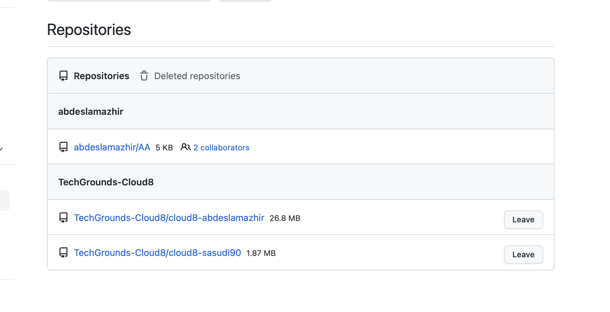

# Git and Github
Git is software for tracking changes in any set of files, usually used for coordinating work among programmers collaboratively developing source code during software development. Its goals include speed, data integrity, and support for distributed, non-linear workflows (thousands of parallel branches running on different systems) 

GitHub is a website and cloud-based service that helps developers store and manage their code, as well as track and control changes to their code.

## Key terminology

Repository - A central file storage location. It is used by version control systems to store multiple versions of files. While a repository can be configured on a local machine for a single user, it is often stored on a server, which can be accessed by multiple users.

Main / Master - In Git, "master" is a naming convention for a branch. After cloning (downloading) a project from a remote server, the resulting local repository has a single local branch: the so-called "master" branch. This means that "master" can be seen as a repository's "default" branch.

Branch – A version of the repository that diverges from the main working project

Commit - Used to record the changes in the repository.

Push / Pull - The term pull is used to receive data from GitHub. It fetches and merges changes from the remote server to your working directory. The git pull command is used to pull a repository.

Merge - A command that allows you to merge branches from Git.

Fork - A copy of a repository. Forking a repository allows you to freely experiment with changes without affecting the original project.

## Exercise
### Sources
https://en.wikipedia.org/wiki/Git

https://www.w3schools.com/git/default.asp

https://www.youtube.com/watch?v=hwP7WQkmECE

https://kinsta.com/knowledgebase/what-is-github/

https://www.javatpoint.com/git-pull

### Overcome challanges
It's the first time I've heard of such terms. With the help of Youtube videos, a lot of google search I was able to understand it.

### Results
-Created a Github account

-Made a repository, invited my teammates and gave them permissions to acces.

-Cloned the repository

See the screenshot below.

 

