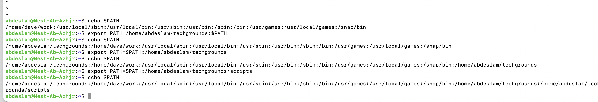
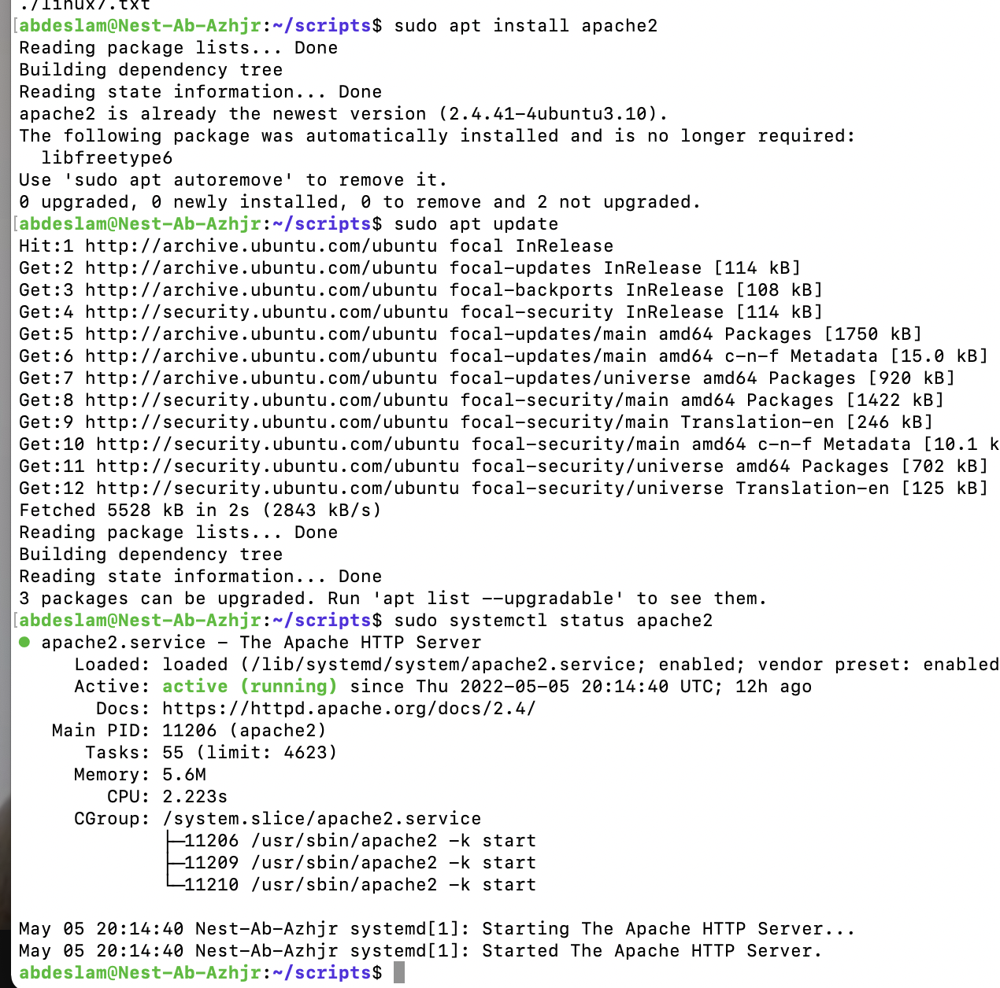
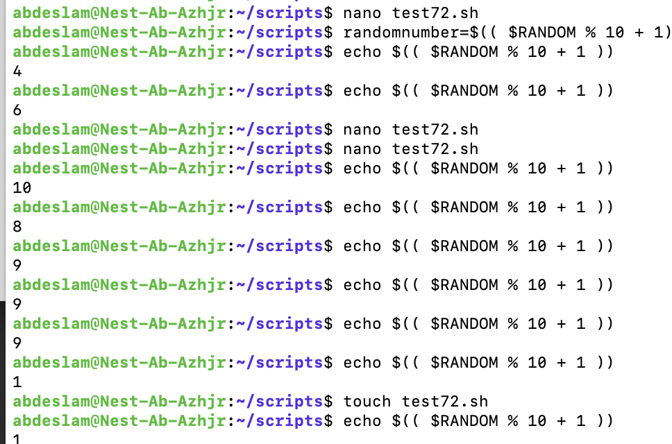
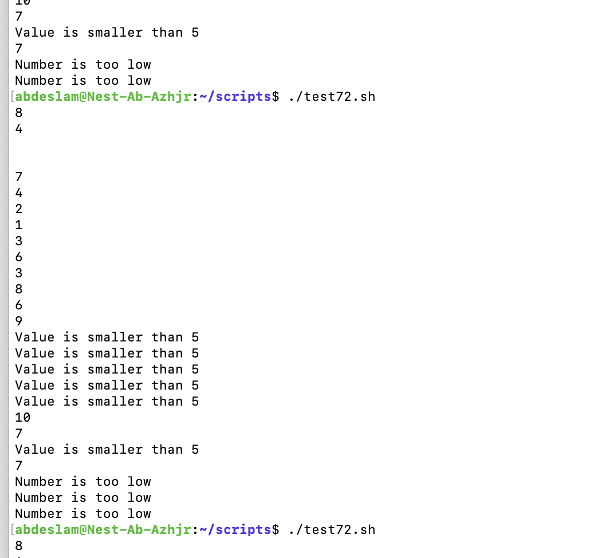

# Bash scripting

Creating a directory and adding it to the PATH variable. 
Installing apache and creating s script that generates a random number and also indicates when a number is lower dan 5.

## Key terminology
Bash - Bourne again Shell,a command language.

PATH -  A variable in Linux and other Unix-like operating systems that tells the shell which directories to search for executable files

## Exercise

1

-Create a directory called ‘scripts’. Place all the scripts you make in this directory.
Add the scripts directory to the PATH variable.

-Create a script that appends a line of text to a text file whenever it is executed.

-Create a script that installs the httpd package, activates httpd, and enables httpd. Finally, your script should print the status of httpd in the terminal.

2

-Create a script that generates a random number between 1 and 10, stores it in a variable, and then appends the number to a text file.

3 

-Create a script that generates a random number between 1 and 10, stores it in a variable, and then appends the number to a text file only if the number is bigger than 5. If the number is 5 or smaller, it should append a line of text to that same text file instead.

### Sources
https://www.howtogeek.com/658904/how-to-add-a-directory-to-your-path-in-linux/

https://stackoverflow.com/questions/1194882/how-to-generate-random-number-in-bash

https://www.cyberciti.biz/faq/linux-install-and-start-apache-httpd/

https://linuxize.com/post/bash-append-to-file/

https://blog.eduonix.com/shell-scripting/generating-random-numbers-in-linux-shell-scripting/

https://linuxhint.com/generate-random-number-bash/

https://httpd.apache.org/docs/2.4/install.html

### Overcome challanges
Had to find out how to use exactly the right code.

### Results

