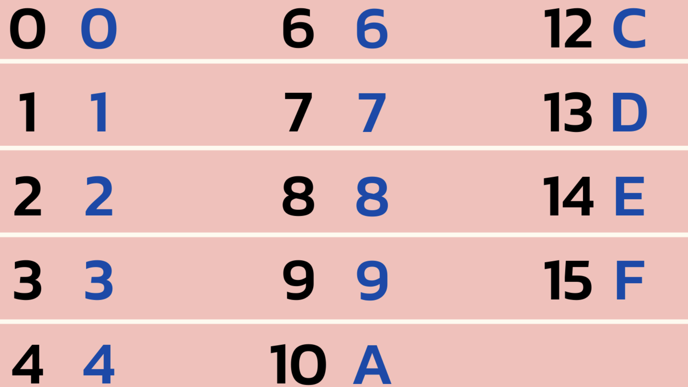

# Counting in Binary and Hex

Learn about how to count in binary and hex. Binary has just two options, the 1 and 0 and the hex (hexadecimal) has 16 symbols, 0-9 and a to f.

## Key terminology

Binary - Base 2, 0 or 1.

Decimal - Base 10, 0 to 9.

Hexadecimal -  Base 16, 0 to 9 and A to F.

## Exercise

Translate from Decimal to Binary.

Translate from Binary to Decimal.

Translate Decimal to Hexadecimal.

Translate Hexadecimal to Decimal.

### Sources

https://www.youtube.com/watch?v=R8bdSWiBsfw

https://stackoverflow.com/questions/19896167/converting-base-2-to-base-16

https://www.cuemath.com/numbers/decimal-to-binary/

https://www.permadi.com/tutorial/numDecToHex/

https://www.youtube.com/watch?v=izywvlnQfdE

### Overcome challanges

Trying to understand the base, and to find out how to to the translations manualy without a calculator.

### Results

