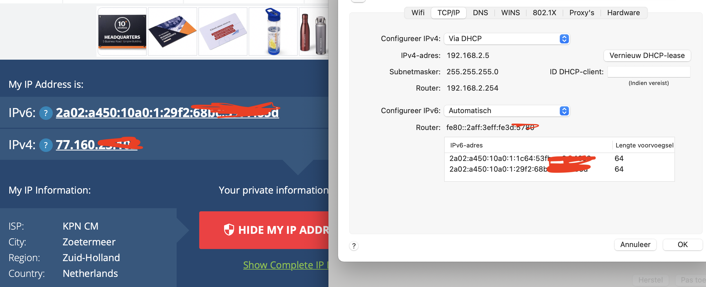
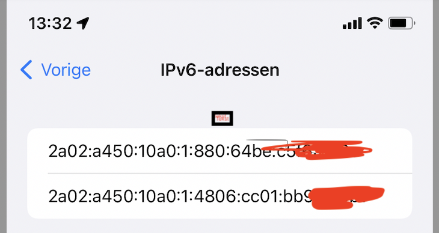
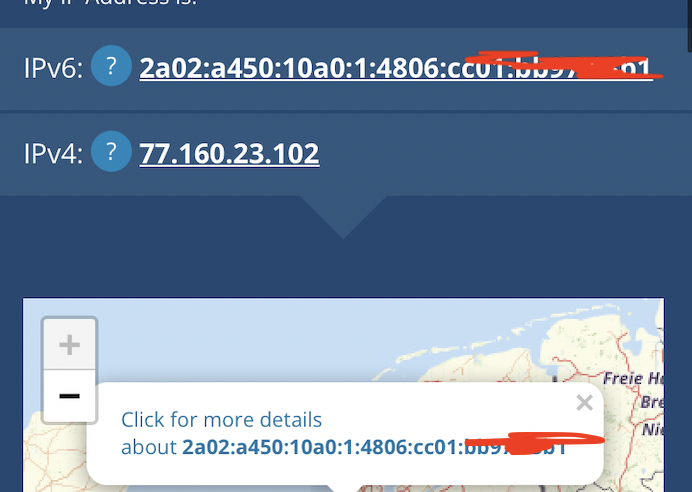

# IP Addresses
[Give a short summary of the subject matter.]

## Key terminology

IP Address - a unique address that identifies a device on the internet or a local network. IP stands for "Internet Protocol," which is the set of rules governing the format of data sent via the internet or local network. To send data from one computer to another through the web, a data packet must be transferred across the network containing the IP addresses of both devices.

IPv4 - Stands for Internet Protocol version 4. It is the underlying technology that makes it possible for us to connect our devices to the web. Whenever a device accesses the Internet, it is assigned a unique, numerical IP address
IPv4 uses a 32-bit address for its Internet addresses. That means it can provide support for 2^32 IP addresses in total around 4.29 billion. All 4.29 billion IP addresses have now been assigned, leading to the address shortage issues we face today.

IPv6 - IPv6 (Internet Protocol version 6) is the sixth revision to the Internet Protocol and the successor to IPv4. 
IPv6 utilizes 128-bit Internet addresses. Therefore, it can support 2^128 Internet addresses

Key benefits to IPv6 include:

No more NAT (Network Address Translation)

Auto-configuration

No more private address collisions

Better multicast routing

Simpler header format

Simplified, more efficient routing

True quality of service (QoS), also called "flow labeling"

Built-in authentication and privacy support

Flexible options and extensions

Easier administration (no more DHCP)

Public IP - A public IP address is an IP address that can be accessed directly over the internet and is assigned to your network router by your internet service provider (ISP). Your personal device also has a private IP that remains hidden when you connect to the internet through your router’s public IP.

Private IP - A private IP address is the address your network router assigns to your device. Each device within the same network is assigned a unique private IP address (sometimes called a private network address) — this is how devices on the same internal network talk to each other.

NAT - NAT stands for network address translation. It’s a way to map multiple local private addresses to a public one before transferring the information. Organizations that want multiple devices to employ a single IP address use NAT, as do most home routers.

Static IP - An address that doesn't change. Once your device is assigned a static IP address, that number typically stays the same until the device is decommissioned or your network architecture changes. Static IP addresses generally are used by servers or other important equipment.

Dynamic IP - Dynamic IP addresses are subject to change, sometimes at a moment's notice. Dynamic addresses are assigned, as needed, by Dynamic Host Configuration Protocol (DHCP) servers.
We use dynamic addresses because IPv4 doesn't provide enough static IP addresses to go around. So, for example, a hotel probably has a static IP address, but each individual device within its rooms would have a dynamic IP address.

## Exercise

Find out what your public IP address is for your laptop and mobile on WiFi.

Are the addresses the same or not? Explain why.

Find out what your private IP address is of your laptop and mobile on WiFi.

Are the addresses the same or not? Explain why.

Change the private IP address of your mobile to that of your laptop. What happens then?

Try changing your mobile's private IP address to an address outside your network. What happens then?

### Sources

https://www.comptia.org/content/guides/what-is-network-address-translation

https://www.avast.com/c-ip-address-public-vs-private

https://www.avast.com/c-static-vs-dynamic-ip-addresses

### Overcome challanges

Looking out al the key terms and to find out and change my own IP address.

### Results
As you can see ( or not) is the the IPv4 for both the mobile phone and laptop wifi are the same. on the other hand the IPv6 addresses are different.

