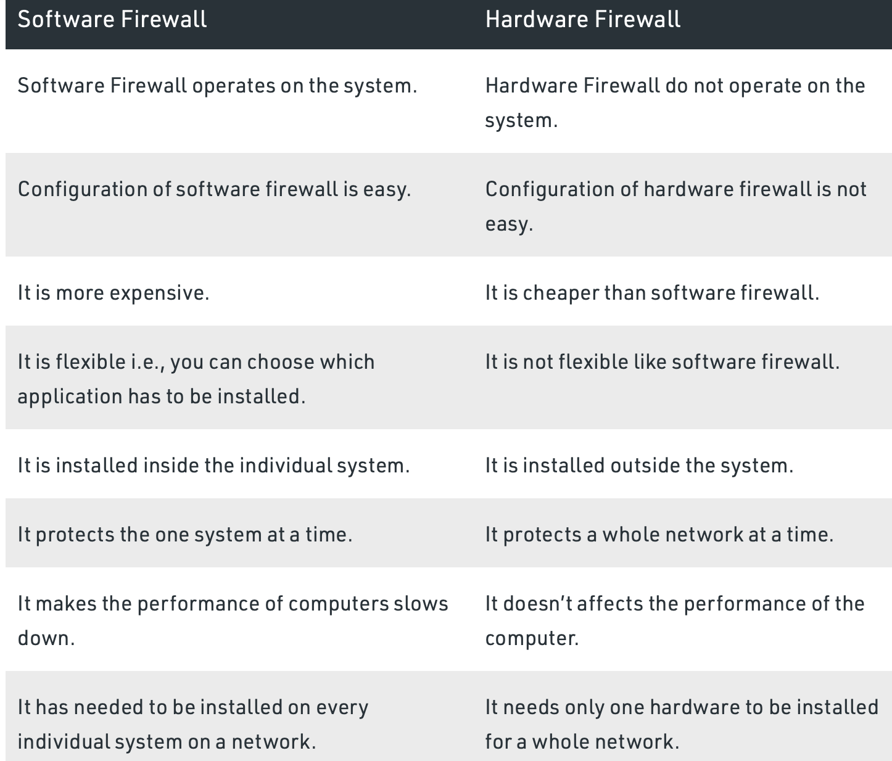
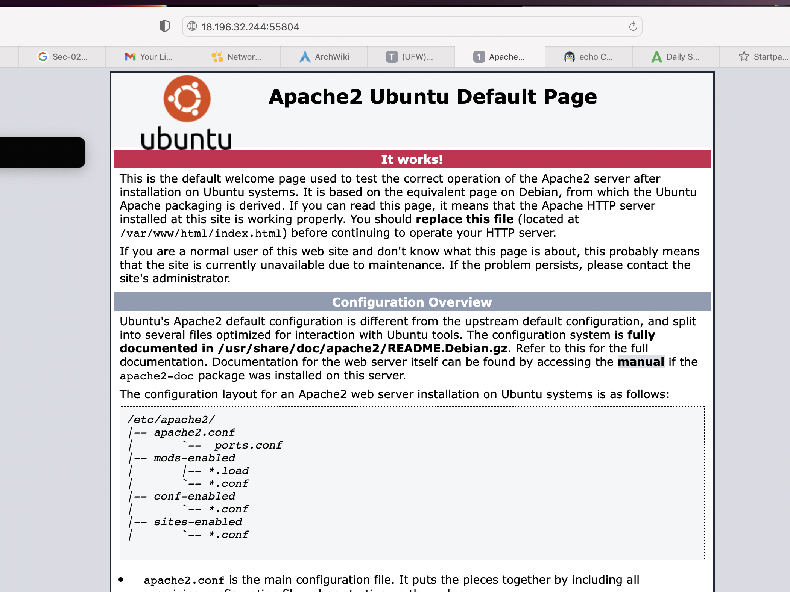
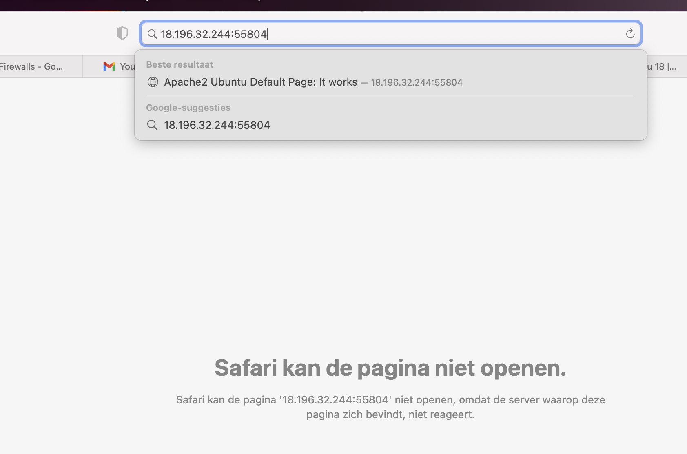
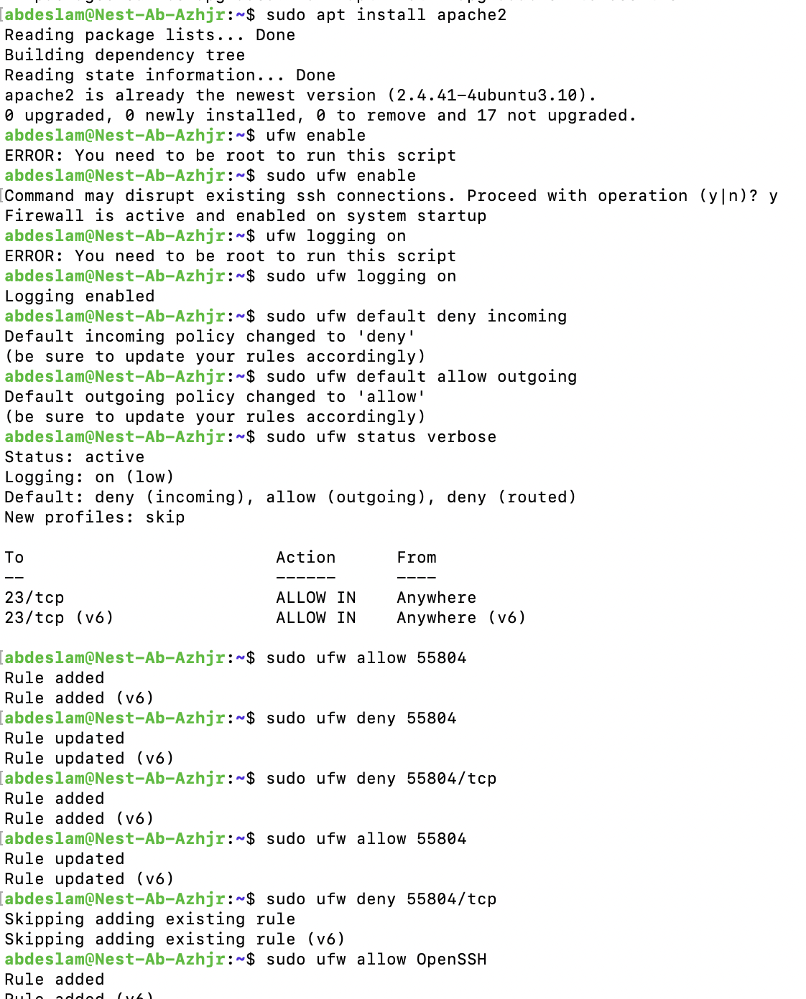

# Firewalls

Installing a webserver on the VM and setting up the firewall that it blocks web traffic exept ssh-traffic.

## Key terminology

Firewall - A firewall is a network security system or shielding layer that lies between the internet and the computer networks. A firewall typically set up a barrier between a trusted network and an untrusted network.

UFW - Uncomplicated Firewall, a front-end to iptables that aims to provide a more user-friendly interface than other firewall management utilities. UFW is well-supported in the Linux community, and is typically installed by default on many distributions.

Stateful firewall - Stateful firewalls monitor all aspects of the traffic streams, their characteristics and communication channels. These firewalls can integrate encryption or tunnels, identify TCP connection stages, packet state and other key status updates.

Stateless firewall - Stateless firewalls use clues from the destination address, source and other key values to assess whether threats are present, then block or restrict those deemed untrusted. Preset rules enforce whether traffic is permitted or denied, but the system is typically unable to determine the difference between truly desired communications and sophisticated attempts to disguise unauthorized communications as trusted ones

Software firewall - Software firewall is a special type of computer software runs on a computer/server. It’s main purpose is to protect your computer/server from outside attempts to control or gain access and depending on your choice of software firewall. Software firewall can also be configured for checking any suspicious outgoing requests. 

Hardware firewall - It is physical piece of equipment planned to perform firewall duties. A hardware firewall can be a computer or a dedicated piece of equipment which serve as a firewall. Hardware firewall are incorporated into the router that is situated between the computer and the internet gateway. 

Difference between Software and Hardware Firewalls.

## Exercise

Install a web server on your VM.

View the default page installed with the web server.

Set the firewall to block web traffic, but allow ssh traffic.

Check if the firewall is doing its job.

### Sources

https://www.cdw.com/content/cdw/en/articles/security/stateful-versus-stateless-firewalls.html

https://www.geeksforgeeks.org/difference-between-hardware-firewall-and-software-firewall/

https://www.transip.nl/knowledgebase/artikel/1937-uncomplicated-firewall-ufw-in-ubuntu/

https://www.digitalocean.com/community/tutorials/how-to-setup-a-firewall-with-ufw-on-an-ubuntu-and-debian-cloud-server

https://www.cyberciti.biz/tips/linux-iptables-4-block-all-incoming-traffic-but-allow-ssh.html

### Overcome challanges

None, the apache already was installed and just had to run the commands and with the help of teammates I knew what port I had to use.

### Results
Apache already was installed in the Linux exercise.

The default page is active and running.

The firewall is blocking web traffic.

