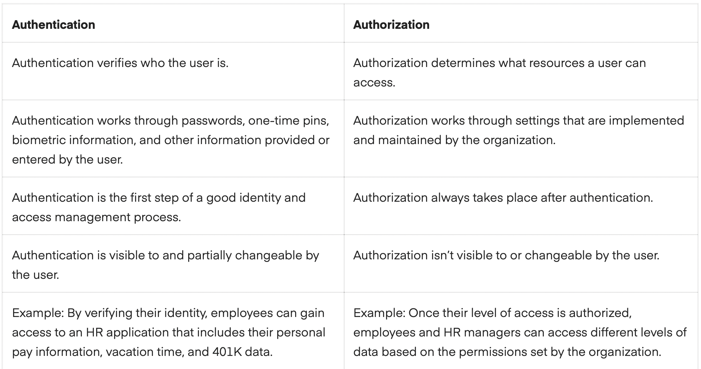
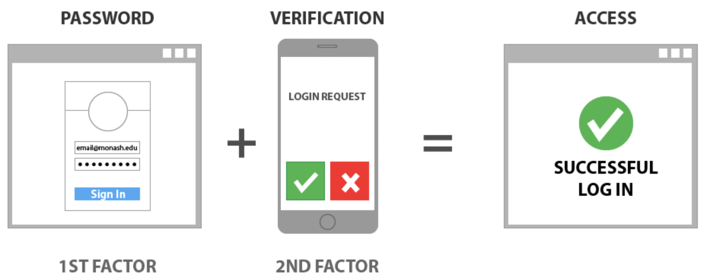
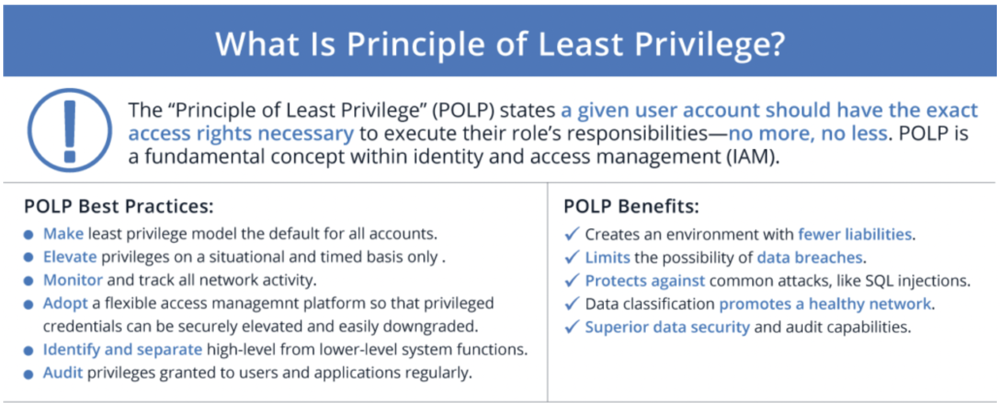

# Identity and Access Management (IAM)

- Learning  about the two steps of security, authentication and authorization and the differences between them.

- Reading about the three factors of authentication and how MFA improves security.

- What the principle of least privilege is and how it improves security.

## Key terminology

Authentication - The process of determining whether someone or something is, in fact, who or what it says it is. Authentication technology provides access control for systems by checking to see if a user's credentials match the credentials in a database of authorized users or in a data authentication server.

Authorization - Authorization is a security mechanism used to determine user/client privileges or access levels related to system resources, including computer programs, files, services, data and application features. Authorization is normally preceded by authentication for user identity verification. System administrators (SA) are typically assigned permission levels covering all system and user resources.

MFA - Multi-factor authentication uses a combination of the following factors: something you know, something you have, and something you are. 2FA is a subset of MFA.

SFA - Single-factor authentication - The simplest form of authentication method. With SFA, a person matches one credential to verify himself or herself online. The most popular example of this would be a password (credential) to a username. Most verification today uses this type of authentication method.

2FA - Two-factor authentication uses the same password/username combination, but with the addition of being asked to verify who a person is by using something only he or she owns, such as a mobile device. Putting it simply: it uses two factors to confirm an identity.

PoLP - Principle of Least Privilege also known as the principle of minimal privilege or the principle of least authority, is an information security concept. It states that any user, device, workload, or process should only have the bare minimum privileges it needs to perform its intended function.

## Exercise

The difference between authentication and authorization.

The three factors of authentication and how MFA improves security.

What the principle of least privilege is and how it improves security.

### Sources

https://www.techtarget.com/searchsecurity/definition/authentication

https://delinea.com/blog/sfa-mfa-difference

https://www.techopedia.com/definition/10237/authorization

https://www.sailpoint.com/identity-library/difference-between-authentication-and-authorization/

https://www.onelogin.com/learn/least-privilege-polp

https://www.checkpoint.com/cyber-hub/network-security/what-is-the-principle-of-least-privilege-polp/

https://www.tools4ever.com/glossary/what-is-principle-of-least-privilege/

### Overcome challanges

None, just had to look some things up. I am already familiar with some of the terms and have been using 2fa (Google Authenticator) for years.

### Results

Authentication is used to verify that users really are who they represent themselves to be. Once this has been confirmed, authorization is then used to grant the user permission to access different levels of information and perform specific functions, depending on the rules established for different types of users.

Authentication vs. Authorization

While user identity has historically been validated using the combination of a username and password, today’s authentication methods commonly rely upon three classes of information:

What you know: Most commonly, this is a password. But it can also be an answer to a security question or a one-time pin that grants user access to just one session or transaction. 

What you possess: This could be a mobile device or app, a security token, or digital ID card.

What you are: This is biometric data such as a fingerprint, retinal scan, or facial recognition.

Multi-Factor Authentication is a security system thay requires more than one level of authentication before they can be accessed. It was developed to add extra security steps to the login process. It means that users are properly verified before they can gain access to accounts.

PoLP offers additional security benefits:

- Stronger security : Before implementing POLP, organizations must first analyze current access levels for each end user. This process often reveals that many — and in some cases, most — end users have too much access in the first place, and it can be reduced accordingly.

- Thwarting malware : POLP can help contain malware to a single device or to a limited number of devices, which can give security teams the time they need to investigate, contain and remediate.
- Greater stability : POLP prevents end users with relatively low-level accounts from executing changes that would affect the entire system.
- Data classification: POLP helps organizations identify what data they have in their ecosystem, where it lives, and who has access to it.
- Audit readiness: POLP significantly simplifies and streamlines the auditing process.
