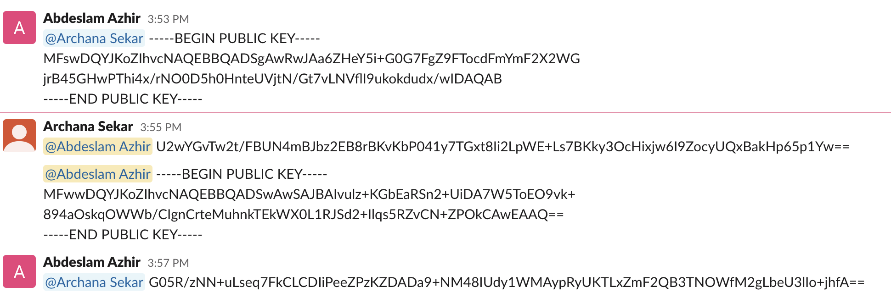
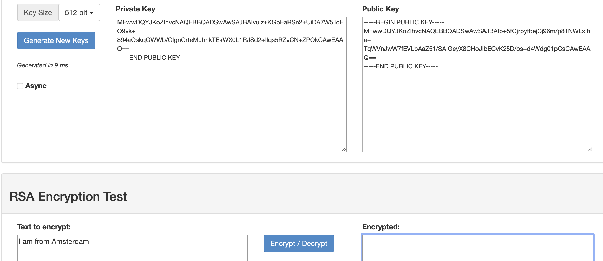

# Asymmetric encryption

Learning the difference between symmetric and assymetric encryption. We saw in the last exercise that symmetric encryption has it's disadvantage's.

## Key terminology

Asymmetric Encryption -
To address the problem of key exchange, another type of encryption was developed. Asymmetric encryption is also called public key encryption, but it actually relies on a key pair. Two mathematically related keys, one called the public key and another called the private key, are generated to be used together. The private key is never shared; it is kept secret and is used only by its owner. The public key is made available to anyone who wants it. Because of the time and amount of computer processing power required, it is considered “mathematically unfeasible” for anyone to be able to use the public key to re-create the private key, so this form of encryption is considered very secure.

Public key - A public key is a large numerical value that is used to encrypt data. The key can be generated by a software program, but more often, it is provided by a trusted, designated authority and made available to everyone through a publicly accessible repository or directory.

Private key - A private key, also known as a secret key, is a variable in cryptography that is used with an algorithm to encrypt and decrypt data. Secret keys should only be shared with the key's generator or parties authorized to decrypt the data. Private keys play an important role in symmetric cryptography, asymmetric cryptography and cryptocurrencies.

## Exercise

- Generate a key pair.
- Send an asymmetrically encrypted message to one of your peers via the public Slack channel. They should be able to decrypt the message using a key you share with them. The recipient should be able to read the message, but it should remain a secret to everyone else.
You are not allowed to use any private messages or other communication channels besides Slack. Analyse the difference between this method and symmetric encryption.

### Sources

https://www.techtarget.com/searchsecurity/definition/private-key

https://www.techtarget.com/searchsecurity/definition/public-key

### Overcome challanges

Had to figure out how the asymetric encryption works. 

### Results

After creating a key pair my teammate and I shared our public key with each other and the enctrypted message over the public chat.

With the private key  we could decrypt the message.

Generating a public key in the VM with GPG

