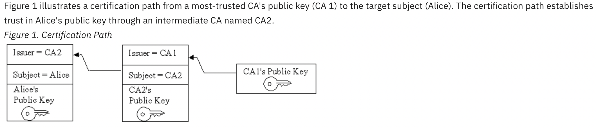
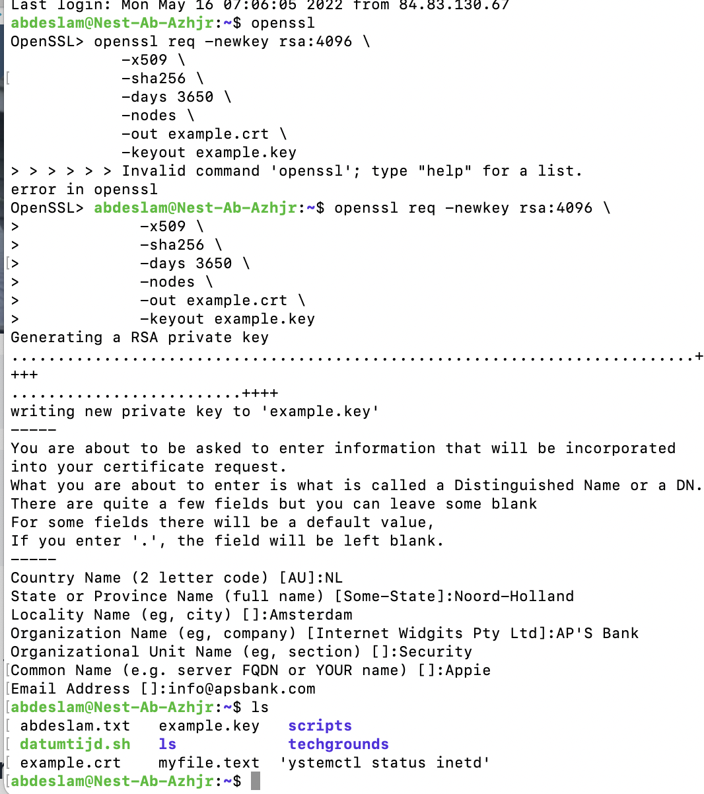
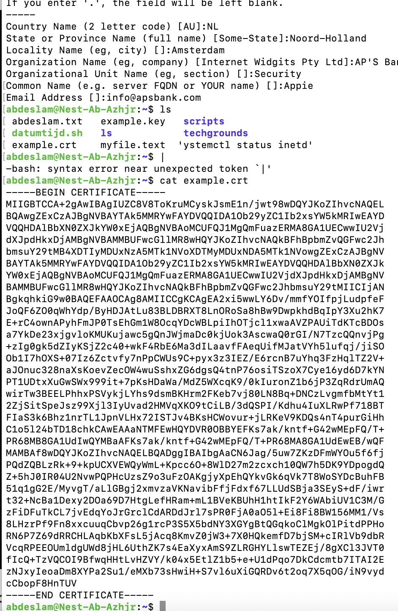
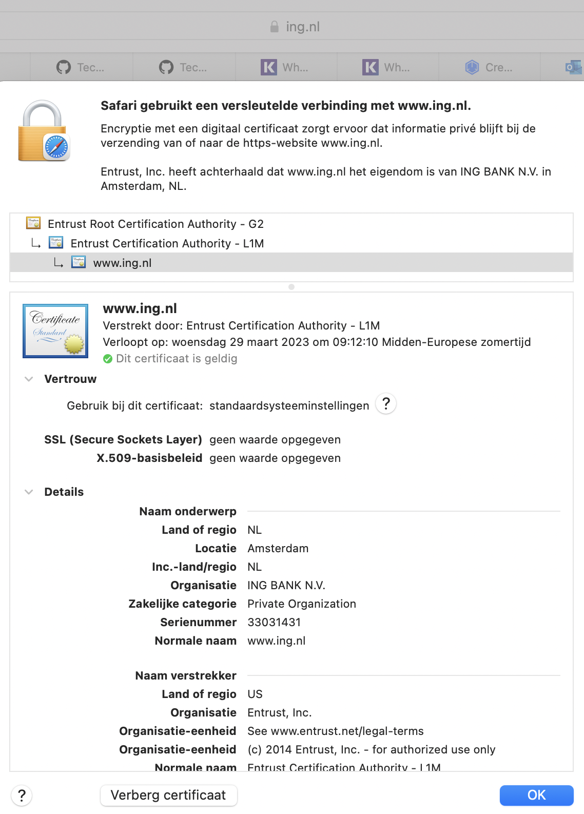
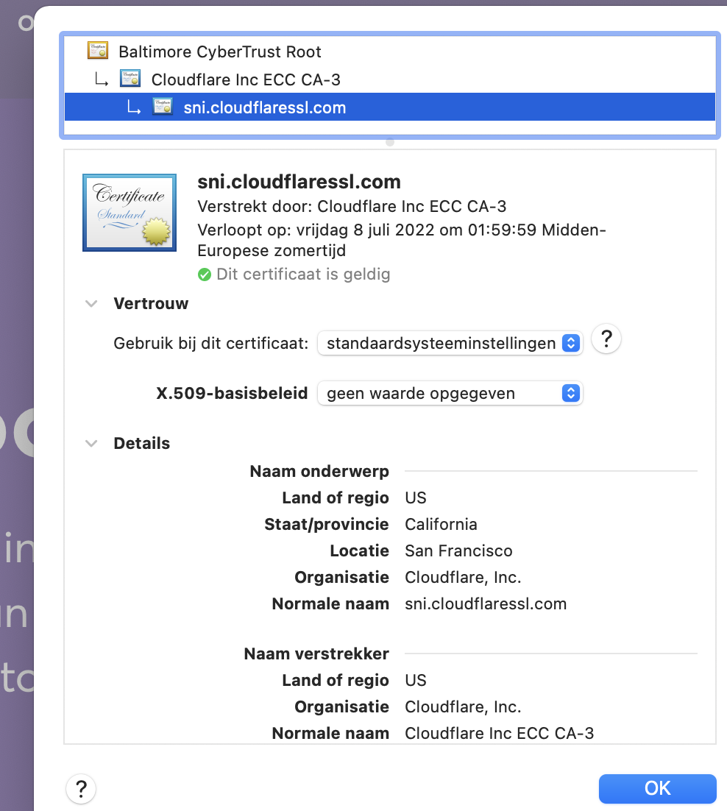

# Public Key Infrastructure

Users of public key applications and systems must be confident that a subject's public key is genuine, for example, that the associated private key is owned by the subject. Public key certificates are used to establish this trust. A public key (or identity) certificate is a binding of a public key to an identity, which is digitally signed by the private key of another entity, often called a Certification Authority (CA)

## Key terminology

Public Key Infratsructure - Public key infrastructure (PKI) is a catch-all term for everything used to establish and manage public key encryption, one of the most common forms of internet encryption. It is baked into every web browser in use today to secure traffic across the public internet, but organizations can also deploy it to secure their internal communications and access to connected devices.

X.509 - An X.509 certificate is a digital certificate based on the widely accepted International Telecommunications Union (ITU) X.509 standard, which defines the format of public key infrastructure (PKI) certificates. They are used to manage identity and security in internet communications and computer networking.

Certified Authority - A certificate authority (CA), also sometimes referred to as a certification authority, is a company or organization that acts to validate the identities of entities (such as websites, email addresses, companies, or individual persons) and bind them to cryptographic keys through the issuance of electronic documents known as digital certificates. 

Certification path - a certification path is an ordered list of certificates, usually comprised of the end-entity's public key certificate and zero or more additional certificates.

Certification Path

## Exercise

Create a self-signed certificate on your VM.

Analyze some certification paths of known websites (ex. techgrounds.nl / google.com / ing.nl).

Find the list of trusted certificate roots on your system (bonus points if you also find it in your VM).

### Sources

https://www.keyfactor.com/resources/what-is-pki/

https://www.keyfactor.com/blog/what-is-x509-certificate/

https://linuxize.com/post/creating-a-self-signed-ssl-certificate/

https://sectigo.com/resource-library/what-is-x509-certificate

https://www.ssl.com/faqs/what-is-a-certificate-authority/

https://www.ibm.com/docs/en/sdk-java-technology/7?topic=certpath-certification-path-introduction

### Overcome challanges

A lot to read about this subject. Had to find out how to find the list of certificates on my system.

### Results

Openssl was already installed. With the following commands I created  a self-signed certificate on my VM. 

The certificate created

The certification path of ing.com. You can see it is signed by Entrust.

The certification path of techgrounds.nl is signed by Cloudflare.

The list of trusted certificate roots in my system.

### Bonus points if you also find it in your VM)

