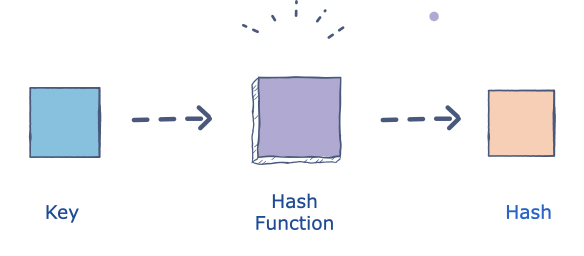

# Passwords

The passwords in a computer system are not stored directly as plain texts but are hashed using encryption. A hash function is a 1-way function, which means that it can’t be decrypted. Whenever a user enters a password, it is converted into a hash value and is compared with the already stored hash value. If the values match, the user is authenticated. In this exercise I am learning about hashing and how the rainbow table works.

## Key terminology

Hashing - Hashing is the process of converting a given key into another value. A hash function is used to generate the new value according to a mathematical algorithm. The result of a hash function is known as a hash value or simply, a hash.

Collision - When two keys generate the same hash.

Salting - A random value added to a password before hashing it. Salting a password before hashing means the resulting hash is different. Using Salts, it's not required to store the actual password of a user, only the salt and the resulting hash. If an attacker knows the hash, it's very hard to calculate the password.

Rainbow table - A database that is used to gain authentication by cracking the password hash. It is a precomputed dictionary of plaintext passwords and their corresponding hash values that can be used to find out what plaintext password produces a particular hash. Since more than one text can produce the same hash, it’s not important to know what the original password really was, as long as it produces the same hash. 

MD5 - The MD5 (message-digest algorithm) hashing algorithm is a one-way cryptographic function that accepts a message of any length as input and returns as output a fixed-length digest value to be used for authenticating the original message.
 

## Exercise

Find out what hashing is and why it is preferred over symmetric encryption for storing passwords.

Find out how a Rainbow Table can be used to crack hashed passwords.

Below are two MD5 password hashes. One is a weak password, the other is a string of 16 randomly generated characters. Try to look up both hashes in a Rainbow Table.
- 03F6D7D1D9AAE7160C05F71CE485AD31

- 03D086C9B98F90D628F2D1BD84CFA6CA

Create a new user in Linux with the password 12345. Look up the hash in a Rainbow Table.

Despite the bad password, and the fact that Linux uses common hashing algorithms, you won’t get a match in the Rainbow Table. This is because the password is salted. To understand how salting works, find a peer who has the same password in /etc/shadow, and compare hashes.

### Sources

https://www.educative.io/edpresso/what-is-hashing

https://www.geeksforgeeks.org/understanding-rainbow-table-attack/

https://auth0.com/blog/hashing-passwords-one-way-road-to-security/

https://www.techtarget.com/searchsecurity/definition/MD5

https://auth0.com/blog/adding-salt-to-hashing-a-better-way-to-store-passwords/

https://www.cyberciti.biz/faq/understanding-etcshadow-file/

https://linuxize.com/post/etc-shadow-file/

### Overcome challanges

It was difficult to understand how the salting outcome could be so different.

### Results

In contrast to encryption, hashing is a one-way mechanism. The data that is hashed cannot be practically "unhashed".
 
Encryption and Hashing

The passwords in a computer system are not stored directly as plain texts but are hashed using encryption. A hash function is a 1-way function, which means that it can’t be decrypted. Whenever a user enters a password, it is converted into a hash value and is compared with the already stored hash value. If the values match, the user is authenticated. 
A rainbow table is a database that is used to gain authentication by cracking the password hash. It is a precomputed dictionary of plaintext passwords and their corresponding hash values that can be used to find out what plaintext password produces a particular hash. Since more than one text can produce the same hash, it’s not important to know what the original password really was, as long as it produces the same hash. 

A rainbow table works by doing a cryptanalysis very quickly and effectively. Unlike bruteforce attack, which works by calculating the hash function of every string present with them, calculating their hash value and then compare it with the one in the computer, at every step. A rainbow table attack eliminates this need by already computing hashes of the large set of available strings.

Two MD5 password hashes.
 One is a weak password, the other is a string of 16 randomly generated characters. 

Creating a new user with password 12345 in my VM.

With the command sudo tail /etc/shadow I can see my hashed password:

$6$wJqIoz9o3AYZkXNw$BursEKqeYUa56p3uyyguw8oTyncC/TQca2tWfvqHsXJ2g40sxbVXHTF8iBJIhy0Y.f8ITfiVnO/0AOoMM0uCn1

As you can see it starts with $6$, that means it is encrypted with the SHA-512 algorithm.

After comparing the passwords with two peers I have come to the conclusion that they are all different. The rainbow table could not read them because the are salted in Linux.

