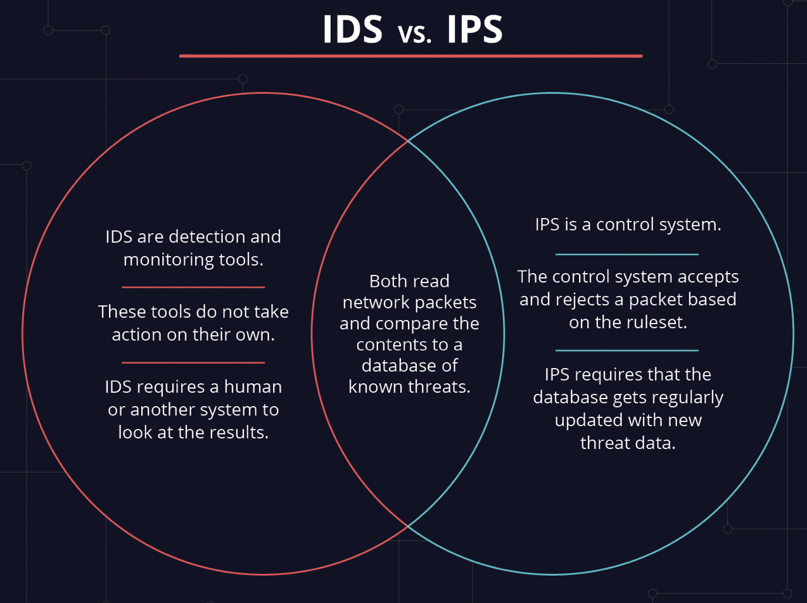
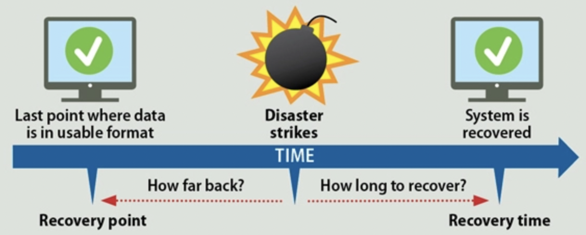

# Detection, response and analysis

Intrusion Detection Systems (IDS) analyze network traffic for signatures that match known cyberattacks. Intrusion Prevention Systems (IPS) also analyzes packets, but can also stop the packet from being delivered based on what kind of attacks it detects — helping stop the attack.

## Key terminology

IDS - An intrusion detection system (IDS) is a device or software application that monitors a network for malicious activity or policy violations. Any malicious activity or violation is typically reported or collected centrally using a security information and event management system.

IPS - An intrusion prevention system (IPS) is a form of network security that works to detect and prevent identified threats. Intrusion prevention systems continuously monitor your network, looking for possible malicious incidents and capturing information about them. The IPS reports these events to system administrators and takes preventative action, such as closing access points and configuring firewalls to prevent future attacks.

The main difference between them is that IDS is a monitoring system, while IPS is a control system.

Malware - Malware (short for “malicious software”) is a file or code, typically delivered over a network, that infects, explores, steals or conducts virtually any behavior an attacker wants. And because malware comes in so many variants, there are numerous methods to infect computer systems. Though varied in type and capabilities, malware usually has one of the following objectives:

Provide remote control for an attacker to use an infected machine.
Send spam from the infected machine to unsuspecting targets.
Investigate the infected user’s local network.
Steal sensitive data.

RPO - Recovery point objectives refer to the company’s loss tolerance: the amount of data that can be lost before significant harm to the business occurs. The objective is expressed as a time measurement from the loss event to the most recent preceding backup.

RTO - Recovery time objective refers to how much time an application can be down without causing significant damage to the business. Some applications can be down for days without significant consequences. Some high priority applications can only be down for a few seconds without incurring employee irritation, customer anger and lost business.

## Exercise

A Company makes daily backups of their database. The database is automatically recovered when a failure happens using the most recent available backup. The recovery happens on a different physical machine than the original database, and the entire process takes about 15 minutes. What is the RPO of the database?

An automatic failover to a backup web server has been configured for a website. Because the backup has to be powered on first and has to pull the newest version of the website from GitHub, the process takes about 8 minutes. What is the RTO of the website?

### Sources

https://www.barracuda.com/glossary/intrusion-detection-system

https://www.varonis.com/blog/ids-vs-ips

https://www.paloaltonetworks.com/cyberpedia/what-is-malware

https://www.enterprisestorageforum.com/management/rpo-and-rto-understanding-the-differences/

### Overcome challanges

None, just looking up al the terminology

### Results

A Company makes daily backups of their database. The database is automatically recovered when a failure happens using the most recent available backup. The recovery happens on a different physical machine than the original database, and the entire process takes about 15 minutes. What is the RPO of the database?

- The RPO is 24 ours, because they backup every 24 hours. Then in the worst-case scenario you will lose 24 hours’ worth of data.

An automatic failover to a backup web server has been configured for a website. Because the backup has to be powered on first and has to pull the newest version of the website from GitHub, the process takes about 8 minutes. What is the RTO of the website?

- The RTO for the website is 8 minutes because that is the time needed to start up again the newest version from Github.

