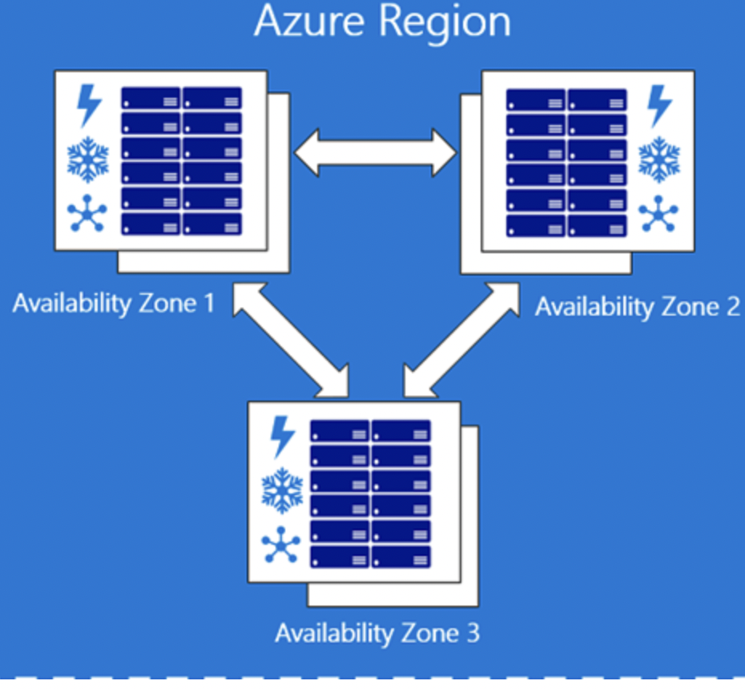
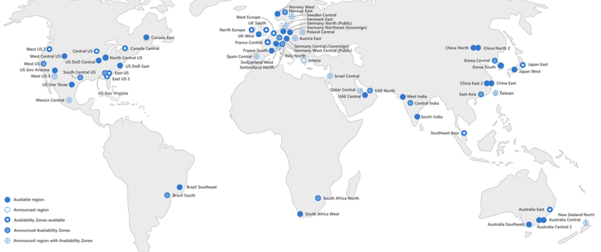

# Azure Global Infrastructure

Everything in the cloud, from servers to networking, is virtualized. As a customer of a cloud provider, you don't have to worry about the underlying physical infrastructure. However, the physical location of your application or data can be important.

The global infrastructure of Azure consists of the following components:
regions
Availability Zones
Region Pairs

You have control over which region you use, but not every service is available in every region. Some services are also not tied to a specific region. Consider, for example, Azure Subscriptions.

## Key terminology

Azure Subscriptions: An Azure subscription is a base container that comprises a group of related business or technical resources. The group of resources are used and billed together. An Azure subscription also acts as an administrative boundary, meaning that it allows subscription administrators to access all resources within the subscription and delegate access through role-based access-control mechanisms. An Azure subscription is mandatory when you are using Azure resources. An Azure resource is a manageable item like a database, web application, virtual network, virtual machine (VM) or storage account that is available on Azure. A subscription authenticates and authorizes you to use these resources. An Azure subscription links to an Azure account, which in turn is an identity in Azure Active Directory (AD). Hence, a subscription is an agreement between an organization and Microsoft to use resources, for which charges are either paid on a per-license basis or a cloud-based, resource-consumption basis.

## Exercise

Study Azure Global Infrastucture

### Sources

https://azure.microsoft.com/en-us/global-infrastructure/services/

https://cswsolutions.com/blog/posts/2021/september/azure-regions-what-they-are-why-they-matter/

https://azure.microsoft.com/en-us/global-infrastructure/

https://docs.microsoft.com/nl-nl/azure/availability-zones/az-overview

https://www.parallels.com/blogs/ras/azure-subscription/
### Overcome challanges

None

### Results

### What is an Azure Region?

- An Azure Region is a group of one or more Azure datacenters, deployed within a latency-defined perimeter. They're connected through a dedicated regional low-latency network. This design ensures that Azure services within any region offer the best possible performance and security.
Azure Regions is a very important concept because every time you create an Azure resource, such as a virtual machine, you must specify the region where you want to create the resource, in this case the virtual machine. In 2022 there are more then 60 Regions.

### What is an Azure Availability Zone?

- An Azure Availability Zone is a unique physical location within an Azure Region. Each Availability Zone consists of one or more Data Centers with independent power, cooling, and networking. Not all Regions have Availability Zones. Regions that support Availability Zones have a minimum of three separate zones to ensure 'Resiliency'. If one of the Availability Zones is down for some reason, we still have our applications and data available from the rest of the two Availability Zones. Failures can range from software and hardware failures to events such as earthquakes, floods, and fires. 

   There is a physical separation between each Availability Zone, and it is this separation that protects our applications and data from data center failures. With Availability   Zones, Azure offers the industry's best 99.99% VM uptime SLA. Availability zones are designed so that if one zone is affected, regional services, capacity, and high availability are supported by the remaining two zones.

   

### What is an Azure Region Pair?

- An Azure Region can also be combined with other Azure Regions within the same geographic area(Region Pairs).
 This allows resources, such as VM storage, to be replicated in a different location within the same geographic area, reducing the chance of both regions being affected simultaneously by natural disasters, unrest, power outages, or physical network outages. Using region pairs offers more benefits:
In the event of a broader Azure outage, one region of each pair will be prioritized to ensure applications are back up and running as soon as possible.
Scheduled Azure updates are deployed one at a time for paired regions to mitigate downtime and the risk of downtime applications.

### Why would you choose one region over another?

- Because each Azure region has specific properties. Choosing the right region is therefore very important. These include available services, capacity, restrictions and sovereignty:

- Available Services: Services deployed in each region differ based on several factors.

- Sovereignty: Certain regions are assigned to specific sovereign entities. While all regions are Azure regions, these sovereign regions are completely isolated from the rest of Azure. Each region has a maximum capacity. This can affect which types of subscriptions can deploy which types of services and under which circumstances.

- Restrictions: Certain restrictions are imposed on the deployment of services in certain regions. For example, some regions are only available as a backup or failover target.

- Sovereignty: Certain regions are assigned to specific sovereign entities. While all regions are Azure regions, these sovereign regions are completely isolated from the rest of Azure.