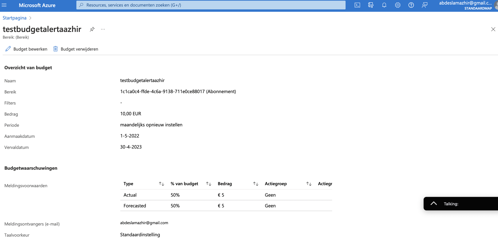
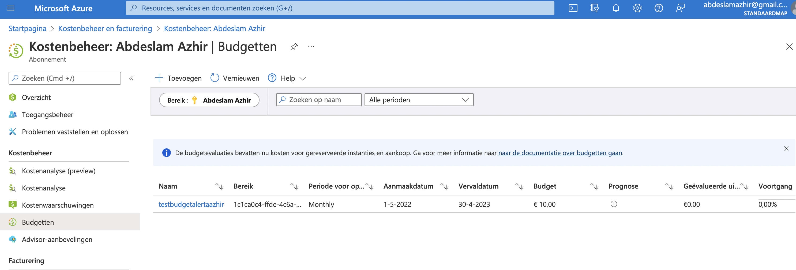
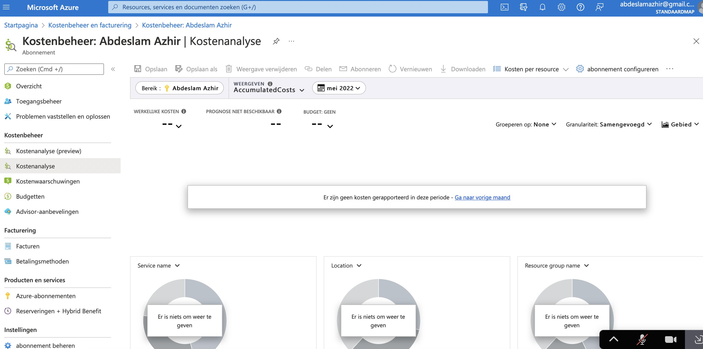

# Cost Management + Billing

Cloud computing offers your business many benefits. It allows you to set up what is essentially a virtual office to give you the flexibility of connecting to your business anywhere, any time. 

A frequently mentioned advantage of the cloud is that you only pay for what you use. This concerns OPEX instead of CAPEX expenditure. The “Cost Management + Billing” tool provides insight into your expenses in Azure and allows you to manage your subscriptions.

Azure provides the following principles to successfully reduce your costs:

Planning

Visibility 

Accountability 

Optimization 

Iteration 

TCO

## Key terminology

OpEx: Operation Expense, is spending money on services or products now and being billed for them now. You can deduct this expense from your tax bill in the same year. There’s no upfront cost but has a recurring cost. You pay for a service or product as you use it i.e. pay-as-you-go pricing.

CapEX: Capital Expenditure is the spending of money on physical infrastructure upfront and then deducting that expense from your tax bill over time. CapEx is an upfront cost, which has a value that reduces over time and usually has no recurring cost. Deploying your own data center and Azure Reserved VM Instances are a few examples of the CapEx pricing model.

## Exercise

Study Cost Management + Billing

Create an alert with which you can monitor your own Cloud Pass.

Understand the options Azure offers to view your spend

### Sources

https://docs.microsoft.com/nl-nl/azure/?product=popular

https://www.azureguru.org/capex-vs-opex/

https://azure.microsoft.com/nl-nl/free/free-account-faq/

https://docs.microsoft.com/nl-nl/azure/architecture/framework/cost/principles

https://docs.microsoft.com/en-us/azure/cost-management-billing/costs/cost-mgt-best-practices

https://dev.to/azure/azure-free-account-is-it-really-free-53cb

https://azure.microsoft.com/en-us/pricing/tco/

https://docs.microsoft.com/en-us/azure/azure-monitor/alerts/alerts-metric

https://docs.microsoft.com/en-us/azure/cost-management-billing/cost-management-billing-overview

### Overcome challanges

Looking up al the terms and how to create a alert in my Azure Cloud environment.

### Results

### The Azure principles for cost management

- Planning: Advance planning allows you to tailor cloud usage to your specific business requirements.
What business problem am I solving?
What usage patterns do I expect from my resources?
Your answers will help you choose the offer that's right for you. They determine which infrastructure to use and how it is used to maximize your Azure efficiency.

- Accountability: Gain cost visibility across your organization to ensure those responsible are accountable for their team's expenses. To fully understand your organization's Azure spend, organize your resources to maximize visibility into cost allocation. A good organization helps to control and reduce costs and holds people accountable for efficient spending in your organization.

- Optimization: With the most optimal insight, for example through planning and visibility, you can act to reduce expenses and optimize costs. You can consider purchasing and licensing optimizations, as well as infrastructure deployment changes.

- Iteration: Everyone in the organization will need to be aware of the cost management lifecycle. They must be continuously involved in order to optimize costs by, among other things, monitoring and improvement. 

- Visibility: When structured properly, the 'Cost Management' will help you inform people about the Azure costs they are responsible for or the money they spend. Azure has services like (Cost Management) that are designed to give you insight into where your money is being spent. Take advantage of these tools. They can help you find underutilized resources, remove waste and maximize cost-saving opportunities.

- TCO: When evaluating your use of the Azure cloud, it is important to consider the Total Cost of Ownership (TCO). The TCO is used to calculate how much an infrastructure costs when hosted in the traditional way. With the TCO calculator you can compare the costs of a traditional infrastructure with the costs for the same infrastructure on Azure.
For example, you can use the TCO calculator to estimate the cost savings by migrating your workloads to Azure.

### The conditions of the `Free subscription`

- USD200 in Azure credits is offered to use within 30 days.

- 12 months of specific services are free.

- The Azure free account is available to all new Azure customers who have not previously had an Azure free account and received a USD200 credit.

### The difference between CAPEX and OPEX

- Capital expenditures (CapEx) generate benefits over a long period. These expenditures are generally nonrecurring and result in the acquisition of permanent assets. Building an application could qualify as a capital expenditure. Example, Azure Reserved Instances (Azure RI) help Azure’s most active customers save on long-term VM usage reserving VMs in advance at a discounted price by committing to a one or three-year benefits.

- Operating expenses (OpEx) are the day-to-day expenses a company incurs to keep its business operational. Consuming cloud services in a pay-as-you-go model could qualify as an operating expenditure. 

The difference is dat CapEx involves significant upfront investment, as well as ongoing maintenance and support costs. OpEx, on the other hand, is a consumption-based model.

### The TCO Calculator

- Azure offers a TCO calculator, one of a set of Azure cost management tools, that lets you estimate the cost of migrating your workloads to Azure and predict your potential savings for existing workloads.

### Create an alert with which you can monitor your own Cloud Pass.

Created an alert to monitor my subscription

I receive a alert when I reach 50% of the entered amount of 10 euros. 

### Understand the options Azure offers to view your spend

Since I haven't incurred any expenses yet, you don't see any expenses.
