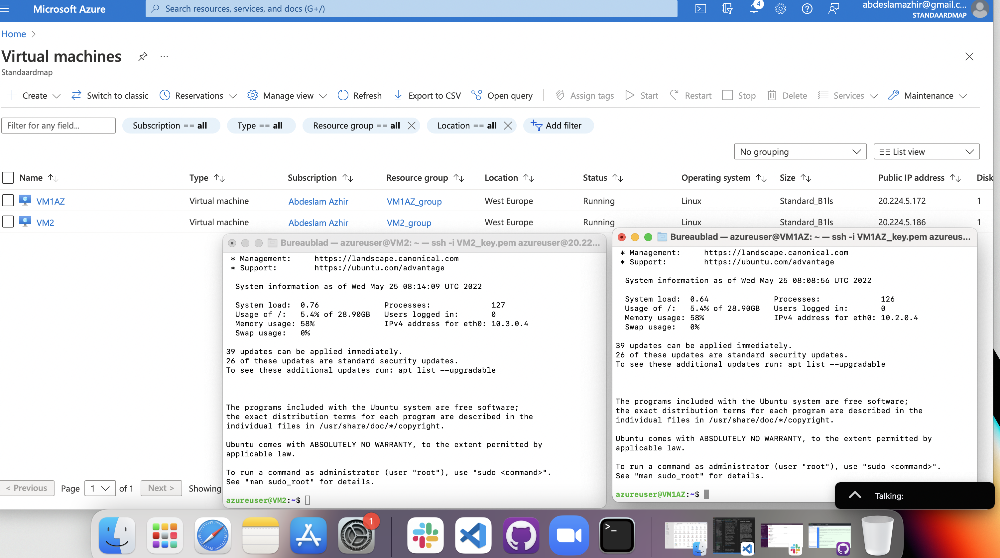
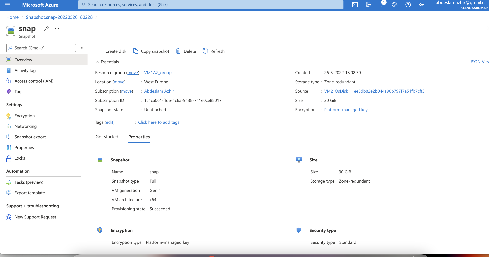

# Azure Disk Storage

Azure Disk Storage can be seen as a virtual hard drive in the cloud. A disk can be an OS disk (where the OS resides) or a Data Disk (similar to an external hard disk). You have a choice between Managed Disks and Unmanaged Disks. Unmanaged Disks are cheaper, but you do need a Storage Account (and you have to manage the disk yourself). Managed Data Disks can be shared between multiple VMs, but that is a relatively new feature and there are some snags.

Backups of a Managed Disk can be made with Incremental Snapshots that only save the changes since the last snapshot. For an Unmanaged Disk you can only take a 'normal' snapshot.

There are 4 types of managed disks. In general you can say that more performance leads to higher costs.

## Key terminology

## Exercise

1 - Start 2 Linux VMs. Ensure you have access to both via SSH.

2 - Create an Azure Managed Disk and attach it to both VMs at the same time.

3 - On your first machine, create a file and place it on the Shared Disk.

4 - Check on the second machine if you can read the file.

5 - Take a snapshot of the disk and try to create a new Disk with it

6 - Mount this new Disk and view the file.

### Sources

https://docs.microsoft.com/en-us/azure/virtual-machines/disks-types

https://docs.ukcloud.com/articles/azure/azs-how-add-managed-disks-portal.html?tabs=tabid-a

https://linuxhint.com/parted_linux/

https://access.redhat.com/documentation/en-us/red_hat_enterprise_linux/8/html/configuring_and_managing_virtualization/sharing-files-between-the-host-and-its-virtual-machines_configuring-and-managing-virtualization#doc-wrapper

### Overcome challanges

Verry dificult!

### Results

 Exercise 1&2 the two VMs with the attached Azure Managed Disk to both VMs

---

Exercise 3 on your first machine, create a file and place it on the Shared Disk.

---

Exercise 4 check on the second machine if you can read the file.

---

Exercise 5 Snapshot of the disk

---

Exercise 6 Mount this new Disk and view the file

