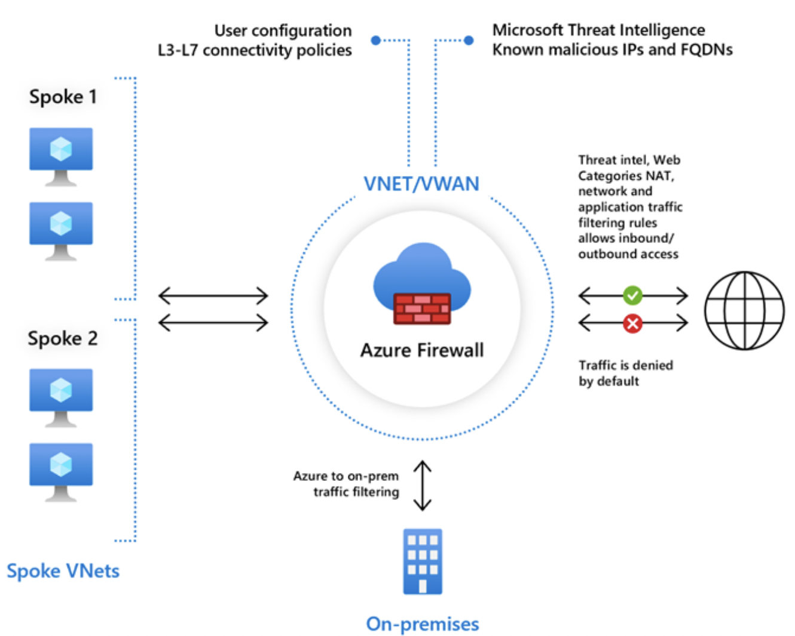
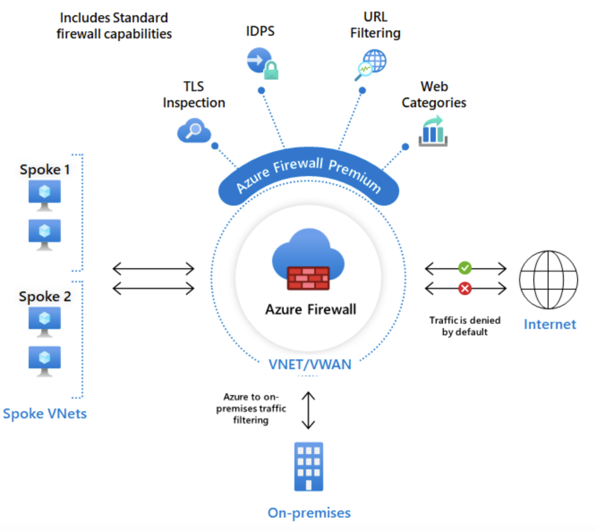
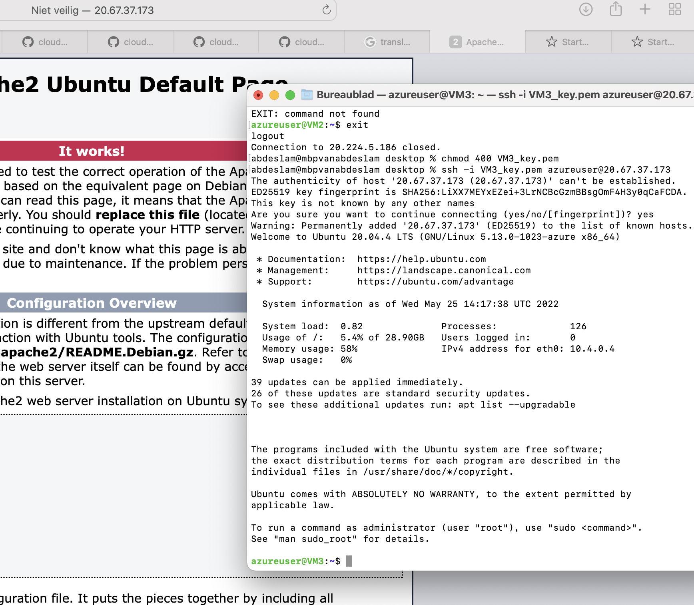
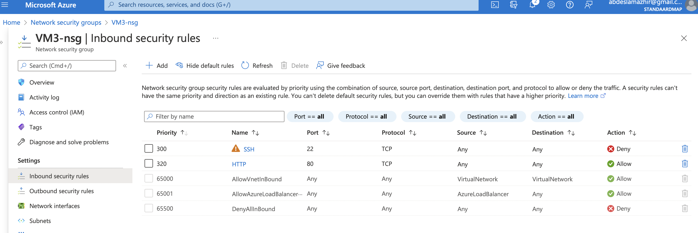
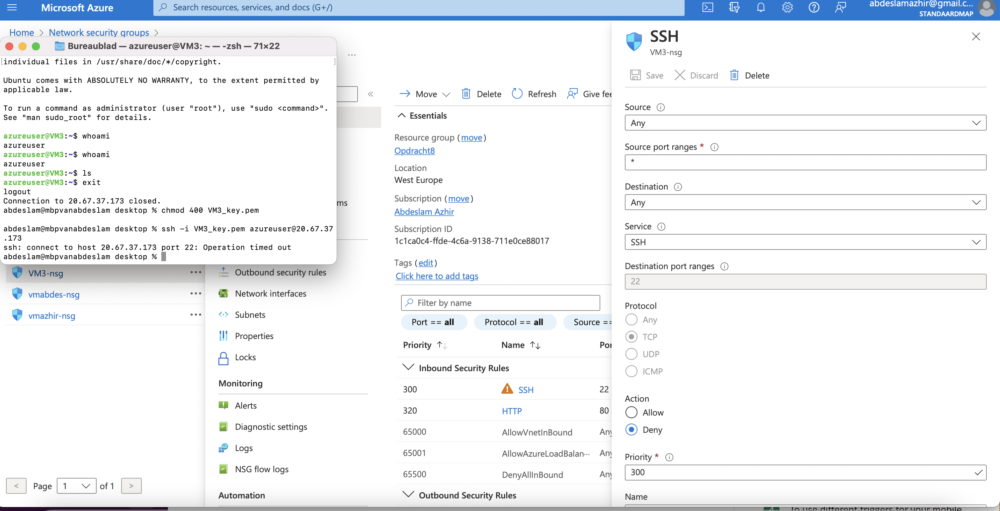

# Azure Firewall

Since all cloud resources are always online, it is important to secure them from intended and unintended malicious traffic. Azure Firewalls can protect VNets from this traffic.

You can use the Firewall in different configurations in a subnet, or in a hub-and-spoke network. A Firewall always has a public IP address to which all incoming traffic should be sent. And a private IP address where all outgoing traffic has to go.

There are two types of firewalls: stateless, and stateful. Azure Firewall is a stateful firewall.

## Key terminology

- Stateful firewall: Stateful firewalls monitor all aspects of the traffic streams, their characteristics and communication channels. These firewalls can integrate encryption or tunnels, identify TCP connection stages, packet state and other key status updates.

- Statelesss firewall: Stateless firewalls use clues from the destination address, source and other key values to assess whether threats are present, then block or restrict those deemed untrusted. Preset rules enforce whether traffic is permitted or denied, but the system is typically unable to determine the difference between truly desired communications and sophisticated attempts to disguise unauthorized communications as trusted ones. As one of the earlier iterations of firewalls, stateless firewalls don't look beyond the header of packet contents to determine if traffic is authorized.

- NSG: An Azure Network Security Group (NSG) is a core component of Azure's security fabric. Leveraging an NSG, you can filter traffic to and from Azure resources that you have commissioned on an Azure Virtual Network (VNet). At its core, an NSG is effectively a set of access control rules you assign to an Azure resource.

## Exercise

Study:

The difference between Basic and Premium Firewall

The difference between a Firewall and a Firewall policy (Firewall Policy)

That Azure Firewall is much more than just a firewall

Assignment:

Turn on a web server. Make sure the ports for both SSH and HTTP are open.

Create an Azure Firewall in VNET. Make sure that your web server is still reachable via HTTP, but that SSH is blocked.
### Sources

https://docs.microsoft.com/en-us/azure/firewall/overview

https://docs.microsoft.com/en-us/azure/virtual-network/network-overview

### Overcome challanges

None

### Results

To meet the increased performance demands of IDPS and TLS inspection, Azure Firewall Premium uses a more powerful virtual machine SKU. Like the Standard SKU, the Premium SKU can seamlessly scale up to 30 Gbps and integrate with availability zones to support the service level agreement (SLA) of 99.99 percent.

Firewall Basic

Firewall premium

Created a new VM with SSH and HTTP open.

Blocked the SSH in the Network security group (nsg)

Not working with SSH because it is blocked
