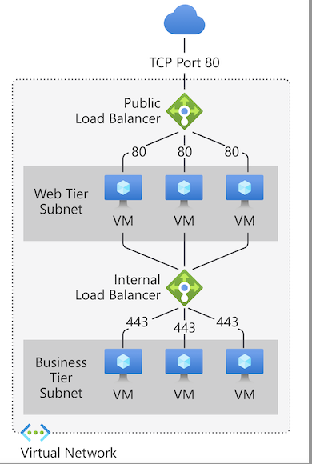
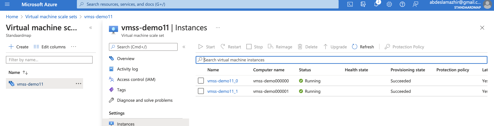
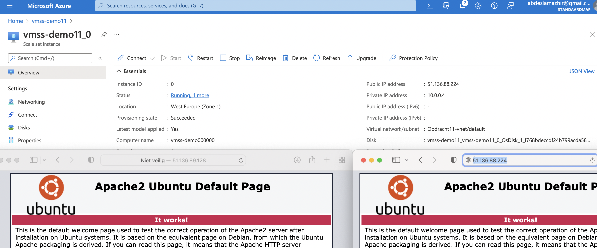
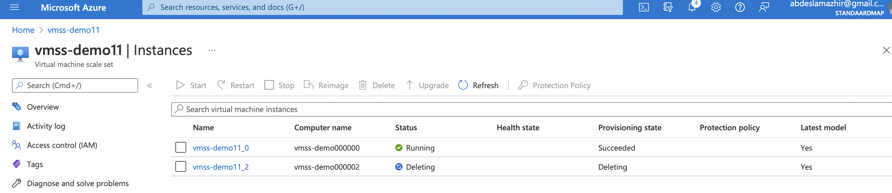
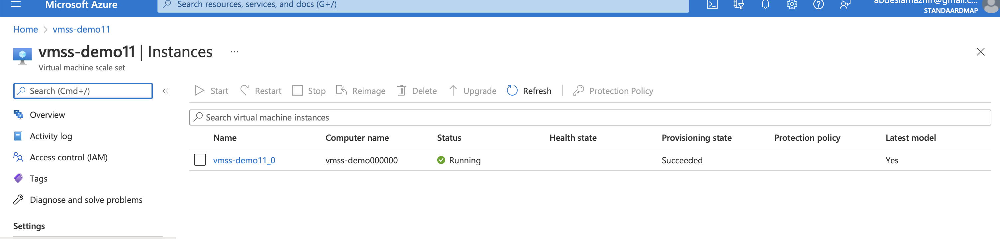
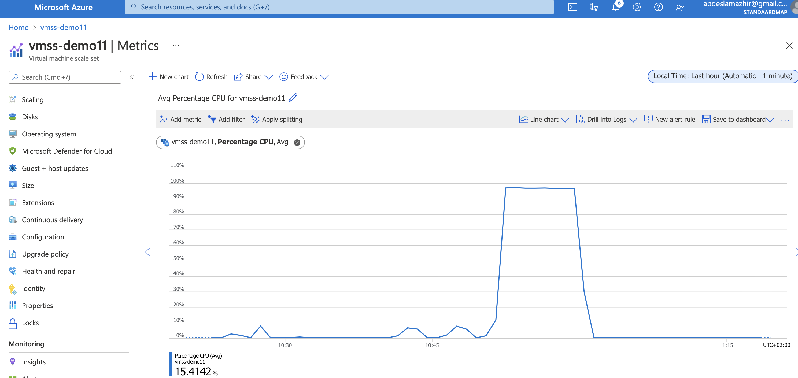
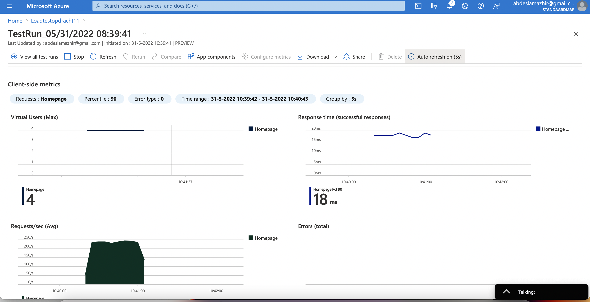
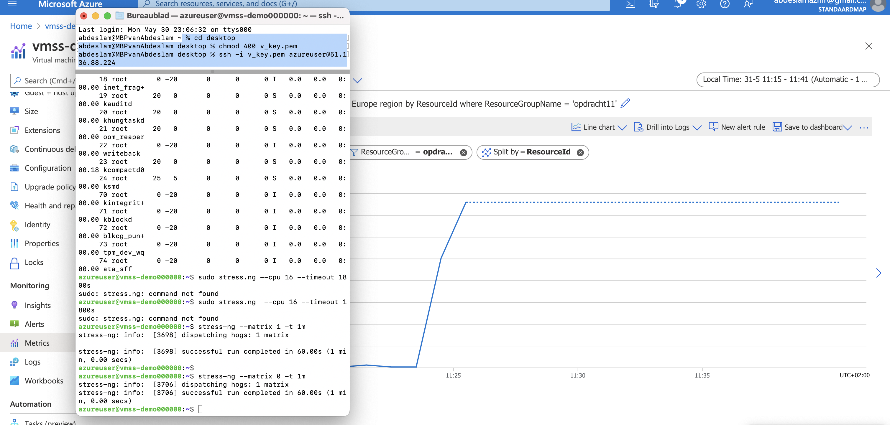
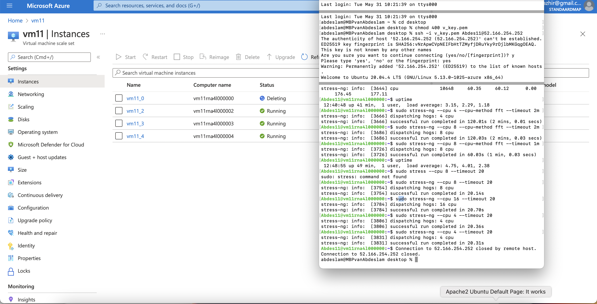
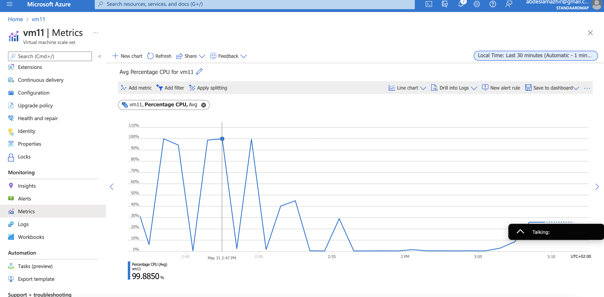

# Azure Load Balancer (ALB) & Auto Scaling

One of the biggest advantages of the cloud is that you don't have to guess how much capacity you need. You can always scale up and down with on-demand services. One of the services that makes this possible is called Auto Scaling.

When running applications with a spiky workload, you can create a VM Scale Set instead of a single server. When the demand for the application is high, Auto Scaling can automatically add VMs to your Scale Set. When the demand goes down, it can also remove instances again.

To ensure that all VMs are the same, you must designate an image when configuring a VM Scale Set. You can modify this image later with the reimage option. Auto Scaling uses Azure Monitor to determine whether to add or remove VMs.

In a traditional architecture, a client connects to a single server with a single public IP address. When you have a fleet of servers, this no longer works. That is why you can use a load balancer as an endpoint for the client. The load balancer will forward the request to one of the servers in your fleet and send the response back to the client.

Azure has two managed solutions for load balancing to a fleet of servers:
- Azure Load Balancer: You get this for free with a VM Scale Set. The ALB operates on layer 4 of the OSI stack (TCP/UDP). An ALB can only route to Azure resources.
- Application Gateway: This load balancer operates on layer 7 of the OSI stack (HTTP/HTTPS). It also has support for SSL termination and Web Application Firewall (WAF) features, among other things. An Application Gateway can route to any routable IP address.

## Key terminology

- Public load balancer: can provide outbound connections for virtual machines (VMs) in the virtual network. These connections are established by translating the private IP addresses to public IP addresses. Public load balancers are used to distribute internet traffic to the VMs.

- Private load balancer: is only used when private IPs are only required on the front-end. Internal load balancers are used to distribute traffic within a virtual network. In a hybrid scenario, a load balancer front end can also be reached from an on-premises network. 

- Azure Autoscaling: Azure Autoscaling lets you set up automated processes that scale your virtual machines (VMs). You do this by creating an Azure VM scale set, which defines how VMs are increased and decreased. After you create rules that define acceptable performance, the process performs actions that adjust the capacity according to your scale set. You can also schedule events that automatically scale VMs during fixed time intervals.

Azure Autoscaling can be used to adjust infrastructure to known or unexpected application loads, and to assist with cost management, by shutting down infrastructure that is currently not needed. 

## Exercise 1

- Create a Virtual Machine Scale Set with the following requirements:
    - Ubuntu Server 20.04 LTS - Gen1
    - Size: Standard_B1ls
    - Allowed inbound ports:
        - SSH (22)
        - HTTP (80)
    - OS Disk type: Standard SSD
    - Networking: defaults
    - Boot diagnostics are not necessary
    - Custom dates:
        - #!/bin/bash
sudo su
apt update
apt install apache2 -y
ufw allow 'Apache'
systemctl enable apache2
systemctl restart apache2
    - Initial Instance Count: 2
    - Scaling Policy: Custom
        - Number of VMs: minimum 1 and maximum 4
    - Add a VM at 75% CPU usage
    - Delete a VM at 30% CPU usage

## Exercise 2

- Check whether you can reach the web server via the endpoint of your load balancer.
- Run a load test on your server(s) to enable auto scaling. There may be a delay in creating new VMs, depending on the settings in your VM Scale Set.

### Sources

https://docs.microsoft.com/nl-nl/azure/load-balancer/load-balancer-overview

https://docs.microsoft.com/nl-nl/azure/azure-monitor/autoscale/autoscale-overview

https://spot.io/resources/azure-pricing/azure-autoscaling-a-practical-guide/

https://www.youtube.com/watch?time_continue=335&v=Y_STYgRQyAE&feature=emb_logo

https://wiki.ubuntu.com/Kernel/Reference/stress-ng

https://www.tecmint.com/linux-cpu-load-stress-test-with-stress-ng-tool/

### Overcome challanges

Difficult exercise.

---

### Results

Created the Virtual Machine Scale Set with the asked requirements. Here you can see two Instances are running.

--- 
The servers are working

---
One Instance was removed because CPU usage was lower then 30%

---
A Testrun on the Portal

---

Stress-ng tool installed on Linux and performed a stress test

--- 

Activated Autoscaling by a load test on the server.

