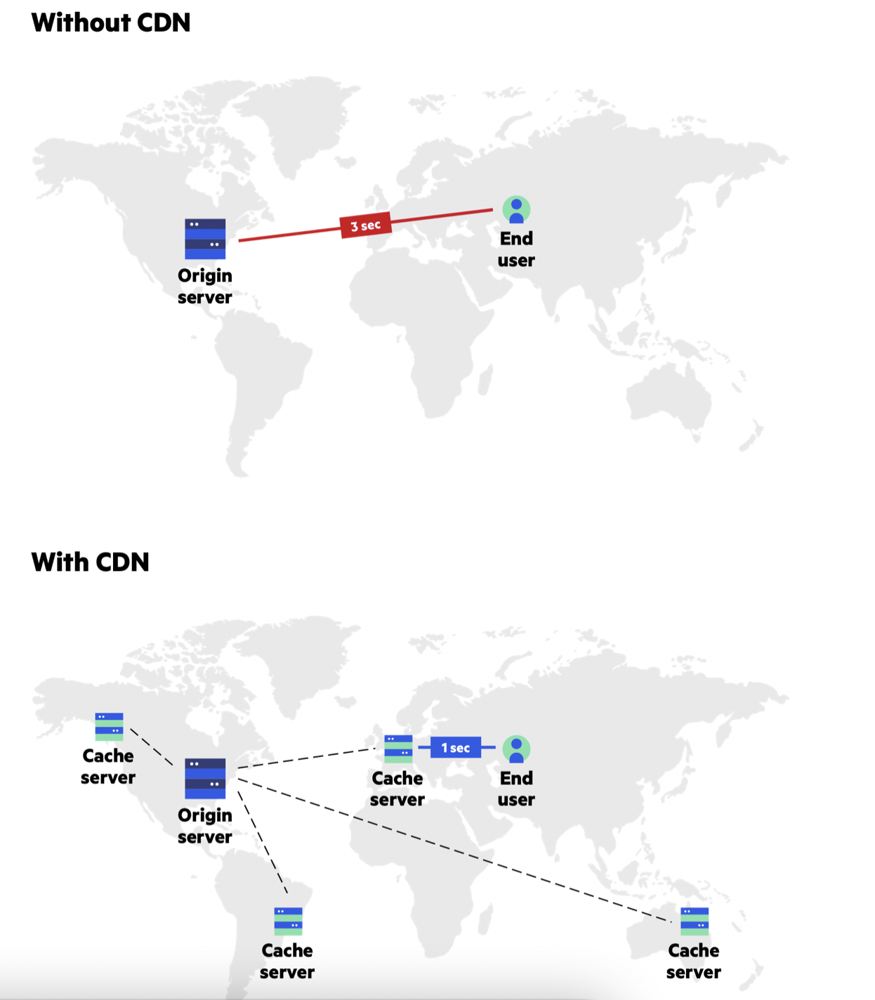

# Content Delivery Network (CDN) 

## What is CDN?

Content delivery networks (CDN) are the transparent backbone of the Internet in charge of content delivery. Whether we know it or not, every one of us interacts with CDNs on a daily basis; when reading articles on news sites, shopping online, watching YouTube videos or perusing social media feeds.

No matter what you do, or what type of content you consume, chances are that you’ll find CDNs behind every character of text, every image pixel and every movie frame that gets delivered to your PC and mobile browser.

To understand why CDNs are so widely used, you first need to recognize the issue they’re designed to solve. Known as latency, it’s the annoying delay that occurs from the moment you request to load a web page to the moment its content actually appears onscreen.

That delay interval is affected by a number of factors, many being specific to a given web page. In all cases however, the delay duration is impacted by the physical distance between you and that website’s hosting server.

A CDN’s mission is to virtually shorten that physical distance, the goal being to improve site rendering speed and performance.

---
---

## How a CDN Works?

To minimize the distance between the visitors and your website’s server, a CDN stores a cached version of its content in multiple geographical locations (points of presence, or PoPs). Each PoP contains a number of caching servers responsible for content delivery to visitors within its proximity.

Azure CDN from Microsoft has 118 PoPs across 100 metro cities.

To use Azure CDN, you must own a Azure subscription. You also need to create at least one CDN profile, which is a collection of CDN endpoints. Every CDN endpoint represents a specific configuration of content deliver behavior and access.

There are also some limitations:
- The number of CDN profiles that can be created.
- The number of endpoints that can be created in a CDN profile.
- The number of custom domains that can be mapped to an endpoint.

In essence, CDN puts your content in many places at once, providing superior coverage to your users. For example, when someone in London accesses your US-hosted website, it is done through a local UK PoP. This is much quicker than having the visitor’s requests, and your responses, travel the full width of the Atlantic and back.

### CDN Overview
  - 1. A user (Alice) requests a file (also called an asset) by using a URL with a special domain name, such as <endpoint name>.azureedge.net. This name can be an endpoint hostname or a custom domain. The DNS routes the request to the best performing POP location, which is usually the POP that is geographically closest to the user.

 - 2. If no edge servers in the POP have the file in their cache, the POP requests the file from the origin server. The origin server can be an Azure Web App, Azure Cloud Service, Azure Storage account, or any publicly accessible web server.

 - 3. The origin server returns the file to an edge server in the POP.

 - 4. An edge server in the POP caches the file and returns the file to the original requestor (Alice). The file remains cached on the edge server in the POP until the time-to-live (TTL) specified by its HTTP headers expires. If the origin server didn't specify a TTL, the default TTL is seven days.

 - 5. Additional users can then request the same file by using the same URL that Alice used, and can also be directed to the same POP.

 - 6. If the TTL for the file hasn't expired, the POP edge server returns the file directly from the cache. This process results in a faster, more responsive user experience.

---
---

## Key terminology

- Content Delivery Network: (CDN) is a globally distributed network of servers that can deliver content to consumers. CDNs store cached content on the edge servers’ PoP (Point of Presence) locations that are close to consuming users, thereby minimizing network latency. 

 - Points of Presence: CDN PoPs (Points of Presence) are strategically located data centers responsible for communicating with users in their geographic vicinity. Their main function is to reduce round trip time by bringing the content closer to the website’s visitor. Each CDN PoP typically contains numerous caching servers.

- Endpoint: An endpoint is basically a destination and a launching point. As the term, itself implies it is the “end point.” In other words, it is a node that’s linked to the internet and receives communication and content back and forth multiple other servers. Simply put, an endpoint can refer to a switch, modem, bridge, hub, or in this case—and as already written—a server. 

- Edge server: The server that is the nearest to a user.

---
---

## Exercise

Study Content Delivery Network (CDN).

---
---

### Sources

https://docs.microsoft.com/nl-nl/azure/cdn/cdn-overview

https://kishoregopalan.medium.com/azure-front-door-or-azure-cdn-what-solution-will-you-use-for-your-high-availability-sites-be26bb34aee7

https://www.imperva.com/learn/performance/what-is-cdn-how-it-works/

https://www.belugacdn.com/what-is-a-cdn-endpoint/

