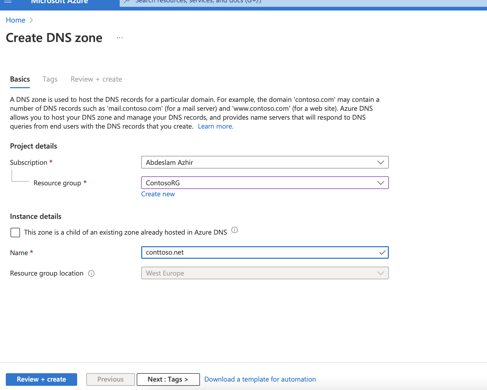
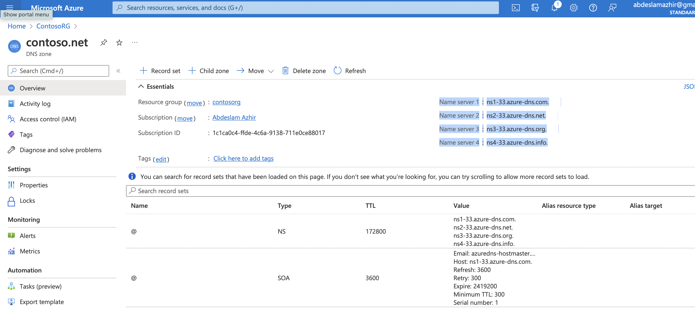
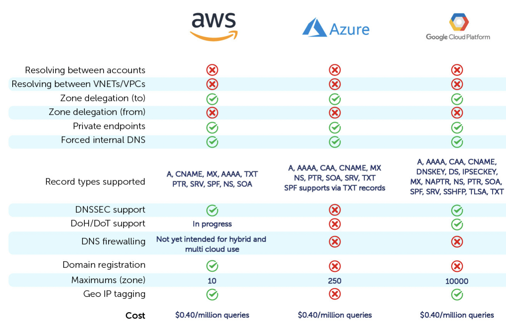

# Azure DNS 

### What is DNS?

Azure DNS is a cloud service that allows you to host and manage Domain Name System (DNS) domains, also known as DNS zones. A DNS zone is a collection of DNS records. DNS records can associate a fully qualified domain name (FQDN) associated with the zone with an IP address or other DNS record. For example www.tailwindtraders.com : assign (a host record) to a specific IP address (40.71.177.34).

Applications, APIs, and cloud services already hosted in the cloud, like Microsoft Azure can make use of Azure DNS for hosting. All in one place and resource group. This gives the advantage of better management of services. 

DNS domains in Azure DNS are hosted on Azure's global network of DNS name servers. Azure DNS uses anycast networking. Each DNS query is answered by the closest available DNS server to provide fast performance and high availability for your domain.

Azure DNS is based on Azure Resource Manager, which provides security features such as:

 - Azure role-based access control (Azure RBAC) to control who has access to specific actions for your organization.

 - Activity logs to monitor how a user in your organization modified a resource or to find an error when troubleshooting.

 - Resource locking to lock a subscription, resource group, or resource. Locking prevents other users in your organization from accidentally deleting or modifying critical resources.

---
---

## Key terminology

 - DNS: The Domain Name System is the phonebook of the Internet. Humans access information online through domain names, like nytimes.com or espn.com. Web browsers interact through Internet Protocol (IP) addresses. DNS translates domain names to IP addresses so browsers can load Internet resources.

---
---

## Exercise

Study Azure DNS

---

1. Creating a DNS Zone

2. Retrieved the name servers

- Name server 1
:
ns1-33.azure-dns.com.

- Name server 2
:
ns2-33.azure-dns.net.

 - Name server 3
:
ns3-33.azure-dns.org.

 - Name server 4
:
ns4-33.azure-dns.info.

3. Once the DNS zone gets created and you have the name servers, you'll need to update the parent domain with the Azure DNS name servers. Each registrar has its own DNS management tools to change the name server records for a domain

4. After you complete the delegation, you can verify that it's working by using a tool such as nslookup to query the Start of Authority (SOA) record for your zone. The SOA record is automatically created when the zone is created
---

### Sources

https://docs.microsoft.com/en-us/azure/dns/dns-overview

https://jonahandersson.tech/azure-dns-how-to-create-dns-zone-and-record-set/

https://www.cloudflare.com/learning/dns/what-is-dns/

https://docs.microsoft.com/en-us/azure/dns/dns-delegate-domain-azure-dns

 https://docs.microsoft.com/en-us/azure/architecture/aws-professional/networking

### Comparison

Azure DNS is the Microsoft service that allows the user to perform roughly the same functions as Amazon Route 53 and Google Cloud Platform.

There is no major functional difference between the three services.

