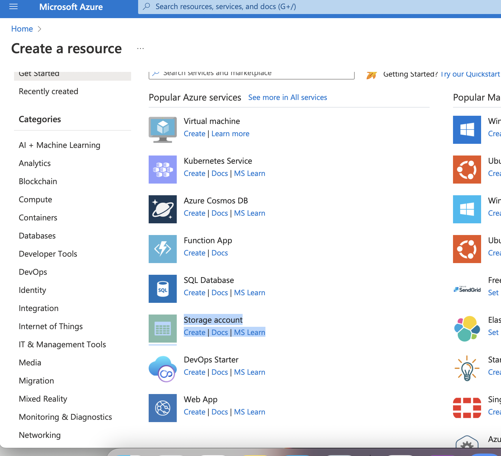
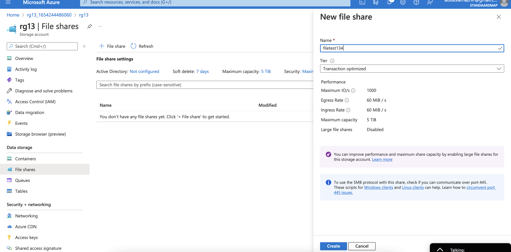
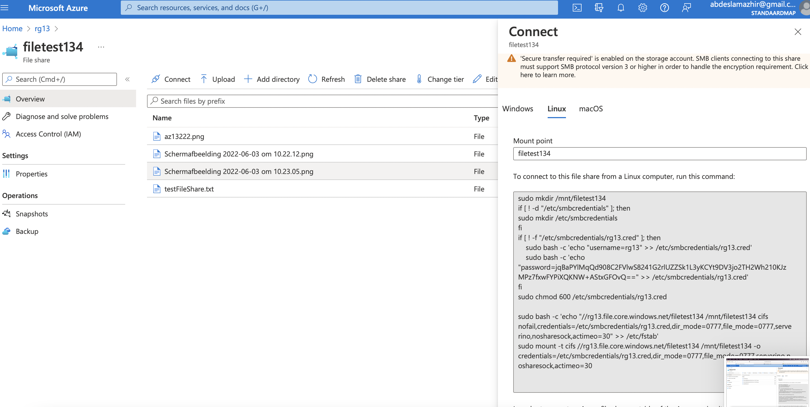
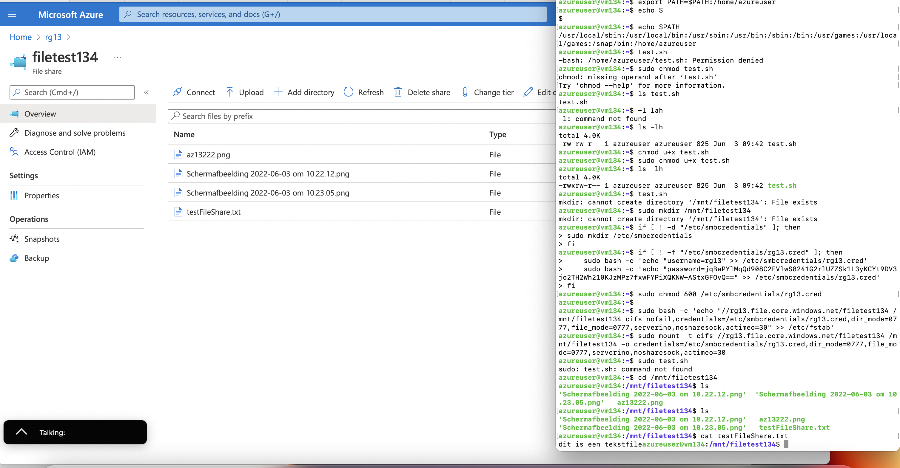
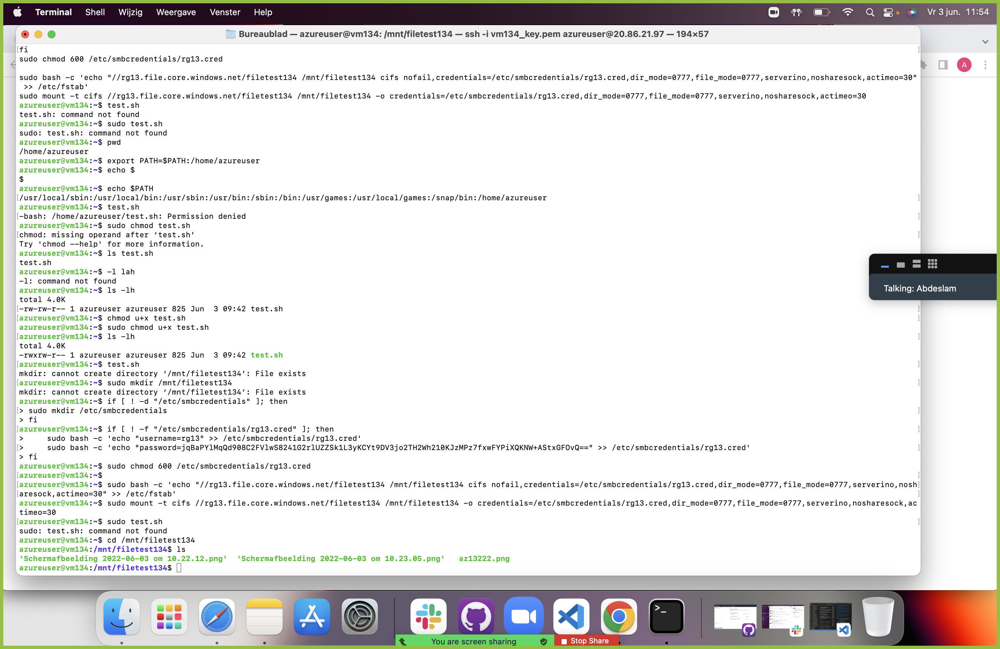

# Azure Files

### What is Azure Files for?

Azure Files offers fully managed file shares in the cloud that are accessible via the industry standard Server Message Block (SMB) protocol or Network File System (NFS) protocol.
That means that multiple VMs can share the same files with both read and write access. You can also read the files using the REST interface or the storage client libraries.

 Azure Files file shares can be mounted concurrently by cloud or on-premises deployments. SMB Azure file shares are accessible from Windows, Linux, and macOS clients. NFS Azure Files shares are accessible from Linux or macOS clients. Additionally, SMB Azure file shares can be cached on Windows Servers with Azure File Sync for fast access near where the data is being used.

Azure file shares can be used to:

- Replace or supplement on-premises file servers
  - You can use Azure Files to replace network attached storage (NAS) or on-premises file systems. By adding on Azure File Sync, you can replicate data to your on-premises locations for distributed caching and increased performance.

- "Lift and shift" applications
  - Azure Files enables you to migrate applications and data “as-is” by supporting current protocols. You can move either data, applications, or both.

- Simplify cloud development
  - Shared application settings: you can configure Azure Files as a centralized file share for application data and configuration files. However, this method only supports SMB access.
  - Diagnostic share: Azure Files enables you to centralize metrics and log files for ingestion by monitoring and analytics tools. This provides redundancy for monitoring and troubleshooting data.
  - Dev/Test/Debug: you can use Azure Files to create a centralized repository for code or utilities used during testing and development. Centralization supports collaboration and ensures standardization.

- Containerization

One thing that distinguishes Azure Files from files on a corporate file share is that you can access the files from anywhere in the world using a URL that points to the file and includes a shared access signature (SAS) token. You can generate SAS tokens; they allow specific access to a private asset for a specific amount of time.

---

### When to use it?

- You want to "lift and shift" an application to the cloud that already uses the native file system APIs to share data between it and other applications running in Azure. Configuration files can be stored on a file share and accessed from multiple VMs. Tools and utilities used by multiple developers in a group can be stored on a file share, ensuring that everybody can find them, and that they use the same version.

 - You want to replace or supplement on-premises file servers or NAS devices. Many on-premises applications use file shares. This feature makes it easier to migrate those applications that share data to Azure. If you mount the file share to the same drive letter that the on-premises application uses, the part of your application that accesses the file share should work with minimal, if any, changes.

- You want to store development and debugging tools that need to be accessed from many virtual machines. Resource logs, metrics, and crash dumps are just three examples of data that can be written to a file share and processed or analyzed later.

---

### How does Azure Files fit  classic setting?

Azure Files can be used to completely replace or complement traditional on-premises file servers or NAS devices. The classic setting was that the files and applications must be maintained, stored and provided by own equipment. Now that is not necessary and this can be bridged by using cloud services from Azure.

### Why to use it?

- Cost-Effective 
  - A notable advantage contributing to the explosive rise in demand for cloud computing services in general, is the cost advantage. With cloud-based file sharing systems, this is still a major benefit for companies.  Companies only pay for storage that is utilized and which grows and shrinks according to the files added or removed.

- Companies Can Work Without File Servers Or VPNs
  - Another added advantage of using cloud for data sharing and storage is the fact that companies can work without using their VPNs or file servers. In addition to the benefit of workers being able to access data remotely, this eliminates the costly setup and maintenance costs for keeping their company file servers operational. This also makes it easier to expand their operations to multiple cities or even countries as all file sharing and storage can now be done online via the cloud; on-premises file servers no longer need to be set up and maintained.

  - Better security than tradidional options
    - Cloud-based file sharing systems can provide better security as only those with authorization can gain access to a company’s files and data.

---
---

## Key terminology

- SMB: Server Message Block, also known as Common Internet File System (CIFS), is the network protocol used to enable file sharing between multiple computers in Microsoft Windows.

- NFS: The Network File System, or NFS for short, is a network file system originally designed by Sun Microsystems in 1984 for their own Unix workstations. NFS makes it possible to request files over the network in the same way that one would request files on the local disk.

---

## Exercise

Study Azure Files

### Sources

https://docs.microsoft.com/en-us/azure/storage/files/storage-files-introduction

https://docs.microsoft.com/en-us/azure/storage/common/storage-introduction

https://www.techtarget.com/searchenterprisedesktop/definition/Network-File-System

https://www.techtarget.com/searchnetworking/definition/Server-Message-Block-Protocol

https://cloud.netapp.com/blog/azure-anf-blg-azure-files-the-basics-and-a-quick-deployment-guide

https://www.apps4rent.com/blog/azure-files-vs-amazon-efs/

https://www.computersupport.com/itanywherelabs/how-awss-efs-and-microsofts-azure-files-are-the-clouds-game-changers/

---

### Results

- Where can I find this service in the console?
  - On the Portal in te Storage Account section.

- How do I enable this service?

Azure portal creating a Storage Account

---

After creating the Storage Account in a new Resource group, you can select under Data Storage, File Shares.

---

When selecting the Azure File Shares, you can upload your files and see the link on how to connect to the Shared files by Windows, Linux and Mac.
I used Linux command in the Custom data area when creating my VM.

---

Deployd a Linux VM and connected to it.
Mounted the file share into the VM.

---

Here you can see the images and read the txt file i uploaded in the Azure Files

---
---

### Comparison

Azure Files and Amazon Elastic File System (EFS) are two cloud storage services.

Azure file shares support the industry-standard SMB and NFS protocols. Amazon EFS primarily supports NFS protocol, whereas additional AWS DataSync subscription is required to provide support for Server Message Block (SMB) protocol. Amazon EFS provides shared file system storage and low latency for Linux workloads. On the other hand, Azure shares the files system across multiple machines like Windows, Mac, and Linux. As a result, Azure Files has a significant advantage for applications that need shareability. Azure Files lets you access your files quickly over high latency or low bandwidth links by allowing you to catch frequently used files using Azure File Sync, while Amazon comes optimized for low latency for Linux workloads.

