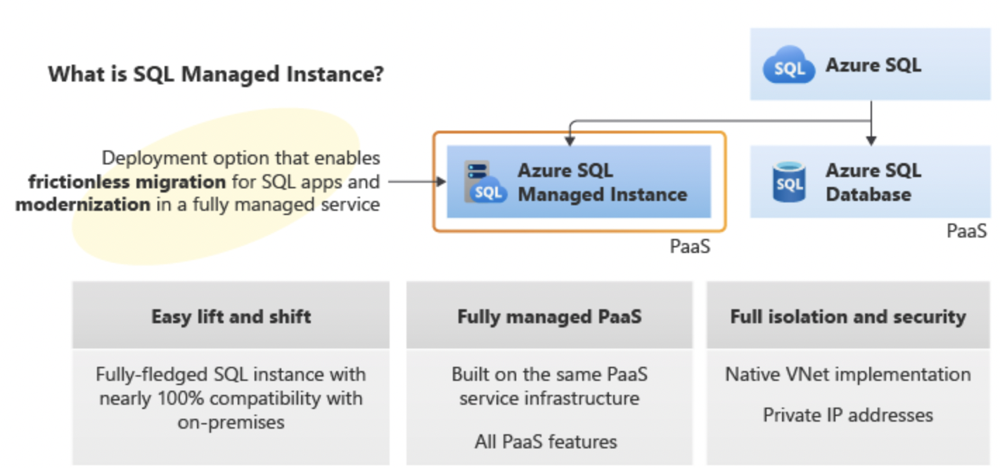
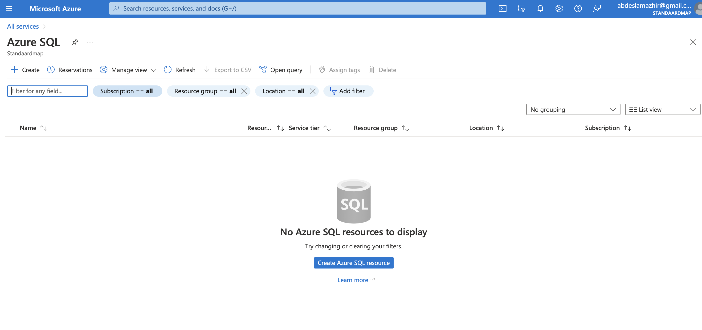
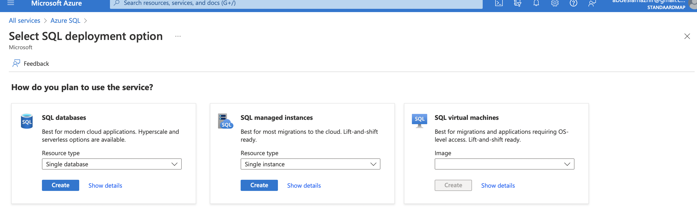
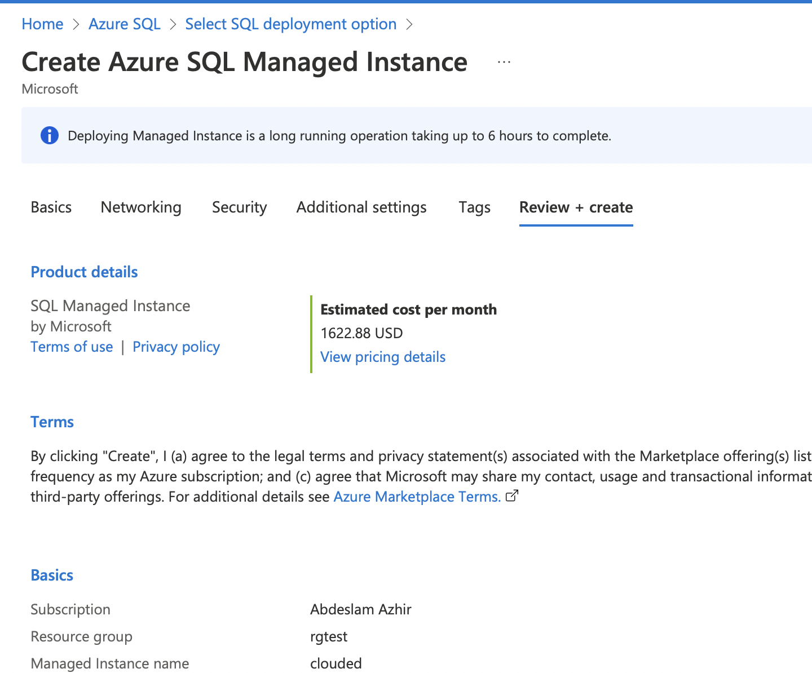
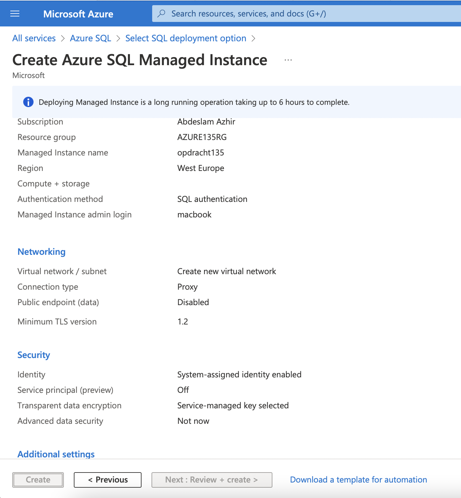
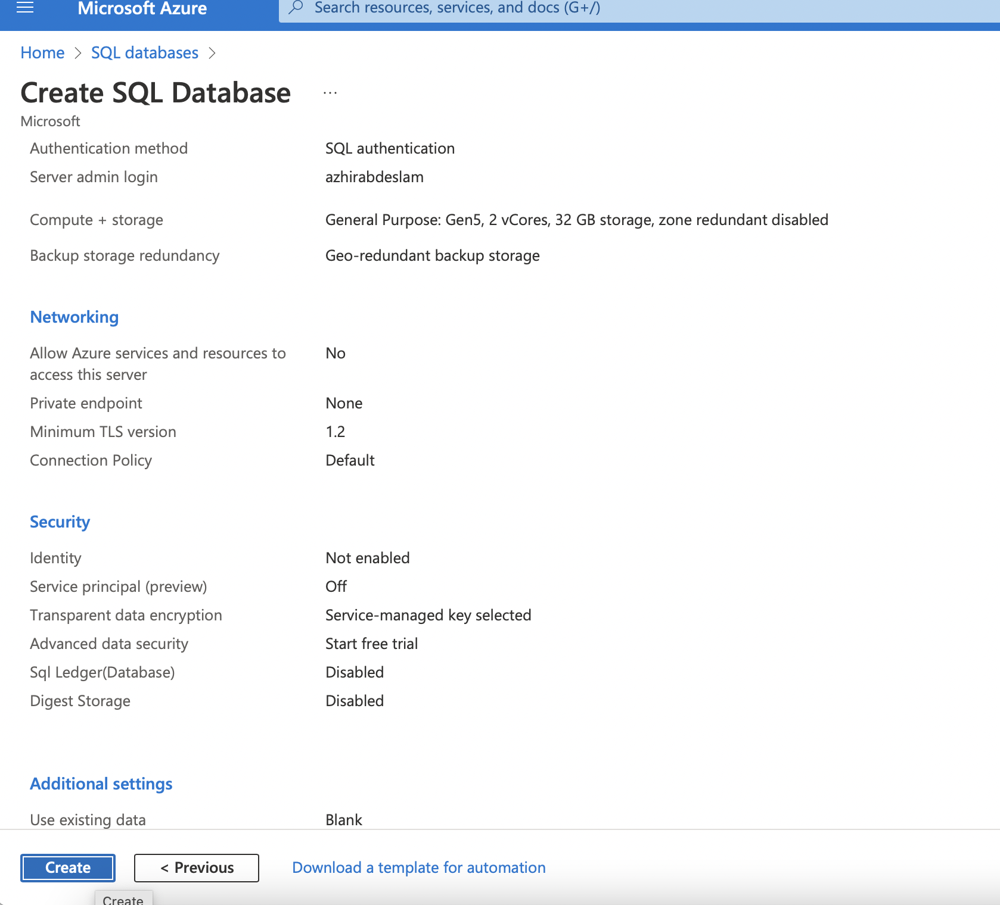
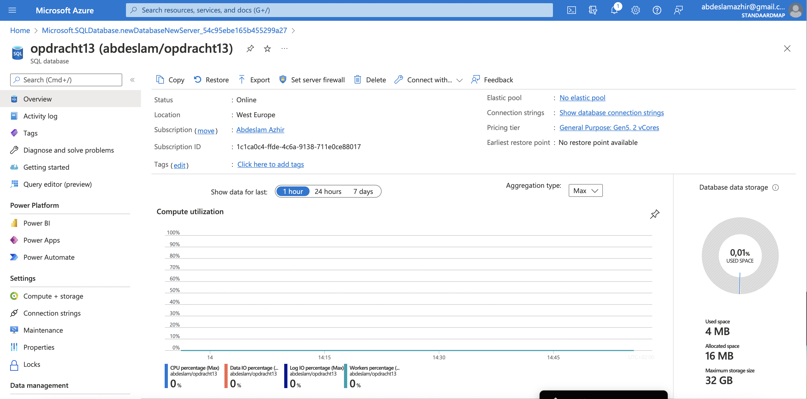

# Azure Database (+ managed instance) 

### What is Azure Managed Instance?

Azure SQL Managed Instance is the intelligent, scalable cloud database service that combines the broadest SQL Server database engine compatibility with all the benefits of a fully managed and evergreen platform as a service. SQL Managed Instance has near 100% compatibility with the latest SQL Server (Enterprise Edition) database engine, providing a native virtual network (VNet) implementation that addresses common security concerns, and a business model favorable for existing SQL Server customers. SQL Managed Instance allows existing SQL Server customers to lift and shift their on-premises applications to the cloud with minimal application and database changes. At the same time, SQL Managed Instance preserves all PaaS capabilities (automatic patching and version updates, automated backups, high availability) that drastically reduce management overhead and TCO.

### For what?

Azure SQL Managed Instance is designed for customers looking to migrate a large number of apps from an on-premises or IaaS, self-built, or ISV provided environment to a fully managed PaaS cloud environment, with as low a migration effort as possible. Using the fully automated Azure Data Migration Service, customers can lift and shift their existing SQL Server instance to SQL Managed Instance, which offers compatibility with SQL Server and complete isolation of customer instances with native VNet support. For more information on migration options and tools, see Migration overview: SQL Server to Azure SQL Managed Instance.

With Software Assurance, you can exchange your existing licenses for discounted rates on SQL Managed Instance using the Azure Hybrid Benefit for SQL Server. SQL Managed Instance is the best migration destination in the cloud for SQL Server instances that require high security and a rich programmability surface.

Key features of SQL Managed Instance

---
---

## Exercise

Study Azure Database (+ managed instance) 

---

### Sources

https://medium.com/azure-sqldb-managed-instance/introducing-managed-instance-5dcc0d806a87

https://docs.microsoft.com/en-us/azure/azure-sql/managed-instance/sql-managed-instance-paas-overview?view=azuresql

https://www.spyglassmtg.com/blog/azure-vs-aws

https://docs.microsoft.com/en-us/azure/azure-sql/database/single-database-create-quickstart?view=azuresql&tabs=azure-portal

---
---

### Result

In the Portal you search for Azure SQL and then + Create.

---
---
Via Azure SQL, you can choose to create a Managed Instance

---
---

It  is quite expensive

---
---

Deployment of the Managed Instance can take up to 6 hours co complete

---
---

---
---

---
---

### Comparison

The Managed Database of AWS is called AWS RDS.

- Cost Management:

  - Costs for AWS RDS are determined by the amount of hardware resources that your instance uses, like CPU, RAM, storage, and network bandwidth. In the Azure database services, cost depends on your database size, concurrent connections, and throughput levels.

  - The pricing alone justifies SQL on Azure. With the advantages of Hybrid and reserved in the SQL options, savings can be upwards of 60% over AWS deployments. The “Pay as You Go” pricing on Azure is half of the respective Amazon RDS service.

 - Security:

   - Both platforms have a host of security add-ons beyond the typical VM based security features of on-prem deployments. Including managed service firewalls, database management UI’s, encryption at rest, authentication (AD or otherwise), virtual network integration and auditing. Noting that encryption at rest only comes with the enterprise license in AWS and AWS does NOT enforce things like SSL or encryption while Azure requires those security features. 
   
   - Additionally, Microsoft takes the platform security integration one step farther and put Advanced Threat detection and data masking capabilities on top.

- Disaster Recovery and Availability:

  - Azure SQL Database offers the following capabilities for recovering from an outage and if you are using zone-redundant Premium or Business Critical databases or pools, the recovery process is automated and the rest of this is irrelevant.

    - Active geo-replication

    - Auto-failover groups

    - Geo-restore

    - Zone-redundant databases

  - Amazon RDS provides a highly available Multi-AZ configuration as well, which protects against localized failures but not from every possibility, such as a natural disaster, a malicious actor, or logical corruption of a database. However, SQL itself provides advanced capabilities with Always on Availability groups which you can deploy on AWS RDS.

    - High availability (Multi-AZ) for Amazon RDS

    - Backing up and restoring an Amazon RDS DB instance

