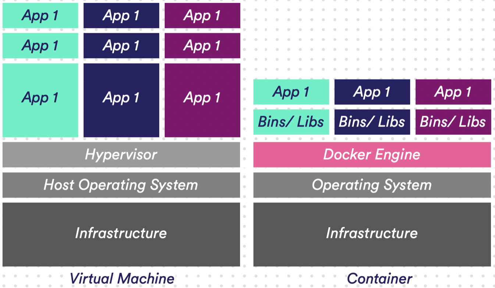

# Containers

### What are Containers 

Just as transport companies use physical containers to separate different types of cargo, for example in transport on ships and trains, so too are software development technologies increasingly adopting a method that uses containers.

A standard package of software called a container bundles an application's code together with the associated configuration files, libraries, and dependencies needed to run the app. 

Containers are becoming the preferred way to package, deploy, and manage cloud applications. Azure Container Instances offers a fast and simple way to run a container in Azure, without having to manage any virtual machines and without having to adopt a higher-level service.

Whereas virtual machines (VMs) virtualize at the hardware level, containers virtualize at the operating system level. Because of this, containers are far more lightweight than VMs, making them faster to spin up and much more portable (VMs carry around with them their own OS, the application itself, any necessary libraries, etc.).

Azure Container Instances (ACI) is a solution for any scenario that can operate in isolated containers, including simple applications, task automation, and build jobs. 

VMs carry around with them their own OS, the application itself, any necessary libraries, etc.

## Key terminology

- Kubernetes: An open source container orchestration platform that automates many of the manual processes involved in deploying, managing, and scaling containerized applications.

- Azure Kubernetes Service:  (AKS) makes it simple to manage a hosted Kubernetes environment in Azure (which can include for example Docker containers). It is best suited for scenarios where you need complete container orchestration, including service discovery across multiple containers, automatic scaling, and coordinated application upgrades. Kubernetes abstracts away complex container management and provides us with declarative configuration to orchestrate containers in different compute environments.

- Docker: Is an open-source technology—and a container file format—for automating the deployment of applications as portable, self-sufficient containers that can run in the cloud or on-premises.

## Exercise
 
 Study Containers.

### Why Containers?

- Flexibility

  - When developers develop, containerize, and deliver their applications to the IT team to run on a standardized platform, it simplifies application deployment and streamlines the entire development and testing cycle. It also improves collaboration and efficiency between the development team and the operations team so that apps can be delivered faster.

- Portability

  - Containers provide a standardized format for packaging and storing all the parts needed to run the desired application. This solves the typical "it works on my computer" problem and ensures portability between OS platforms and between clouds. Whenever a container is deployed somewhere, it runs in a consistent environment that is the same for all deployments. You now have a consistent layout, from development to production environment.

- Rapid scalability

  - Because containers do not have the overhead that is typical of VMs, such as separate operating system instances, many more containers can be supported on the same infrastructure. The nimbleness of containers means that they can be started and stopped quickly, allowing for rapid upscaling and downscaling.

---
---

- What are Azure Containers for?

  - Isolated applications that can be started quickly without VM settings.

- How does Azure Replace Containers in a classic setting?

  - No more need for a Host VM to run applications.
---
---

  ### Comparison

Amazon EC2 Container Service and Azure Container Service belong to "Containers as a Service" category of the tech stack.

Some of the features offered by Amazon EC2 Container Service are:

- Docker Compatibility
- Managed Clusters
- Programmatic Control

On the other hand, Azure Container Service provides the following key features:

- Create a container hosting solution optimized for Azure
- Scale and orchestrate applications using Apache Mesos or Docker Swarm
- Use popular open source, client-side tooling

ACI and AKS are two Container services from Microsoft Azure.
While ACI can be used for containerization, Azure Kubernetes Service allows you to easily automate this process. It helps with networking, load-balancing, security, and scaling across all Kubernetes nodes which runs your containers.

### Sources

https://azure.microsoft.com/nl-nl/overview/what-is-a-container/#overview

https://docs.microsoft.com/en-us/azure/container-instances/container-instances-overview

https://stackshare.io/stackups/amazon-ec2-container-service-vs-azure-container-service

https://www.redhat.com/en/topics/containers/learning-kubernetes-tutorial?sc_cid=7013a000002wLw5AAE&gclid=CjwKCAjwy_aUBhACEiwA2IHHQGyKH04__579XadR3hd3TvdEFehmZFIsCq363qrw_bx6bzGHQ8QAnhoCcrQQAvD_BwE&gclsrc=aw.ds

https://azure.microsoft.com/en-us/topic/kubernetes-vs-docker/
